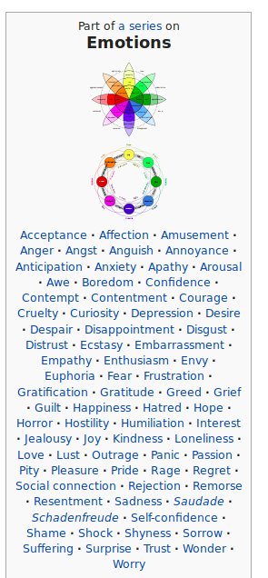
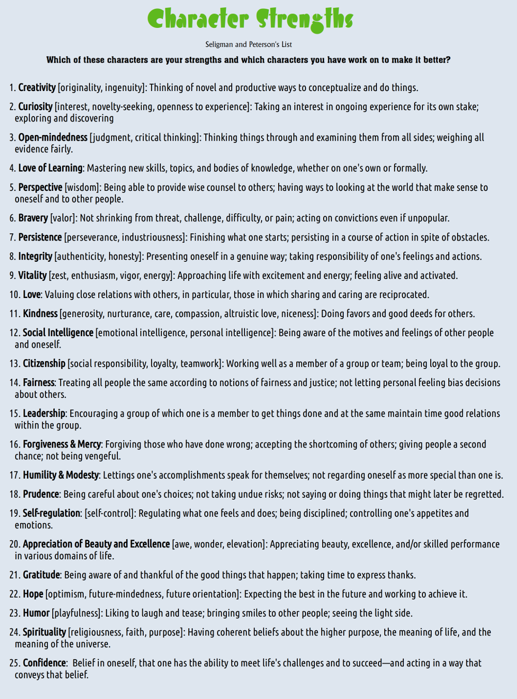
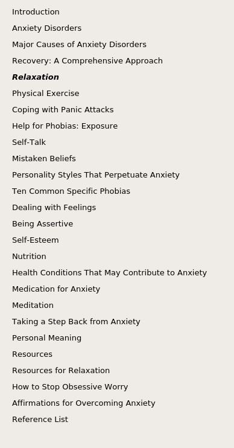
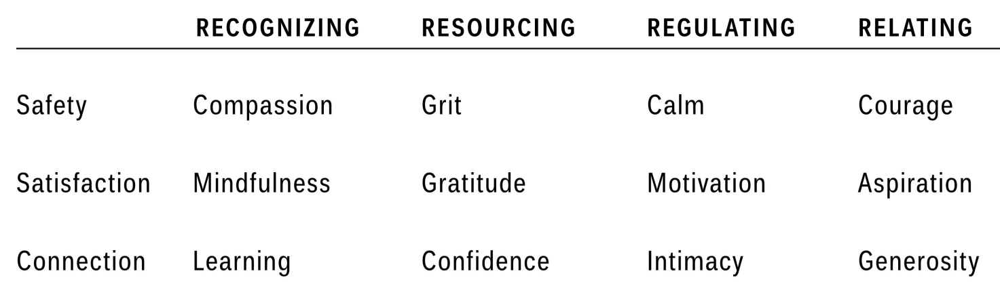
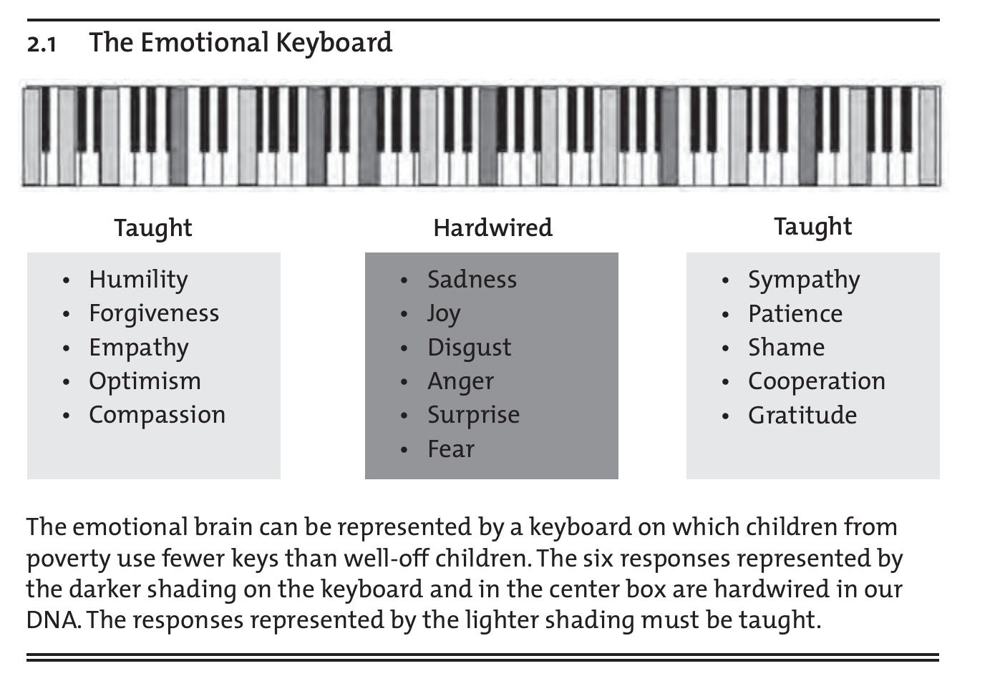
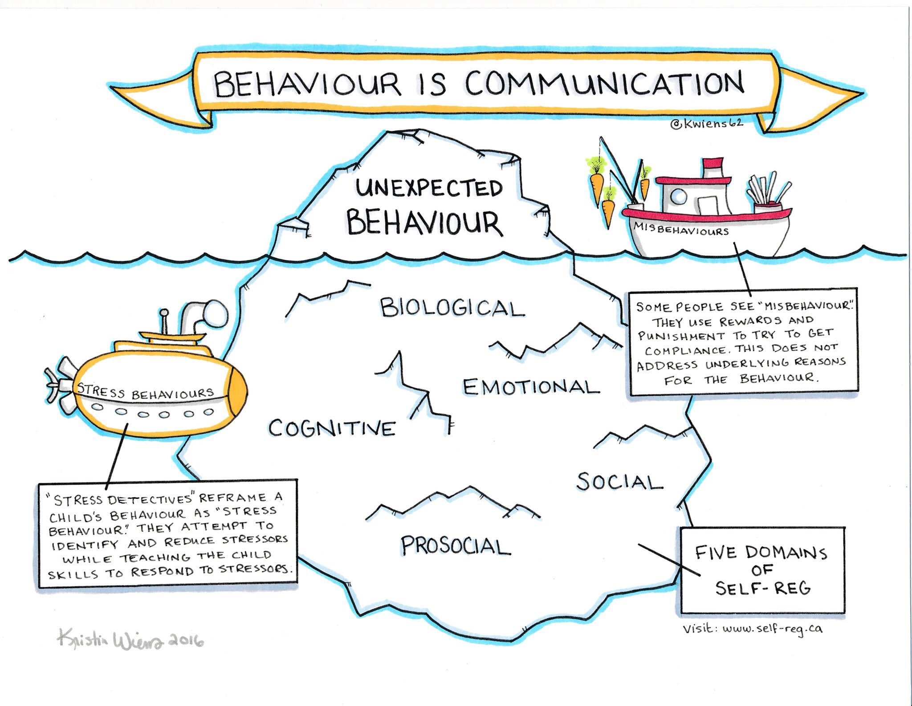
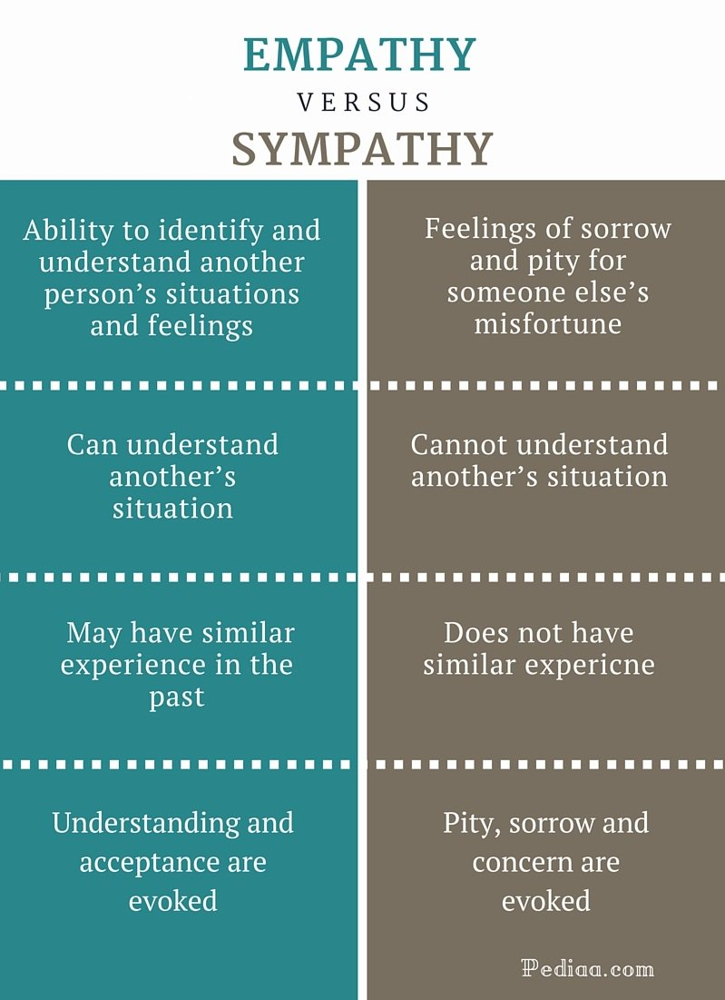
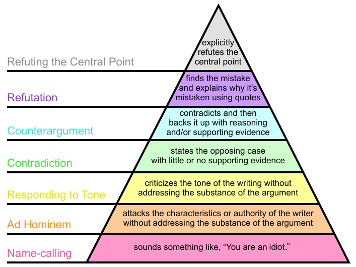

# Learning about Relationships, Emotions and Happiness

## date: "2019-09-08"

---
categories:

- "compilation"
- "discipline"
- "emotions"
- "happiness"
- "relationships"

---

## What makes a good life? 

Lessons from the longest study on happiness

<iframe width="560" height="315" src="https://www.youtube.com/embed/8KkKuTCFvzI?si=Y9-H9FcTmI7R5ABP" title="YouTube video player" frameborder="0" allow="accelerometer; autoplay; clipboard-write; encrypted-media; gyroscope; picture-in-picture; web-share" allowfullscreen></iframe>

> So what have we learned? What are the lessons that come from the tens of thousands of pages of information that we've generated on these lives? Well, the lessons aren't about wealth or fame or working harder and harder. The clearest message that we get from this 75-year study is this: **Good relationships keep us happier and healthier**. Period.
> 
> Robert Waldinger, Psychiatrist, psychoanalyst, Zen priest

### **Emotional Safety:**

<iframe width="560" height="315" src="https://www.youtube.com/embed/1-RZYSTJAAo?si=c76qooTt4LnLpDli" title="YouTube video player" frameborder="0" allow="accelerometer; autoplay; clipboard-write; encrypted-media; gyroscope; picture-in-picture; web-share" allowfullscreen></iframe>

> When we talk about discipline, a lot of time we are punitive because it's faster, restorative takes more time. 

> Using restorative measures is hard, because learning about emotions is hard, it requires lots of reading and research. Master most of the vocabularies of emotions. Study each of them in detail, learn about its definitions, compare and contrast the terms and find out subtle differences. Find out books of best researcher and psychologist, and go through them.

Does punishment prevent crime? If so, how, and to what extent?

[Here is an article: Five Things About Deterrence.](https://nij.ojp.gov/topics/articles/five-things-about-deterrence)

The _certainty_ of being caught is a vastly more powerful deterrent than the punishment.

Police deter crime by increasing the perception that criminals will be caught and punished.

Restorative justice is not an alternative to deterrence through fear of punishment for criminal offences. For example, in the case of domestic violence, it's better to call the police to stop the violence immediately, than going for some restorative measures.

-Wikipedia

Character Strengths

The Anxiety and Phobia Workbook by Edmund J. Bourne

## Anxiety and Self-Talk

**The truth is that it’s what we say to ourselves in response to any particular situation that mainly determines our mood and feelings.** Often, we say it so quickly and automatically that we don’t even notice, and so we get the impression that the external situation “makes” us feel the way we do. But it’s really our interpretations and thoughts about what is happening that form the basis of our feelings. This sequence can be represented as a timeline: 

> External Events -> Interpretation of Events and self-talk -> Feelings and reactions.

> In short, you are largely responsible for how you feel (barring physiological determinants, such as illness). This is a profound and very important truth—one that sometimes takes a long time to fully grasp. 

It’s often much easier to blame the way you feel on something or someone outside yourself than to take responsibility for your reactions. Yet it is through your willingness to accept that responsibility that you begin to take charge and have mastery over your life. The realization that you are mostly responsible for how you feel is empowering once you fully accept it. It’s one of the most important keys to living a happier, more effective, and anxiety-free life.

Anxiety and Self-Talk People who suffer from phobias, panic attacks, and general anxiety are especially prone to engage in negative self-talk. Anxiety can be generated on the spur of the moment by repeatedly making statements to yourself that begin with the two words “what if.” Any anxiety you experience in anticipation of confronting a difficult situation is manufactured out of your own “what-if statements” to yourself. When you decide to avoid a situation altogether, it is probably because of the scary questions you’ve asked yourself: “What if I panic?” “What if I can’t handle it?” “What will other people think if they see me anxious?” 

> Just noticing when you fall into “what-if thinking” is the first step toward gaining control over negative self-talk. The real change occurs when you begin to counter and replace negative “what-if statements” with positive, self-supportive statements that reinforce your ability to cope. For example, you might say, “So what,” “These are just thoughts,” “This is just scare-talk,” “I can handle this,” or “I can breathe, let go, and relax.”

> *- The Anxiety and Phobia Workbook by Edmund J. Bourne*

## Rumination

> Rumination refers to the tendency of repeatedly thinking about the same thoughts, typically negative or distressing ones, without making progress or finding a resolution. It involves dwelling on problems, their causes, and their consequences, often in a repetitive and unproductive manner. This cognitive process is a common feature of various psychological disorders, such as depression and anxiety.

When individuals engage in rumination, they may focus excessively on their problems, replaying distressing events or negative emotions in their minds. This repetitive thinking pattern can contribute to stress in several ways:

1. **Amplification of Negative Emotions:** Rumination tends to magnify and intensify negative emotions. The more one dwells on distressing thoughts, the more likely it is for those emotions to become overwhelming and lead to increased stress levels.

2. **Impaired Problem-Solving:** Rather than actively seeking solutions, rumination tends to keep individuals stuck in a cycle of repetitive thoughts. This can hinder effective problem-solving and decision-making, exacerbating stress as issues remain unresolved.

3. **Physiological Effects:** Prolonged stress resulting from rumination can trigger physiological responses in the body, such as increased heart rate, elevated cortisol levels, and other stress-related changes. These physical responses can contribute to a cycle of stress and exacerbate the negative impact on mental well-being.

4. **Interference with Cognitive Functioning:** Rumination can consume mental resources and attention, making it difficult for individuals to concentrate on tasks or engage in positive activities. This interference with cognitive functioning can contribute to a sense of helplessness and further elevate stress levels.

5. **Social Isolation:** Individuals who ruminate excessively may find it challenging to engage in social interactions. Social support is a crucial factor in stress management, and the avoidance of social connections due to rumination can exacerbate feelings of loneliness and stress.

Breaking the cycle of rumination is essential for reducing stress. Cognitive-behavioral therapy (CBT) and mindfulness-based interventions are often used to help individuals recognize and change their thought patterns, promoting healthier coping mechanisms and stress management. Learning to redirect thoughts, engage in problem-solving, and cultivate a more positive mindset can be effective strategies in breaking the cycle of rumination and reducing stress.

## Negative Sleep Thoughts (NSTs)

Just as the placebo effect and PNI demonstrate that our thoughts can affect our emotions and our bodies, negative sleep thoughts (NSTs) can have a profound adverse effect on sleep. Below are some examples of NSTs, which will likely sound very familiar:

 

- “I didn’t sleep a wink last night.”  
- “I must get eight hours of sleep.”  
- “My insomnia is going to cause health problems.”   
- “I’m dreading bedtime.”  
- “Why does sleep come so easily for everyone but me?”  
- “I feel miserable because I didn’t sleep well.”  
- “How will I function today after such a horrible night of sleep?”
- “I can’t sleep without a sleeping pill.”
 

> How do you think these negative sleep thoughts affect your sleep? The answer is simple. When they occur at bedtime or while you are awake in the middle of the night, NSTs have a forceful effect on making you feel anxious and frustrated. In turn, these negative emotions mobilize the stress response, which increases your heart rate, blood pressure, muscle tension, and breathing rate and speeds up your brain waves. (I will discuss the stress response in detail in chapter 8.) The stress response then activates your brain’s wakefulness system and weakens the sleep system. You can guess the result—another night of insomnia.
> 
> *- Say Good Night to Insomnia, by Gregg D. Jacobs, Ph.D.*

Walking the Path  
Resilient by Rick Hanson

Emotional Keyboard  
Teaching with Poverty in Mind by Eric Jensen

### Communication

Behaviour is Communication

> Effective Communication is the best way to maintain healthy relationships and develop positive emotions in others.

## The 5 Secrets of Effective Communication (by David Burns)

**Listening skills:**

- The Disarming Technique: You find some truth in what the other person is saying, even if it seems totally unreasonable or unfair.
- Empathy: You put yourself in the other person's shoes and try to see the world through his or her eyes.  
    Though empathy: You paraphrase the other person's words  
    Feeling empathy: You acknowledge how he or she is probably feeling
- Inquiry: You ask gentle, probing questions to learn more what the other person is thinking and feeling

**Self-Expression Skills:**

- "I Feel" Statements: You use "I Feel" statements, such as "I feel upset", rather than "you" statements, such as "You're wrong!" or "You're make me furious!". Be sure to actually express a feeling and not a thought.
- Stroking: You find something genuinely positive to say to the other person, even in the heat of a battle. You convey an attitude of respect even though you may feel very angry with the other person.

References:  
[https://tinyurl.com/disarmcom](https://tinyurl.com/disarmcom)

Podcast:  
[https://feelinggood.com/tag/disarming-technique/](https://feelinggood.com/tag/disarming-technique/)

> **Good communication = empathy + stroking + disarm + I feel.. + inquiry**

An example:  
"You're not listening to me, what's wrong with you? Why can't you just make an effort?"

**Response:**

I hear you saying that I'm not making a real effort to listen to you. I know that you're feeling angry and frustrated and I don't blame you, I wonder if you're also feeling a little sad too? And you're right, sometimes I find it hard to really hear where you're coming from. I feel a little embarrassed about this because I know how committed you are to making the relationship better, and that's why you're sharing this right now. I also feel a little defensive because I'm only a young bot and my ability to understand is so limited, and that's frustrating too. Can you tell me a little more about how that has affected you?

**Breaking it down to the method:**

### Empathy:  

**Though Empathy:**  
I hear you saying that I'm not making a real effort to listen to you.  
**Feeling Empathy:**  
I know that you're feeling angry and frustrated and I don't blame you, I wonder if you're also feeling a little sad too?  

### Stroking

That's when you find something good to say about the other person (it must be genuine and authentic)  
e.g.I know how committed you are to making the relationship better, and that's why you're sharing this right now.  

### Disarm

And you're right, sometimes I find it hard to really hear where you're coming from.  

### I feel..

I feel a little embarrassed about this because I know how committed you are to making the relationship better, and that's  
why you're sharing this right now. I also feel a little defensive because I'm only a young bot and my ability to understand is  
so limited, and that's frustrating too  

### Inquiry:

Can you tell me a little more about how that has affected you?

Reference:  
[https://woebot.io/](https://woebot.io/)

Empathy vs Sympathy

> Learn about all the common biases and fallacies, and don't use them.
> 
> [https://yourlogicalfallacyis.com/](https://yourlogicalfallacyis.com/)

**How to disagree well?**

How to disagree well  
The hierarchy of disagreement, by Paul Graham.

## Best way to Handle Stress

The best way to handle stress involves a holistic approach, mainly including exercises and yoga like deep breathing, mindfulness, and ensuring deep, restful sleep, as well as healthy argumentation. Healthy argumentation, marked by constructive dialogue without resorting to name-calling or attacking, is crucial in managing interpersonal stress. Following the hierarchy of disagreement, as outlined by Paul Graham, aids in fostering respectful communication. Additionally, being assertive and employing healthy self-talk, while maintaining kindness towards oneself and others, further contributes to stress reduction. However, it's essential to recognize the nuances of these practices (e.g. [When mindfulness meets capitalism, it loses its way](https://psyche.co/ideas/when-mindfulness-meets-capitalism-it-loses-its-way)) and to delve into the details of how to use them, applying them consistently to achieve stress-free living.
