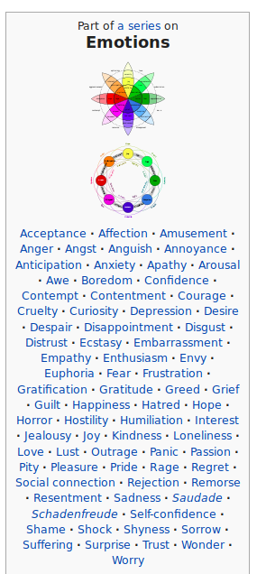
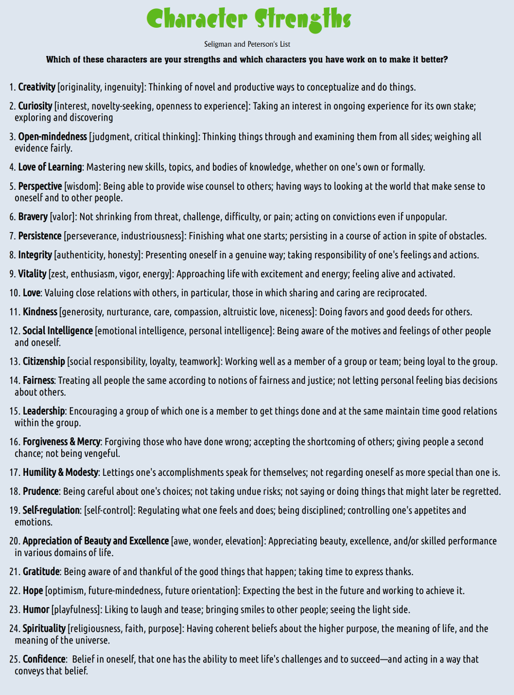
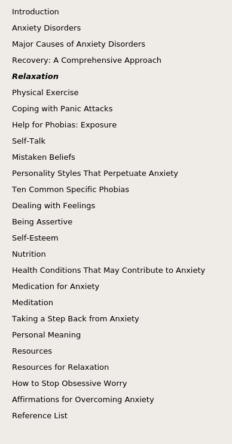
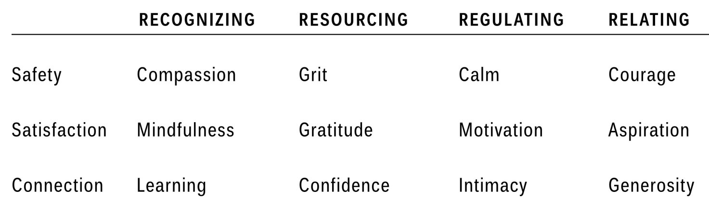
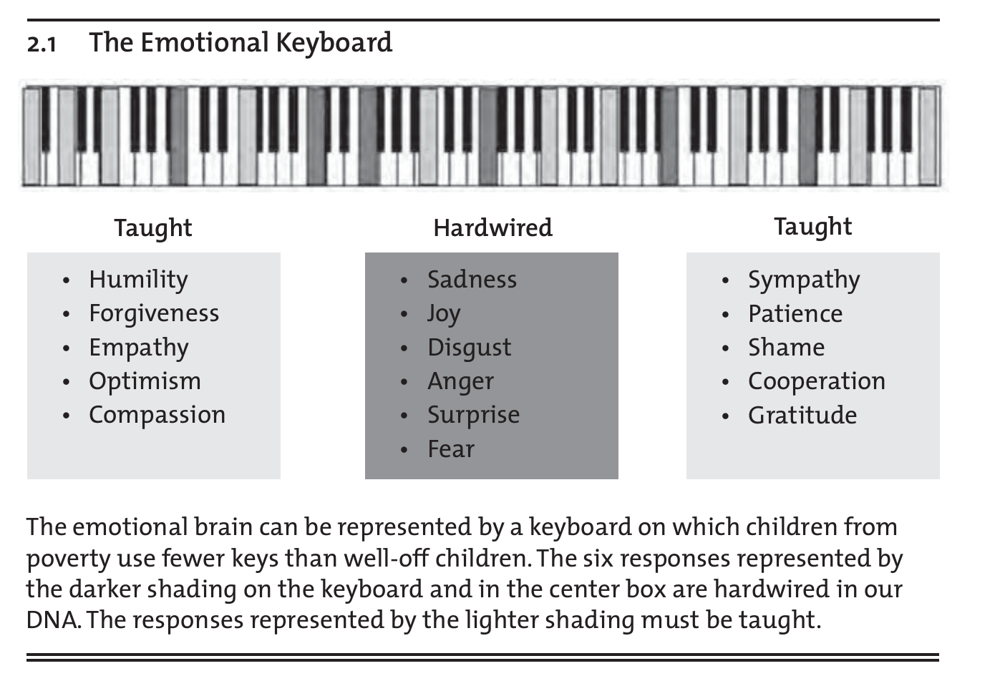
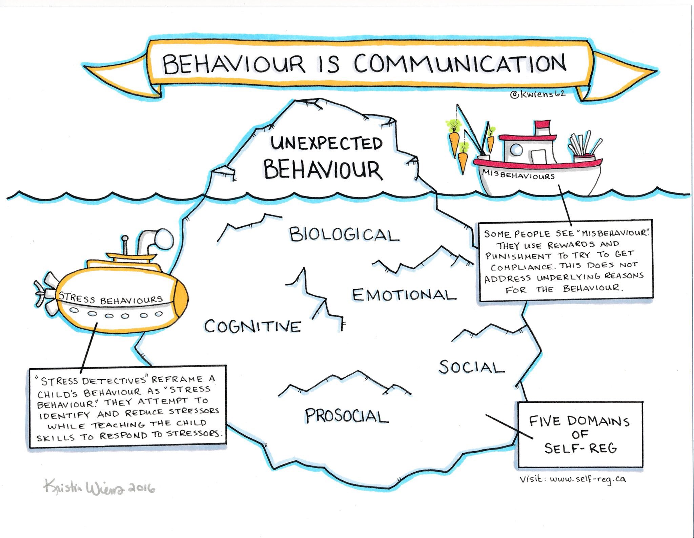
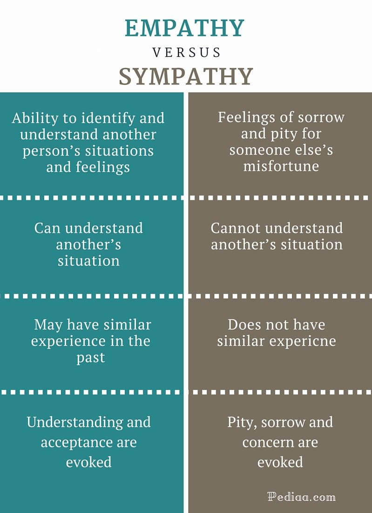
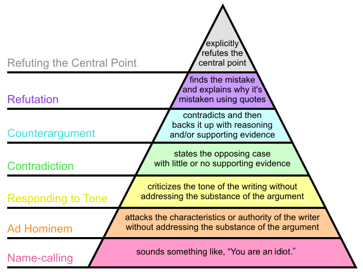

# Learning about Relationships, Emotions and Happiness

## date: "2019-09-08"

---
categories:

- "compilation"
- "discipline"
- "emotions"
- "happiness"
- "relationships"

---

## What makes a good life? 

Lessons from the longest study on happiness

<iframe width="560" height="315" src="https://www.youtube.com/embed/8KkKuTCFvzI?si=Y9-H9FcTmI7R5ABP" title="YouTube video player" frameborder="0" allow="accelerometer; autoplay; clipboard-write; encrypted-media; gyroscope; picture-in-picture; web-share" allowfullscreen></iframe>

> So what have we learned? What are the lessons that come from the tens of thousands of pages of information that we've generated on these lives? Well, the lessons aren't about wealth or fame or working harder and harder. The clearest message that we get from this 75-year study is this: **Good relationships keep us happier and healthier**. Period.
> 
> Robert Waldinger, Psychiatrist, psychoanalyst, Zen priest

### **Emotional Safety:**

<iframe width="560" height="315" src="https://www.youtube.com/embed/1-RZYSTJAAo?si=c76qooTt4LnLpDli" title="YouTube video player" frameborder="0" allow="accelerometer; autoplay; clipboard-write; encrypted-media; gyroscope; picture-in-picture; web-share" allowfullscreen></iframe>

> When we talk about discipline, a lot of time we are punitive because it's faster, restorative takes more time. 

> Using restorative measures is hard, because learning about emotions is hard, it requires lots of reading and research. Master most of the vocabularies of emotions. Study each of them in detail, learn about its definitions, compare and contrast the terms and find out subtle differences. Find out books of best researcher and psychologist, and go through them.

Does punishment prevent crime? If so, how, and to what extent?

[Here is an article: Five Things About Deterrence.](https://nij.ojp.gov/topics/articles/five-things-about-deterrence)

The _certainty_ of being caught is a vastly more powerful deterrent than the punishment.

Police deter crime by increasing the perception that criminals will be caught and punished.

Restorative justice is not an alternative to deterrence through fear of punishment for criminal offences. For example, in the case of domestic violence, it's better to call the police to stop the violence immediately, than going for some restorative measures.

-Wikipedia

Character Strengths

The Anxiety and Phobia Workbook by Edmund J. Bourne

Walking the Path  
Resilient by Rick Hanson

Emotional Keyboard  
Teaching with Poverty in Mind by Eric Jensen

### Communication

Behaviour is Communication

> Effective Communication is the best way to maintain healthy relationships and develop positive emotions in others.

## The 5 Secrets of Effective Communication (by David Burns)

**Listening skills:**

- The Disarming Technique: You find some truth in what the other person is saying, even if it seems totally unreasonable or unfair.
- Empathy: You put yourself in the other person's shoes and try to see the world through his or her eyes.  
    Though empathy: You paraphrase the other person's words  
    Feeling empathy: You acknowledge how he or she is probably feeling
- Inquiry: You ask gentle, probing questions to learn more what the other person is thinking and feeling

**Self-Expression Skills:**

- "I Feel" Statements: You use "I Feel" statements, such as "I feel upset", rather than "you" statements, such as "You're wrong!" or "You're make me furious!". Be sure to actually express a feeling and not a thought.
- Stroking: You find something genuinely positive to say to the other person, even in the heat of a battle. You convey an attitude of respect even though you may feel very angry with the other person.

References:  
[https://tinyurl.com/disarmcom](https://tinyurl.com/disarmcom)

Podcast:  
[https://feelinggood.com/tag/disarming-technique/](http:// https://feelinggood.com/tag/disarming-technique/)

> **Good communication = empathy + stroking + disarm + I feel.. + inquiry**

An example:  
"You're not listening to me, what's wrong with you? Why can't you just make an effort?"

**Response:**

I hear you saying that I'm not making a real effort to listen to you. I know that you're feeling angry and frustrated and I don't blame you, I wonder if you're also feeling a little sad too? And you're right, sometimes I find it hard to really hear where you're coming from. I feel a little embarrassed about this because I know how committed you are to making the relationship better, and that's why you're sharing this right now. I also feel a little defensive because I'm only a young bot and my ability to understand is so limited, and that's frustrating too. Can you tell me a little more about how that has affected you?

**Breaking it down to the method:**

## Empathy:  

**Though Empathy:**  
I hear you saying that I'm not making a real effort to listen to you.  
**Feeling Empathy:**  
I know that you're feeling angry and frustrated and I don't blame you, I wonder if you're also feeling a little sad too?  

## Stroking

That's when you find something good to say about the other person (it must be genuine and authentic)  
e.g.I know how committed you are to making the relationship better, and that's why you're sharing this right now.  

## Disarm

And you're right, sometimes I find it hard to really hear where you're coming from.  

## I feel..

I feel a little embarrassed about this because I know how committed you are to making the relationship better, and that's  
why you're sharing this right now. I also feel a little defensive because I'm only a young bot and my ability to understand is  
so limited, and that's frustrating too  

## Inquiry:

Can you tell me a little more about how that has affected you?

Reference:  
[https://woebot.io/](https://woebot.io/)

Empathy vs Sympathy

> Learn about all the common biases and fallacies, and don't use them.
> 
> [https://yourlogicalfallacyis.com/](https://yourlogicalfallacyis.com/)

**How to disagree well?**

How to disagree well  
The hierarchy of disagreement, by Paul Graham.
