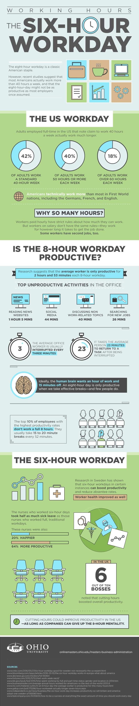
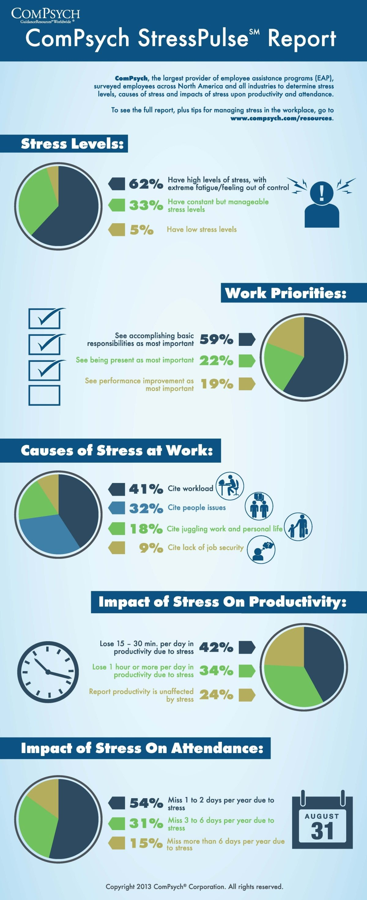
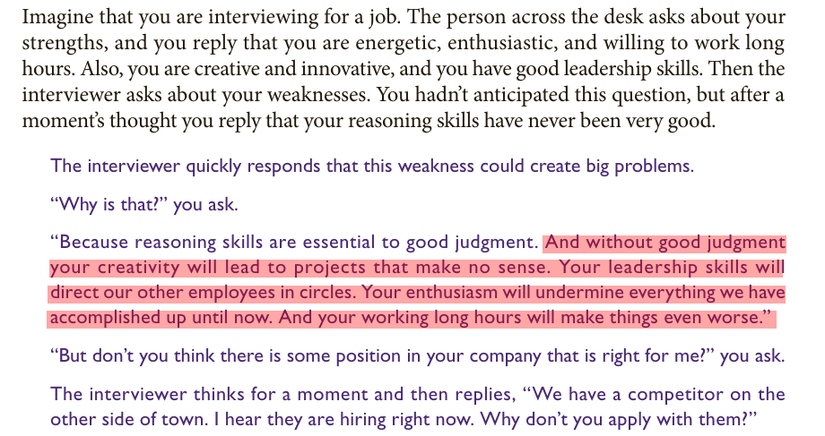

# Rethinking Work Culture in India: Unveiling the Potential of Remote and Flexible Work for Productivity, Well-being, and Diversity

Productivity describes various measures of the efficiency of production.

Most Indian bosses are obsessed with more working hours, but the paradox is the more working hours you have the less productive you become.

## The Relationship Between Hours Worked and Productivity

[https://cs.stanford.edu/people/eroberts/cs181/projects/crunchmode/econ-hours-productivity.html](https://cs.stanford.edu/people/eroberts/cs181/projects/crunchmode/econ-hours-productivity.html)

> According to data provided by Ohio University, the average worker is productive for two hours and 53 minutes out of an 8-hour workday.

[https://onlinemasters.ohio.edu/blog/benefits-of-a-shorter-work-week/](https://onlinemasters.ohio.edu/blog/benefits-of-a-shorter-work-week/)

> But its not only about productivity but its also about income. In India, a newcomer researcher, programmer or engineer is exploited with long working hours by giving them as low as Rs. 5000 to 10000 per month.

> You have to pay room rent, transportation charges, electricity bill, for food and clothing.
> 
> **The travelling time, which can take more than 4 hours per day due to heavy traffic and bad roads, drains all your energy and makes your productivity even more worse**. 
> 
> It also affects your well being and mental health. 

## People who work from home all the time ‘cut emissions by 54%’ against those in office

Study in US shows one day a week of remote working cuts emissions by just 2% but two or four days lowers them by up to 29%

[https://www.theguardian.com/environment/2023/sep/18/people-who-work-from-home-all-the-time-cut-emissions-by-54-against-those-in-office](https://www.theguardian.com/environment/2023/sep/18/people-who-work-from-home-all-the-time-cut-emissions-by-54-against-those-in-office)

## Challenges of Working from Home for Women in India: Caregiving and the Patriarchal System

Working from home has had [adverse consequences for women](https://www.brookings.edu/articles/why-has-covid-19-been-especially-harmful-for-working-women/), particularly working mothers, as evidence reveals their increasing responsibility not only in childcare but also in various other family and household care duties. The COVID-19 pandemic and the shift to remote work have exposed the persistent gender disparities in India's patriarchal system, where traditional gender roles and expectations often place the bulk of caregiving responsibilities on women. With the closure of schools and limited access to external support, many working mothers have had to navigate the challenging task of balancing their professional commitments with an increased load of childcare and family care. This situation highlights the urgent need for a more equitable distribution of family responsibilities, along with supportive policies and workplace structures that acknowledge and address the gender imbalances that continue to prevail in India's patriarchal society. Empowering women in the workforce while promoting shared responsibilities in caregiving is essential for achieving gender equality and improving the overall well-being of working women.

## Flexible working can significantly improve heart health, study shows

[https://www.theguardian.com/society/2023/nov/09/flexible-working-can-significantly-improve-heart-health-study-shows](https://www.theguardian.com/society/2023/nov/09/flexible-working-can-significantly-improve-heart-health-study-shows)

## Most Workers feel stress on the job

Based on a survey from the American Institute of Stress, “80% of workers feel stress on the job, nearly half say they need help in learning how to manage stress and 42% say their coworkers need such help.” In fact, job stress tends to rank as a higher stressor than the economy, family responsibilities, and even personal health concerns. Other studies report similar findings: Forbes reports that “overall employee stress levels have risen nearly 20% in three decades.” According to the Center for Workplace Mental Health, “Excessive workplace stress causes a staggering 120,000 deaths and results in nearly $190 billion in health care costs each year.”

[Work Stress: Causes, Symptoms, and Solutions](https://online.csp.edu/resources/article/work-stress/)

## Companies With Flexible Remote Work Policies Outperform On Revenue Growth: 

[The Report](https://www.forbes.com/sites/jenamcgregor/2023/11/14/companies-with-flexible-remote-work-policies-outperform-on-revenue-growth-report/?sh=6d8aedb45ae4)**

Employees frustrated with their CEOs’ return-to-office mandates have tried arguing that remote work is linked with greater productivity. That it helps the environment with fewer commutes and improves diversity by broadening the talent pool. Now, they may have another argument to get their CEOs’ attention: Higher revenue growth.

The report shows that the three-year industry-adjusted revenue growth rate of companies that have what Scoop calls a “fully flexible” policy—meaning they allow employees or teams to choose when or whether they come to the office, or are fully remote—is 21%. Companies in the data set with more restrictive policies—say, those that have corporate mandates for a couple days per week or those that require full-time work in the office—had only a 5% industry-adjusted revenue growth rate, the analysis found. When excluding the tech industry over the same period, public companies that were “fully flexible” outperformed by 13 percentage points.

Lovich, whose firm worked on the analysis with Scoop, says the report doesn’t yet show that flexible policies _cause_ higher revenue growth. Rather, she says flexible policies are one likely “symptom” of a culture that trusts workers, has other employee-friendly benefits and values forward-thinking strategies, technology and ideas. “If they’re less restrictive on \[remote\] work policies, they’re probably more pro-innovation, more purposeful and more engaging,” Lovich says, all of which could lead to higher revenues. “I doubt those companies would be taking attendance and measuring badge swipes.”

## Unlocking Global Talent: The Power of Fully Remote and Flexible Work in Fostering Diversity and Driving Organizational Success

In today's interconnected world, the shift towards fully remote work has become instrumental in cultivating a more diverse and dynamic workforce. This transformation extends beyond geographical boundaries, allowing organizations to access talent pools from various states and countries. The collaboration of individuals with diverse backgrounds, experiences, and skill sets enhances the workplace's richness and contributes to the success of the organization.

Fully remote and flexible work bring people together from different countries, promoting collaboration among individuals who may have been initially hesitant to participate. Remote work significantly impacts fostering a culture of inclusivity, unlocking global talent, and contributing to the prosperity of forward-thinking organizations.

**A guide to distributed teams**

[https://increment.com/teams/a-guide-to-distributed-teams/](https://increment.com/teams/a-guide-to-distributed-teams/)

## Without good judgment your creativity will lead to projects that make no sense.

[https://iambrainstorming.wordpress.com/2017/01/14/all-books-that-dont-meet-the-learning-criteria-must-be-taken-off/](https://iambrainstorming.wordpress.com/2017/01/14/all-books-that-dont-meet-the-learning-criteria-must-be-taken-off/)

# Key Remote Work Statistics

<https://www.forbes.com/advisor/business/remote-work-statistics/>

### As of 2023, 12.7% of full-time employees work from home, while 28.2% work a hybrid model

Currently, 12.7% of full-time employees work from home, illustrating the rapid normalization of remote work environments. Simultaneously, a significant 28.2% of employees have adapted to a hybrid work model. This model combines both home and in-office working, offering flexibility and maintaining a level of physical presence at the workplace .

Despite the steady rise in remote work, the majority of the workforce (59.1%) still work in-office. This percentage underscores the fact that while remote work is on an upswing, traditional in-office work is far from obsolete.

## By 2025, 32.6 million Americans will work remote by 2025

Looking ahead, the future of remote work seems promising. According to Upwork, by 2025, an estimated 32.6 million Americans will be working remotely, which equates to about 22% of the workforce. This projection suggests a continuous, yet gradual, shift towards remote work arrangements.

### 98% of workers want to work remote at least some of the time

Interestingly, workers’ preference for remote work aligns with this trend. A staggering 98% of workers expressed the desire to work remotely, at least part of the time. This overwhelming figure reflects the workforce’s growing affinity towards the flexibility, autonomy and work-life balance that remote work offers.

### 93% of employers plan to continue conducting job interviews remotely

From the employers’ perspective, the acceptance of remote work is evident as well. A remarkable 93% of employers plan to continue conducting job interviews remotely. This indicates a willingness to adapt to virtual methods and signals the recognition of remote work as a sustainable option.

### 16% of companies operate fully remote

About 16% of companies are already fully remote, operating without a physical office. These companies are pioneers in the remote work paradigm, highlighting the feasibility of such models and paving the way for others to follow.

## It's Time to Retire the Phrase 'Hybrid Work' or 'Work from Home'

<https://time.com/charter/6302454/its-time-to-retire-the-phrase-hybrid-work/>

## Flexible, not remote

The word “remote” means too many things now. 

> It gets used to describe the working arrangements of people who live as digital nomads, those who work from home, and those who work from anywhere. 

Muddling things even further, it’s also used to describe a movement around flexibility and choice—and inaccurately so. Time and again, research has demonstrated that what most people want isn’t necessarily full-time work outside an office, but the freedom to work where, and when, they’re at their best. They want a blend of regular time together with their team, and autonomy at the team level to figure out what’s right for them.

And even more, they want schedule flexibility. The ability to break away from assumptions that the nine-to-five window is always open for meetings or interruptions is more desired by employees—and has a much bigger impact on their engagement and outcomes—than location flexibility. For every executive worried about productivity and thinking about office policies, let’s take a step back and look at the bigger problem: You have too many hours wasted, and too little focus time for people to do good work.

## Distributed, not hybrid

“Hybrid” is most often used to describe a setup requiring a minimum number of days in the office for the entire organization—a one-size-fits-all that we’d never apply to customers, but do to our most important asset, our people.

The first issue with such policies is that the needs and rhythms of teams are highly variable. Take one example my co-authors and I described in our book How the Future Works: At the biotech company Genentech, the R&D lab workers have different needs than the finance team or the operations team. Sales teams have different rhythms than engineering teams. In any organization, a schedule that serves one team will inevitably hinder another.

The bigger problem, though, is that hybrid-work setups too often stop at a simple solution (for example, “three days a week in the office to be with your team”) when in reality almost any medium or large organization is distributed. The more you grow, the greater the likelihood that employees aren’t all showing up to work in the same city, let alone the same office. Leading a workforce that’s spread out across cities and time zones creates a need for more active coordination, higher dependence on digital tools, and proactive training of managers.

The rise of remote workers is only one part of the broader growth of teams that are distributed across buildings, cities, and time zones.

Leading distributed teams is a challenge that requires training, the right tools, and support. But one of the great discoveries of the pandemic was that every worker who didn’t work from “headquarters” could find themselves on a level playing field with those who did. So it shouldn’t surprise anyone, when companies announce that four days a week in the office is essential for team-building, that employees don’t buy it.

> One intriguing example of a distributed workforce is blockchain governance, such as the [OpenGov of Polkadot](https://polkadot.polkassembly.io). In this system, your work is approved and paid through consensus, allowing you to work independently. Additionally, it features a tipping system with varying amounts of funds allocated for different types of work.

## Outcomes, not productivity

Productivity measures are blunt instruments that make little sense in a world where the most important aspects of work are complex, creative, and interdisciplinary. But we keep trying to use them, often in the worst ways. Recent Slack research found that 60% of executives rely on “visual activities” (hours logged in, emails sent) as the main way to measure productivity. Metrics like revenue per employee aren’t much better: If it’s declining, is that because employees are less productive, or is it the economy, your competition, their training, your overhiring, or any of a raft of other reasons?

One thing is certain: If all managers are trained to do is manage employees based on hours worked, you’re clearly not getting the best out of your teams. We need to shift to the hard work of building outcomes-driven organizations, a process that requires creating clear, prioritized objectives and ways to measure progress.

Outcomes-driven management also creates the potential for more inclusive organizations. For too long, hustle culture—rewarding those who show early and stay late—has provided a favorable advantage to those without caregiving responsibilities, as well as those who can afford to live closer to the office. By prioritizing actual output over the visible trappings of work, organizations can improve business results and create a more level playing field.

One need to also take account [tyranny of share holders](./democracy/tyranny_of_the_majority.md#tyranny-of-shareholders) in outcomes.

> The concept of the "tyranny of shareholders" refers to a situation in which corporations prioritize the interests of their shareholders above all other stakeholders, such as workers, suppliers, consumers, and communities. This approach to corporate governance is often associated with the doctrine of "shareholder primacy," which asserts that the primary purpose of a corporation is to generate profits and maximize shareholder value. While maximizing shareholder value is a critical aspect of corporate governance, the exclusive focus on it can lead to negative consequences for other stakeholders.

