# Road Planning for Cities

## date: "2023-05-27"

---
categories:

- "city-planning"

---

## Cycle Lane in Median

<video width="100%" controls preload="none" poster="./images/car_lane_median.png">
  <source src="https://42683ff2b1a2ac5ad2fef0ee01995d78.ipfs.4everland.link/ipfs/bafybeigg3pec6krwxsmevdq3ucaih5wspxn3342gqkvdw26veoqceozqpu/Road%20Planning.mp4" type="video/mp4">
</video>

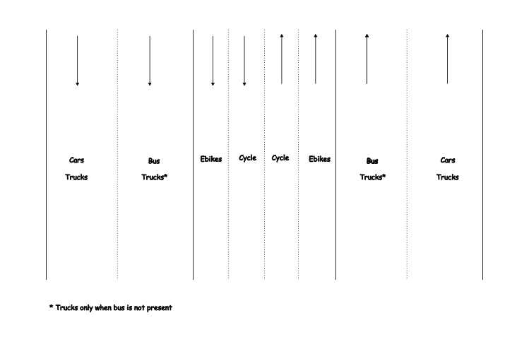

> A cycle lane located in the median effectively addresses the issue of encroachment, such as unauthorized parking of cars and pedestrians using the cycle lane for walking.
>
> However, the presence of a cycle lane in the median poses a challenge when cyclists need to exit the lane to reach destinations such as markets or homes. To mitigate this issue, it is essential to construct suitable traffic signals and bridges that facilitate safe transitions for cyclists.

### Few Problems and the Feasibility of Median Lanes vs. Side Lanes for Cycle Tracks

#### 1. Conflict with Hawking Zones
- If you provide dedicated hawking zones, there is a possibility that a customer might get distracted—say, enjoying the spice of a snack like Panipuri—and unintentionally step into the cycle corridor.
- While educating hawkers about the importance of keeping cycle lanes clear is possible, it is impractical to educate every customer not to stray into the lane. How can such conflicts be minimized?

#### 2. On-Street Parking Hazards
- On-street parking presents a risk: car users exiting their vehicles might inadvertently open doors into the path of cyclists, creating potential accidents.
- How does the design of cycle lanes address this hazard and ensure the safety of cyclists in such situations?

#### 3. Shade and Retail Visibility Conflict
- Segregated and dedicated cycle lanes alone are insufficient; shaded lanes are critical for usability, especially in hot climates.
- However, adding trees for shade might obstruct the visibility of retail outlets, leading to resistance from shopkeepers concerned about their livelihood.
- How can urban planners balance the need for shaded cycling lanes with the economic concerns of shopkeepers?

#### 4. Challenges from Continuous Road Development
- In India, the left side of roads is frequently dug up for utility work—electricity, water, or telecom installations—causing repeated disruptions.
- Median roads, in contrast, are rarely affected unless a major construction like a flyover is underway.

### Proposal: Median Cycle Lanes
- Cycle lanes positioned at the road median may be a better solution to address these conflicts.
- Median lanes minimize disruptions from hawking zones, on-street parking conflicts, and ongoing utility work.
- To provide access to side zones, well-designed intersections or crossing points can be included.

Would this approach mitigate these challenges effectively?

<video controls width="500">
    <source src="https://42683ff2b1a2ac5ad2fef0ee01995d78.ipfs.4everland.link/ipfs/bafybeielwy4dwhok3wjp5anrf3oaps47tilthie6depxnfpu5wm2r4oj4i" type="video/mp4">
    <!-- Add additional source elements for different video formats if needed -->
    Your browser does not support the video tag.
  </video>

[Video Link](https://42683ff2b1a2ac5ad2fef0ee01995d78.ipfs.4everland.link/ipfs/bafybeielwy4dwhok3wjp5anrf3oaps47tilthie6depxnfpu5wm2r4oj4i)

## Cycle lanes on the sides and unauthorized parking

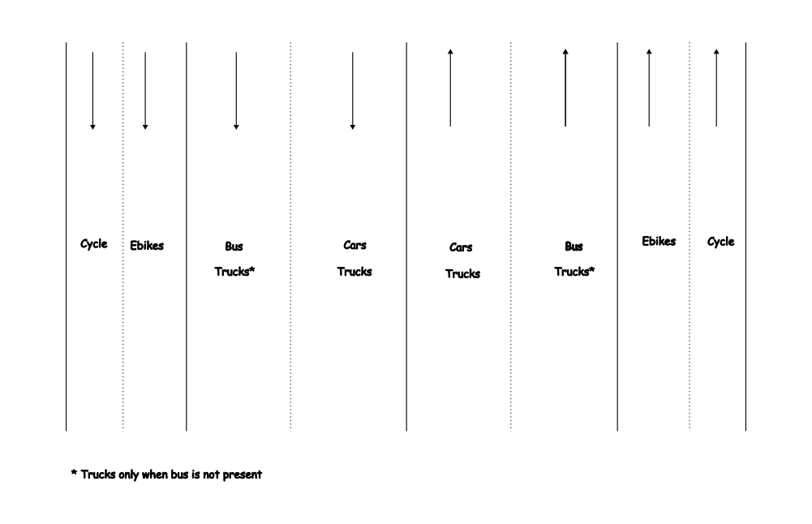

> An alternative approach to consider is the implementation of cycle lanes on the sides of national highways, which may not be suitable for within cities. It's important to note that unauthorized parking is primarily a concern within cities, rather than on highways.
> indicates trucks only when bus is not present, Trucks can operate during nighttime when there is reduced traffic from buses and cars.

In India we do need a motorcycle/ebikes lane as motorcycle are also efficient modes of transport like cycling and one in three households in India own motorcycle. Also, due to hot weather of India, cycling can be exhausting. Without a motorcycle lane problem will be like this:

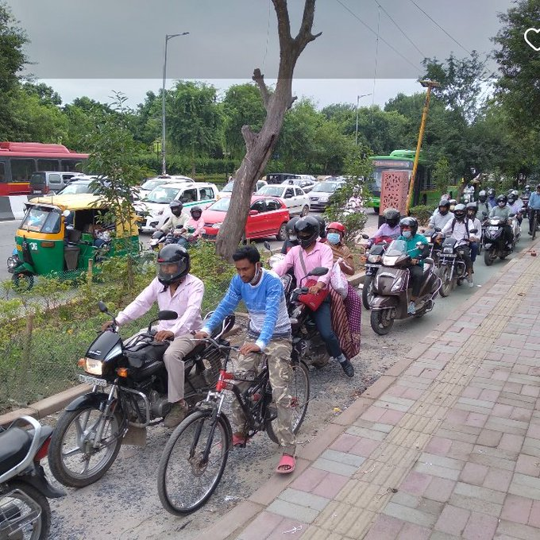

## Bicycles, Hot Weather and 15 mins cities

In India, bicycles face challenges when it comes to widespread adoption due to the hot weather. You can start perspiring within just 5-10 minutes of riding. India's climate differs significantly from that of the Netherlands, where cycling is more popular. Additionally, winters in India now last less than two months a year due to climate change. However, you can still consider using electric cycles (e-cycles) and electric bikes (e-bikes) as eco-friendly alternatives to cars.

You can conduct a small experiment. I walked for 2.5 kilometers at 10 AM when the sun was shining. I was almost completely exhausted due to the humidity and hot weather. However, I can walk in the early morning before 7 AM or in the evening after 6 PM.

So, you can still take walks in the early morning and evening, even during the hot summer. This habit can greatly benefit your mental and physical health.

Additionally, constructing [15-minute cities](https://www.huckmag.com/article/what-its-actually-like-living-in-a-15-minute-city) can address the issue of exhaustion, as it minimizes the need for extensive travel by keeping destinations within a short distance.

One can also construct cycling and pedestrian lanes with integrated solar panels on top, providing shade to the lanes. This not only protects you from the sun but also generates renewable and non-polluting energy.

### Cycle track with integrated solar panels in Hyderabad

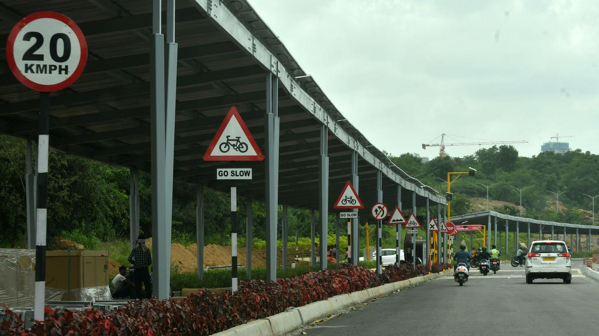

## Green Canopy: The Impact of Urban Trees on City Environments

We can also have a tree canopy on the roadside to decrease the temperature. Due to the continuous widening of roads, we cut down trees instead of planting them. We also hardly provide them enough time to grow, widening the roads again and cutting them down.

> Compared to continuous urban fabric, land surface temperatures (LSTs) observed for urban trees are on average 0-4 K (or 0-4°C) lower in Southern European regions and 8-12 K (8-12°C) lower in Central Europe. Treeless urban green spaces are overall less effective in reducing LSTs, and their cooling effect is approximately 2-4 times lower than the cooling induced by urban trees.
>
>Trees influence urban climate primarily via shading and transpiration and also via albedo. Shading can strongly reduce daytime LSTs and air temperature.
>
> *- [The role of urban trees in reducing land surface temperatures in European cities](https://www.nature.com/articles/s41467-021-26768-w)*

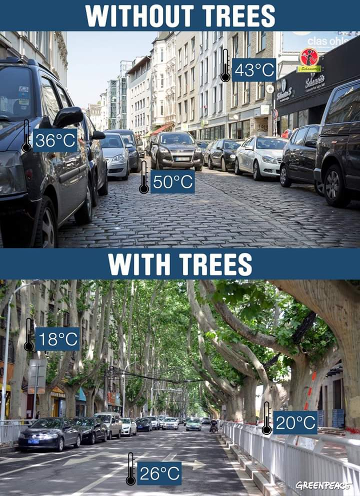

## Why are bike/cycle lanes empty?

> Next time someone criticizes an "empty bike lane," remind them it because they’re efficient.

This efficiency contrasts with the congestion and space consumption often associated with cars. The critique should be reframed not as a flaw in the bike lane but as an opportunity to highlight the drawbacks of traditional car-centric infrastructure.

## Should we consider banning cars?

It's not about adopting an all-or-nothing approach, but rather the imperative need to significantly reduce car usage with specific exceptions. For instance, we could limit private car use, allowing only public cars for booking, especially during emergencies. Exceptions can also be made for disabled individuals who rely on cars for mobility.

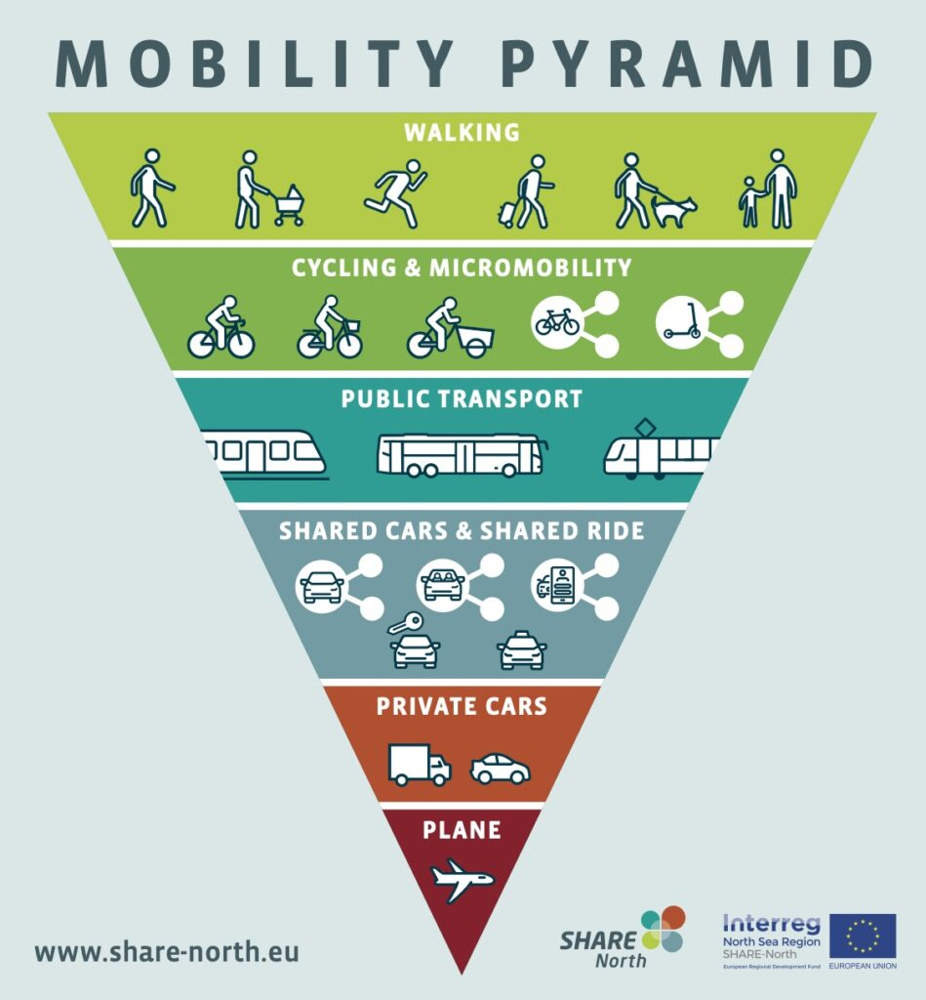

> Disabled people are actually less likely to drive than nondisabled people, and more likely to get around by walking, rolling, or taking public transit. Car-heavy cities are also disproportionately dangerous for disabled individuals.

[Do Car-Free Zones Hurt Disabled People? We Asked Experts.](https://www.motherjones.com/environment/2024/12/car-free-disability-congestion-walkable-cities/)

## These Animated Videos Show Just How Much Space Cars Waste In Our Cities

<iframe width="560" height="315" src="https://www.youtube.com/embed/06IjfbqdnNM?si=O2wC4JqZqTjUrVld" title="YouTube video player" frameborder="0" allow="accelerometer; autoplay; clipboard-write; encrypted-media; gyroscope; picture-in-picture; web-share" allowfullscreen></iframe>

[https://www.fastcompany.com/3063344/these-animated-videos-show-just-how-much-space-cars-waste-in-our-cities](https://www.fastcompany.com/3063344/these-animated-videos-show-just-how-much-space-cars-waste-in-our-cities)

## Can't wait for the road to be widened

> One thing we know for SURE — building and widening highways ALWAYS succeeds in helping sell more cars, gas and suburban sprawl; burning more public budgets; and increasing GHG emissions. So if THOSE are your goals, it’s the perfect thing to do.
>
> Just don’t expect it to reduce traffic.
>
> -Brent Toderian

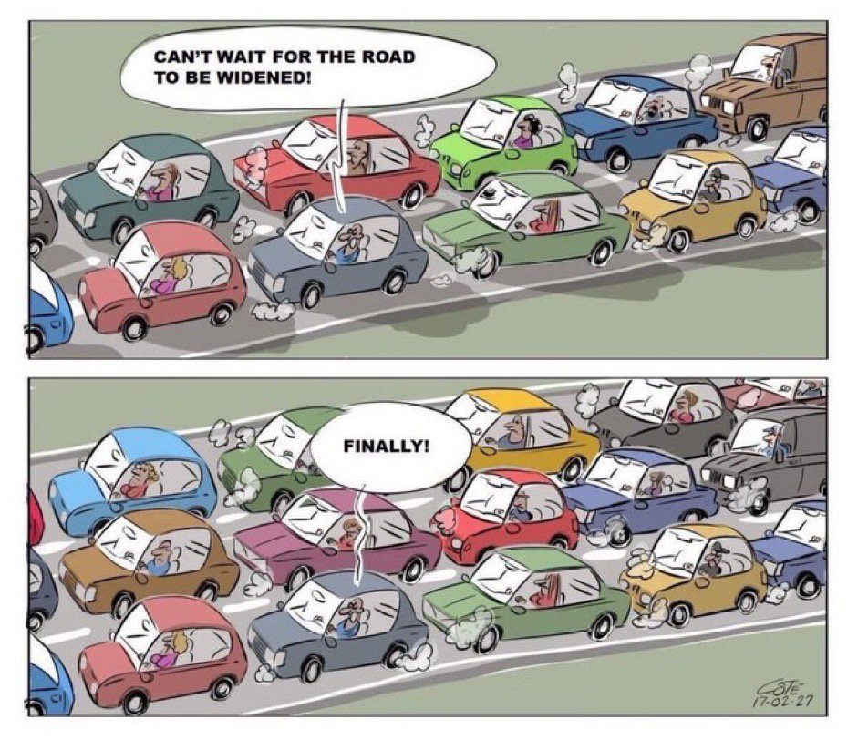

## City Traffic Sucks! They Should Widen the roads

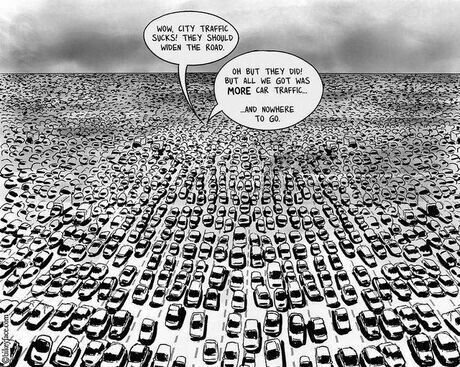

## 🚌 150 people overtaking 50 people. Separating the lane is not hard.

<video width="100%" controls preload="none" poster="./images/bus_lane.png">
  <source src="https://42683ff2b1a2ac5ad2fef0ee01995d78.ipfs.4everland.link/ipfs/bafybeiddh2kuqvg5kg2trcm6iquynmlx2tobtagqeczcvdu4zej3hdlhwq/Bus%20vs%20Cars.mp4" type="video/mp4">
</video>

## Car free cities are good for local businesses

For local businesses, car-free areas are very beneficial, as people using alternative transportation are more likely to shop locally and are more loyal to retailers. Even though they tend to not spend as much as car drivers, they visit the shop more frequently. A 2016 study of over 100 cities showed that pedestrian-only streets increased retail sales by around 49%. As many city centres are dying, car-free measures should be considered much more frequently.

[Citychangers article](https://citychangers.org/the-case-for-car-free/)

## Concrete roads for cars create flooding

Traditional concrete roads are impermeable, meaning water cannot pass through them, causing rainwater to accumulate on the surface and potentially lead to flooding in cities. Some approach like constructing local roads with tiles over a sand base is more permeable. Water can seep through the gaps between the tiles and be absorbed into the underlying sand, thus helping to manage and reduce the risk of flooding by allowing water to infiltrate into the ground.

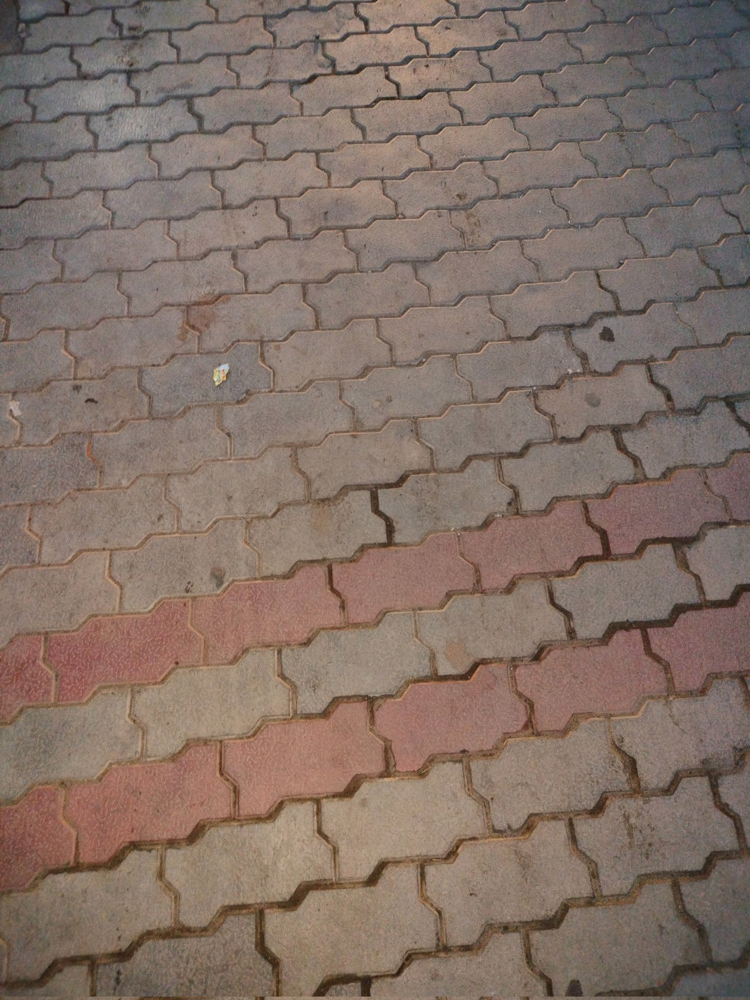

Tiles over sand. A simpler solution to the water logging problem, without the use of any advanced technology

Some advanced technology too exists, to make roads permeable to water, more research needs to be done about its practicality.

This 'thirsty' concrete absorbs 880 gallons of water a minute — here's how it works

[https://www.businessinsider.com/how-magical-concrete-absorbs-water-2015-9?IR=T](https://www.businessinsider.com/how-magical-concrete-absorbs-water-2015-9?IR=T)

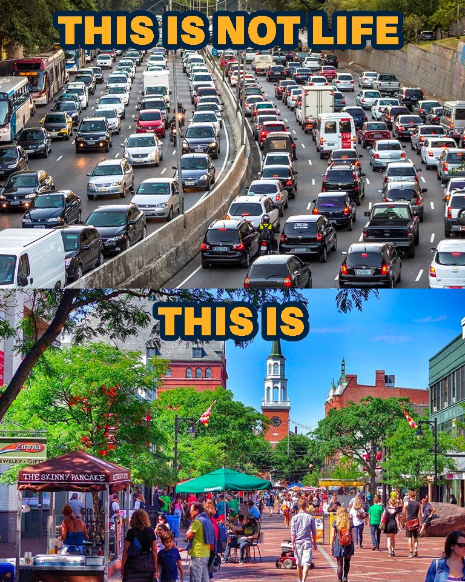

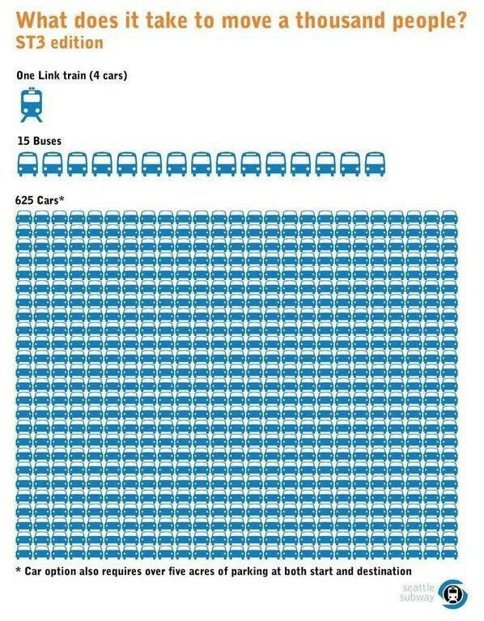

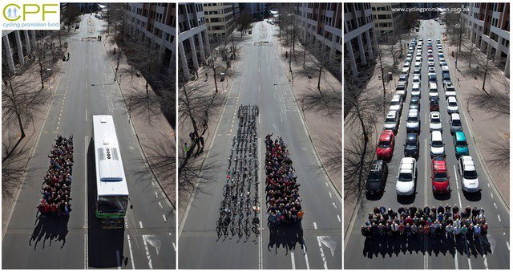

## Traffic in Gurgaon

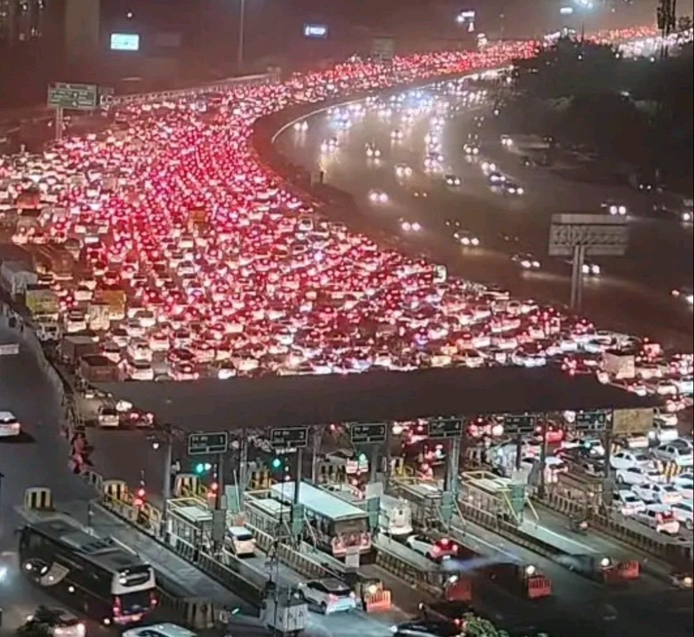

## Traffic in Hyderabad IT corridor

  <video controls height="500">
    <source src="https://42683ff2b1a2ac5ad2fef0ee01995d78.ipfs.4everland.link/ipfs/bafybeihvp7sphelthx5pvbycljfqg6jvkfnek2ledkzpodj2ddcsxagiky" type="video/mp4">
    <!-- Add additional source elements for different video formats if needed -->
    Your browser does not support the video tag.
  </video>

## Get your self a car, looser. What do you think you are?

<video width="100%" controls preload="none" poster="./images/bike_rails.png">
  <source src="https://42683ff2b1a2ac5ad2fef0ee01995d78.ipfs.4everland.link/ipfs/bafybeif2zk6albeippcaugynwclhsiakl7t3eqcrcoi2vbbqunffphlfvq/get%20a%20car%20looser.mp4" type="video/mp4">
</video>

## Effect of Media

> Picture a scenario where electric vehicles (EVs) in various countries incur a mere 5% tax, while cycles face a higher tax rate of 12%. Notably, electric cars benefit from subsidies and climate financing, whereas cycles, including e-cycles, do not enjoy any financial support. Economic policies lacking thoughtfulness, influenced by the Bandwagon effect—a narrative perpetuated by capitalists, advertisers, and the media, asserting that EVs and driverless cars are the ultimate solutions— inadvertently result in undesirable consequences.

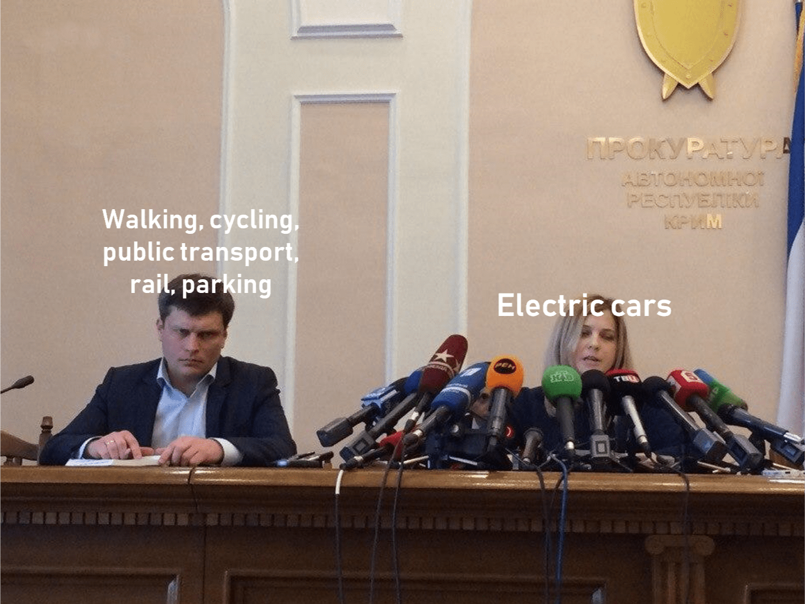

Here is a booklet for Street design manual:

[https://www.oslo.kommune.no/getfile.php/13441080-1646147194/Tjenester%20og%20tilbud/Plan%2C%20bygg%20og%20eiendom/Byggesaksveiledere%2C%20normer%20og%20skjemaer/Gatenormal%20og%20normark/Gate-%20og%20veinormaler/Street-design-manual\_ENG.pdf](https://www.oslo.kommune.no/getfile.php/13441080-1646147194/Tjenester%20og%20tilbud/Plan%2C%20bygg%20og%20eiendom/Byggesaksveiledere%2C%20normer%20og%20skjemaer/Gatenormal%20og%20normark/Gate-%20og%20veinormaler/Street-design-manual_ENG.pdf)

## [5 steps to making better cities](https://www.fastcompany.com/90278237/5-steps-to-making-better-cities)

Any city can push itself to be better, but they usually go through this learning curve first.

I’d rather have cities doing the right thing badly (at first), than continuing to do the wrong thing better.

## Accidents due to traffic: Addressing Road Safety

Approximately 1.5 lakh people die due to road accidents every year in India. While one may attribute road accidents to traffic, narrow roads, and bad driving, the main underlying reason is the presence of heavy vehicles, particularly cars, which occupy a significant amount of space, leaving little room for pedestrians and bikes. Car-centric roads also require [more maintenance](./economics/dismissing_return.md), increasing the likelihood that roads will not be repaired, so more accidents. By promoting the use of public transport, such as buses, accident rates can be drastically reduced.

## How Cars are Destroying India?

<iframe width="560" height="315" src="https://www.youtube.com/embed/XgCPOrRKiOM?si=hhj-zri9ZfzDM7_K" title="YouTube video player" frameborder="0" allow="accelerometer; autoplay; clipboard-write; encrypted-media; gyroscope; picture-in-picture; web-share" allowfullscreen></iframe>

Dhruv Rathee effectively outlined the detrimental impact of cars, yet he took a softer stance on the idea of banning them. While he asserted that an immediate ban would harm the economy, he fell short of providing a thorough explanation.

Banning cars is not analogous to demonetization, where 99% of currency was eliminated, resulting in the loss of at least one million jobs—all for the deceptive rhetoric of combating black money. Although a car ban may pose challenges for the Indian automotive industry, the benefits far outweigh the potential harm. Even tech giants like Google and Facebook have undergone mass layoffs, but displaced employees often find alternative jobs. Prioritizing job preservation at the expense of environmental degradation and pollution reflects myopic/ short-sighted thinking. Employment opportunities can be created by investing in green infrastructure and [generating green jobs](https://www.weforum.org/agenda/2023/01/renewable-energy-transition-green-jobs/), like in the public transport sector, which includes the development of electric buses.

Furthermore, a complete ban may cause some discomfort, but practical solutions can be implemented. For instance, a system could be established through a mobile app, allowing individuals to apply for a limited number of car usage instances based on emergencies or specific reasons. Implementing a quota system, such as allowing cars to run 10-15 times every six months, and facilitating car rentals through the app, would address concerns while promoting responsible car usage.

Approximately 5-10 percent of the Indian population owns cars. Therefore, an immediate car ban is unlikely to impact 90% of the population, who rely on public transport and bikes. While public autos may increase, they too need regulation. The wealthy have become a societal disgrace, a trend supported by data indicating that the world's richest 10% contribute to half of the global carbon emissions.

## The Unsustainable Nature and High Cost of Car-Centric Infrastructure

Car-centric infrastructure, such as broad roads and flyovers, demands extensive investments from the government. This investment is often funded through national debt, placing a significant financial burden on the country. Moreover, these structures necessitate continuous maintenance to ensure their safety and functionality. Unfortunately, without proper upkeep, these roads become hazardous due to the formation of potholes and an increased risk of accidents.

In the long run, car-centric infrastructure fails to solve the traffic problem and can exacerbate other issues. The vast expanses of concrete impede water percolation, leading to flooding during heavy rainfall. Additionally, this infrastructure primarily benefits car owners, who predominantly belong to the higher-income bracket, while neglecting the needs of the majority of the population.

A more sustainable and equitable approach to transportation infrastructure would be to invest in public transport systems, such as efficient and affordable buses, trains, and metro systems. By doing so, the government can provide a reliable, cost-effective, and environmentally-friendly means of transportation for all citizens. This would not only alleviate traffic congestion but also contribute to a cleaner and healthier urban environment.

## Metro Trains vs. Buses: Where Should Government Invest for Better Urban Mobility?

#### How Indian Cities Failed Public Transport | A Quint Deep Dive

<iframe width="560" height="315" src="https://www.youtube.com/embed/JkNLUZa5INk?si=NbjS8SAGzd3Pc0J7" title="YouTube video player" frameborder="0" allow="accelerometer; autoplay; clipboard-write; encrypted-media; gyroscope; picture-in-picture; web-share" referrerpolicy="strict-origin-when-cross-origin" allowfullscreen></iframe>

The hesitance to adopt metro systems in many Indian cities can be attributed to several intertwined factors:

#### Short Trip Distances

The majority of commutes in Indian cities are under 10 km. For such distances, using a metro, which often involves multiple mode changes (e.g., taking an auto or bus to and from metro stations), becomes cumbersome.

For trips shorter than 15 km, the time and energy saved by the metro don't outweigh the convenience of direct door-to-door options like bikes, autos, or personal vehicles.

#### First and Last Mile Connectivity Issues

Commuters often face challenges in reaching the metro station and then traveling from the station to their final destination.

This adds extra time, cost, and effort, reducing the attractiveness of using the metro.

#### Radial and Distributed Urban Layouts

Unlike linear cities like Mumbai, which have concentrated travel corridors, most Indian cities have a radial and distributed structure.

This results in diverse travel patterns, with people commuting in various directions over shorter distances, making metro systems less efficient.

#### Preference for Private Vehicles

Rising incomes and an aspirational middle class have fueled private vehicle ownership. Cars and two-wheelers offer unmatched convenience and flexibility for short commutes.

Congestion exacerbates the problem, as even though roads are crowded, the number of passengers per vehicle remains low.

#### Metro's Limited Applicability

Metro systems excel in scenarios with long trip distances (15 km or more) and extremely high demand corridors (20,000–30,000 commuters in one direction during peak hours).

For cities with low trip distances and dispersed demand, metros aren't the optimal solution.

#### Public Transport Decline

Historically, many Indian cities had robust bus networks and other public transport systems. Over time, the rise of private vehicles and lack of investment in public transport infrastructure led to its decline.

As cities grew, public transport options failed to keep pace, pushing commuters towards personal vehicles.

#### Perceived Complexity

For many, the thought of switching between multiple modes—autos, metros, buses, and walking—is seen as time-consuming and exhausting compared to the simplicity of direct modes like personal vehicles or app-based bike rides.

#### Cost vs. Value

While metro rides might seem cost-effective, the overall journey cost increases when first and last-mile expenses are added. This, coupled with the effort involved, makes alternatives more appealing.

## How Can We Make Public Transport More Comfortable for People?

Making public transport more comfortable for passengers is essential to encourage its use and improve the overall commuting experience.

[Strategies to Make Public Transport Comfortable](./public_transport/comfortable_public_transport.md)

## Trams: The Ideal Urban Transport for Smaller Cities

For smaller cities, metro railways are often not cost-effective. However, trams can be a viable alternative. Trams are spacious and, unlike buses, are less likely to cause motion sickness due to their smoother and more stable ride. Additionally, trams run on electricity, which means they do not release fossil fuel emissions, making them an eco-friendly solution that helps reduce pollution.

Lithium-ion batteries are a scarce resource. Instead of subsidizing EVs, we should focus on expanding tram networks as a more sustainable alternative. Trams are an efficient replacement for cars, buses, and trucks. Trams can reach speeds of up to 80 km/h at longer distances but typically average around 20-25 km/h in built-up areas due to frequent stops and traffic conditions. Trams offer an efficient, long-term solution to urban transportation without the need for large battery supplies.

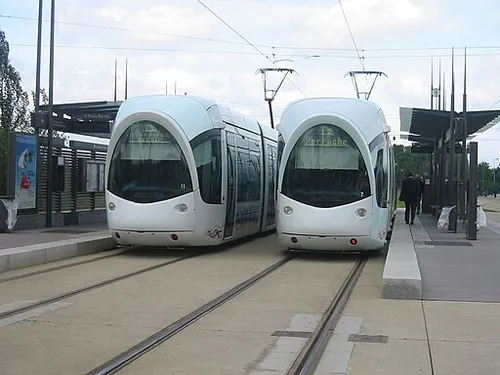

## Why your city needs a tram?

<iframe width="560" height="315" src="https://www.youtube.com/embed/QyNwBBzt2XU?si=JCNd18aTJ7X8Gxbe" title="YouTube video player" frameborder="0" allow="accelerometer; autoplay; clipboard-write; encrypted-media; gyroscope; picture-in-picture; web-share" referrerpolicy="strict-origin-when-cross-origin" allowfullscreen></iframe>

## Congestion pricing is a novel idea to fix traffic and encourage people to use public transport.

**Congestion pricing** is a system that charges drivers a fee for using certain roads during peak times. The goal is to reduce traffic congestion, improve air quality, and encourage the use of public transportation.

[What Is Congestion Pricing?](https://www.nrdc.org/stories/what-is-congestion-pricing)

Here are some key benefits:
1. **Reduced Traffic Congestion:** By charging drivers during peak hours, congestion pricing encourages people to travel at off-peak times or use alternative modes of transportation. This leads to faster travel times and less gridlock.

2. **Improved Air Quality and Public Health:** Reduced traffic lowers emissions of pollutants like nitrogen oxide and particulate matter. For example, in London, congestion pricing cut nitrogen oxide emissions by 13.5% and particulate matter by 15.5% in its first year, leading to better air quality and longer life expectancy. In Stockholm, childhood asthma hospital visits were nearly halved due to cleaner air.

3. **Economic and Social Equity:** Lower-income households, especially those near highways, are disproportionately affected by pollution-related health issues like asthma. Reducing traffic and emissions can improve health outcomes in these communities.

4. **More Profitable and Efficient Public Transport:** Reduced road congestion leads to faster and more reliable public transportation. The increased demand for public transit can make it more profitable, allowing for reinvestment in better services and infrastructure.

5. **Revenue Generation for Infrastructure:** The funds collected from congestion pricing can be used to improve public transportation, maintain roads, and invest in sustainable urban infrastructure.

In New York, congestion pricing is expected to deliver these benefits while also addressing health disparities in low-income neighborhoods, improving the overall quality of life.

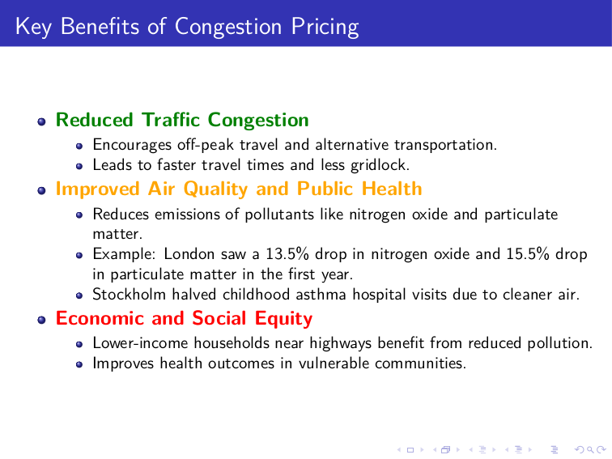

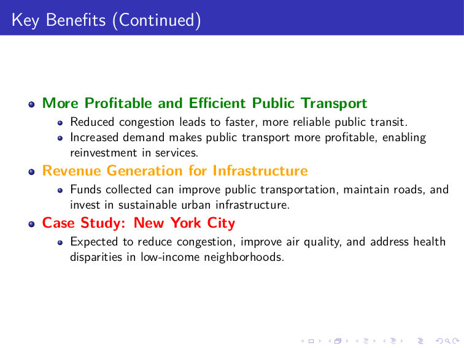
