# Road Planning for Cities

## date: "2023-05-27"

---
categories:

- "city-planning"
  
---

## Cycle Lane in Median 

<video width="100%" controls preload="none" poster="./images/car_lane_median.png">
  <source src="https://bafybeigg3pec6krwxsmevdq3ucaih5wspxn3342gqkvdw26veoqceozqpu.ipfs.w3s.link/Road%20Planning.mp4" type="video/mp4">
</video>

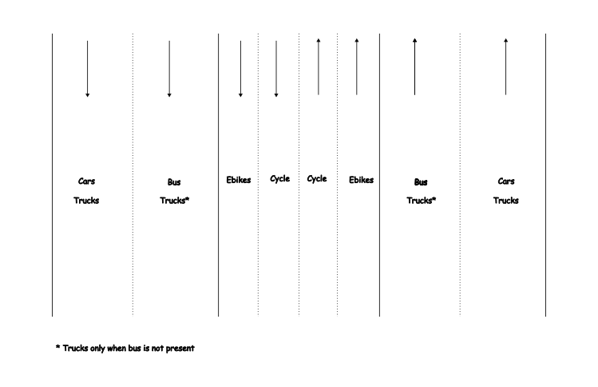

> A cycle lane located in the median effectively addresses the issue of encroachment, such as unauthorized parking of cars and pedestrians using the cycle lane for walking.
> 
> However, the presence of a cycle lane in the median poses a challenge when cyclists need to exit the lane to reach destinations such as markets or homes. To mitigate this issue, it is essential to construct suitable traffic signals and bridges that facilitate safe transitions for cyclists.

## Cycle lanes on the sides and unauthorized parking

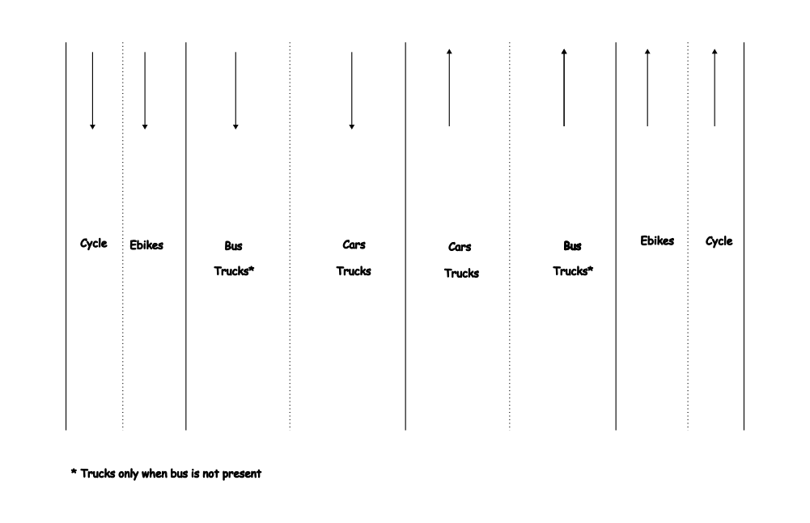

> An alternative approach to consider is the implementation of cycle lanes on the sides of national highways, which may not be suitable for within cities. It's important to note that unauthorized parking is primarily a concern within cities, rather than on highways.
> indicates trucks only when bus is not present, Trucks can operate during nighttime when there is reduced traffic from buses and cars.

In India we do need a motorcycle/ebikes lane as motorcycle are also efficient modes of transport like cycling and one in three households in India own motorcycle. Also, due to hot weather of India, cycling can be exhausting. Without a motorcycle lane problem will be like this:

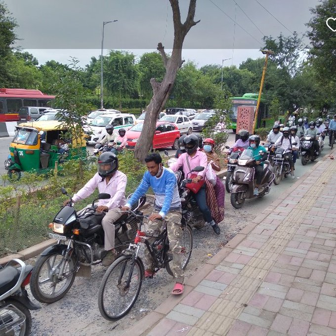

## Bicycles, Hot Weather and 15 mins cities

In India, bicycles face challenges when it comes to widespread adoption due to the hot weather. You can start perspiring within just 5-10 minutes of riding. India's climate differs significantly from that of the Netherlands, where cycling is more popular. Additionally, winters in India now last less than two months a year due to climate change. However, you can still consider using electric cycles (e-cycles) and electric bikes (e-bikes) as eco-friendly alternatives to cars.

You can conduct a small experiment. I walked for 2.5 kilometers at 10 AM when the sun was shining. I was almost completely exhausted due to the humidity and hot weather. However, I can walk in the early morning before 7 AM or in the evening after 6 PM. 

So, you can still take walks in the early morning and evening, even during the hot summer. This habit can greatly benefit your mental and physical health.

Additionally, constructing [15-minute cities](https://www.huckmag.com/article/what-its-actually-like-living-in-a-15-minute-city) can address the issue of exhaustion, as it minimizes the need for extensive travel by keeping destinations within a short distance.

One can also construct cycling and pedestrian lanes with integrated solar panels on top, providing shade to the lanes. This not only protects you from the sun but also generates renewable and non-polluting energy.

### Cycle track with integrated solar panels in Hyderabad

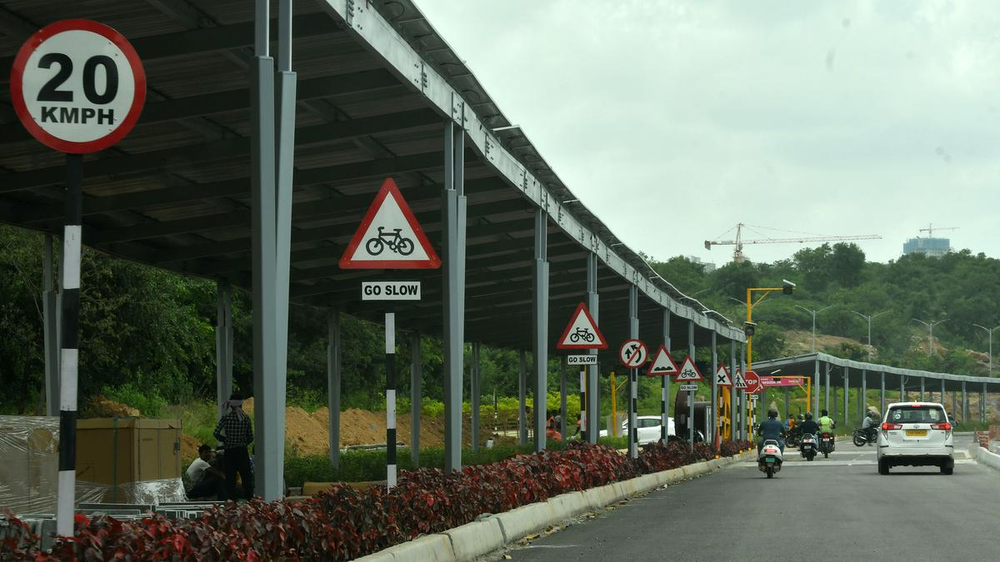

## Why are bike/cycle lanes empty?

> Next time someone criticizes an "empty bike lane," remind them it because they’re efficient.

This efficiency contrasts with the congestion and space consumption often associated with cars. The critique should be reframed not as a flaw in the bike lane but as an opportunity to highlight the drawbacks of traditional car-centric infrastructure.

## Should we consider banning cars? 

It's not about adopting an all-or-nothing approach, but rather the imperative need to significantly reduce car usage with specific exceptions. For instance, we could limit private car use, allowing only public cars for booking, especially during emergencies. Exceptions can also be made for disabled individuals who rely on cars for mobility.

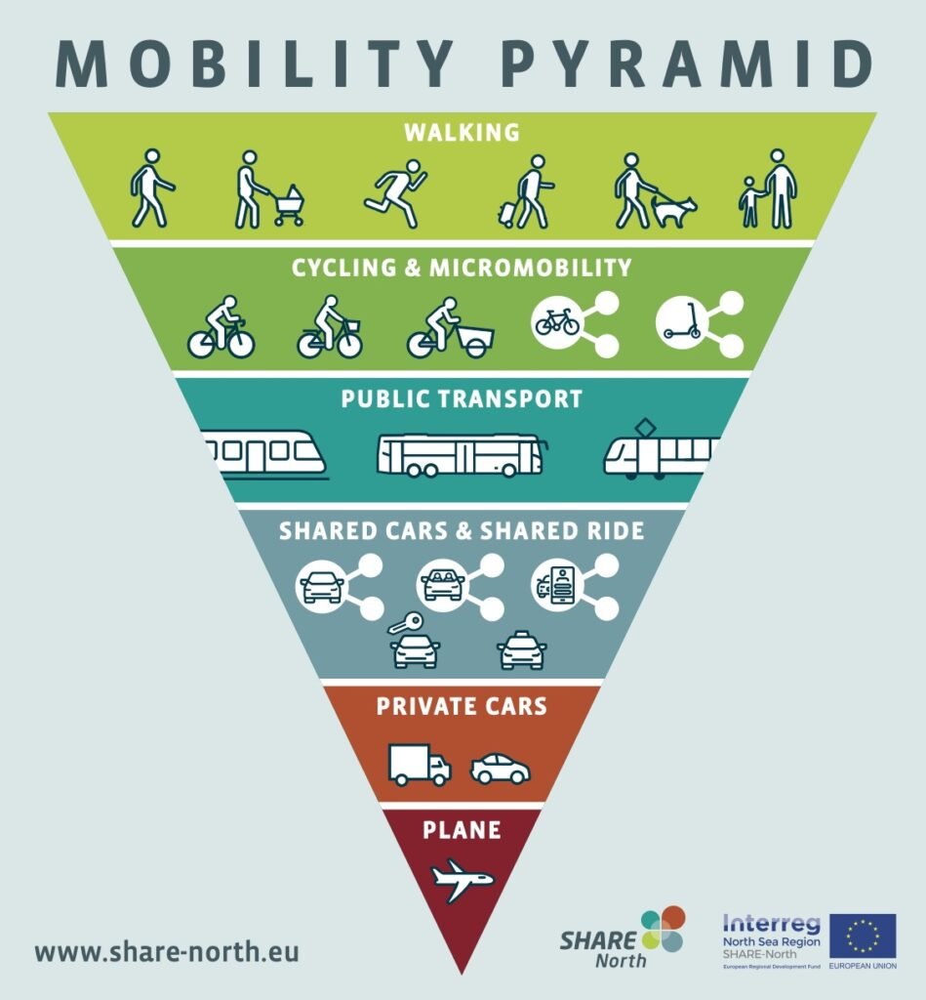

## These Animated Videos Show Just How Much Space Cars Waste In Our Cities

<iframe width="560" height="315" src="https://www.youtube.com/embed/06IjfbqdnNM?si=O2wC4JqZqTjUrVld" title="YouTube video player" frameborder="0" allow="accelerometer; autoplay; clipboard-write; encrypted-media; gyroscope; picture-in-picture; web-share" allowfullscreen></iframe>

[https://www.fastcompany.com/3063344/these-animated-videos-show-just-how-much-space-cars-waste-in-our-cities](https://www.fastcompany.com/3063344/these-animated-videos-show-just-how-much-space-cars-waste-in-our-cities)

## Can't wait for the road to be widened

> One thing we know for SURE — building and widening highways ALWAYS succeeds in helping sell more cars, gas and suburban sprawl; burning more public budgets; and increasing GHG emissions. So if THOSE are your goals, it’s the perfect thing to do.
> 
> Just don’t expect it to reduce traffic.
> 
> -Brent Toderian

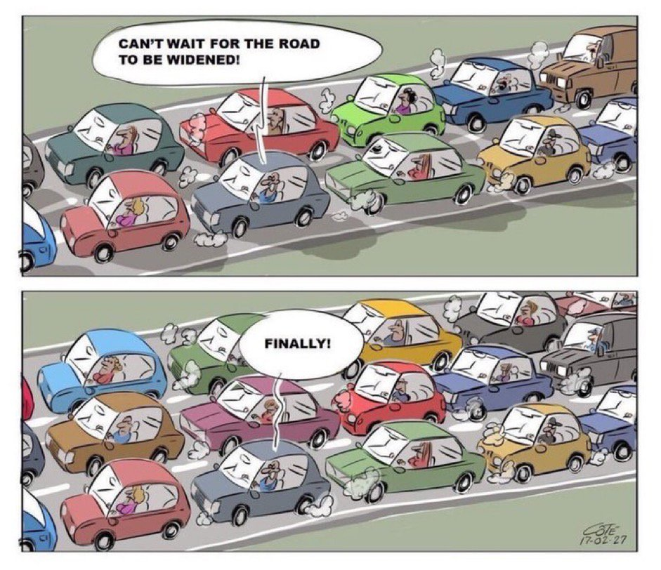

## City Traffic Sucks! They Should Widen the roads

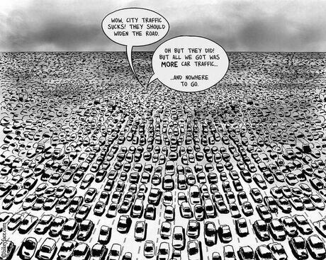

## 🚌 150 people overtaking 50 people. Separating the lane is not hard.

<video width="100%" controls preload="none" poster="./images/bus_lane.png">
  <source src="https://bafybeiddh2kuqvg5kg2trcm6iquynmlx2tobtagqeczcvdu4zej3hdlhwq.ipfs.w3s.link/Bus%20vs%20Cars.mp4" type="video/mp4">
</video>

## Car free cities are good for local businesses

For local businesses, car-free areas are very beneficial, as people using alternative transportation are more likely to shop locally and are more loyal to retailers. Even though they tend to not spend as much as car drivers, they visit the shop more frequently. A 2016 study of over 100 cities showed that pedestrian-only streets increased retail sales by around 49%. As many city centres are dying, car-free measures should be considered much more frequently.

[Citychangers article](https://citychangers.org/the-case-for-car-free/)

## Concrete roads for cars create flooding

Traditional concrete roads are impermeable, meaning water cannot pass through them, causing rainwater to accumulate on the surface and potentially lead to flooding in cities. Some approach like constructing local roads with tiles over a sand base is more permeable. Water can seep through the gaps between the tiles and be absorbed into the underlying sand, thus helping to manage and reduce the risk of flooding by allowing water to infiltrate into the ground.

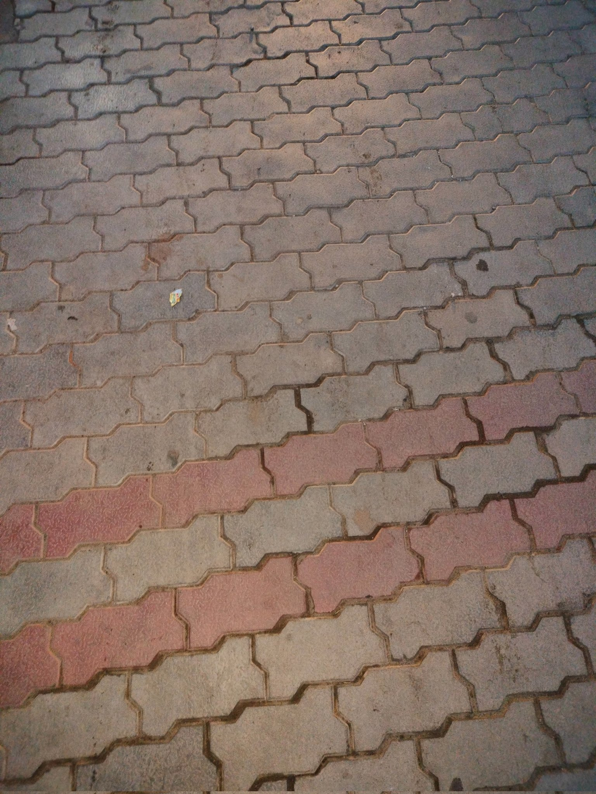

Tiles over sand. A simpler solution to the water logging problem, without the use of any advanced technology

Some advanced technology too exists, to make roads permeable to water, more research needs to be done about its practicality.

This 'thirsty' concrete absorbs 880 gallons of water a minute — here's how it works

[https://www.businessinsider.com/how-magical-concrete-absorbs-water-2015-9?IR=T](https://www.businessinsider.com/how-magical-concrete-absorbs-water-2015-9?IR=T)

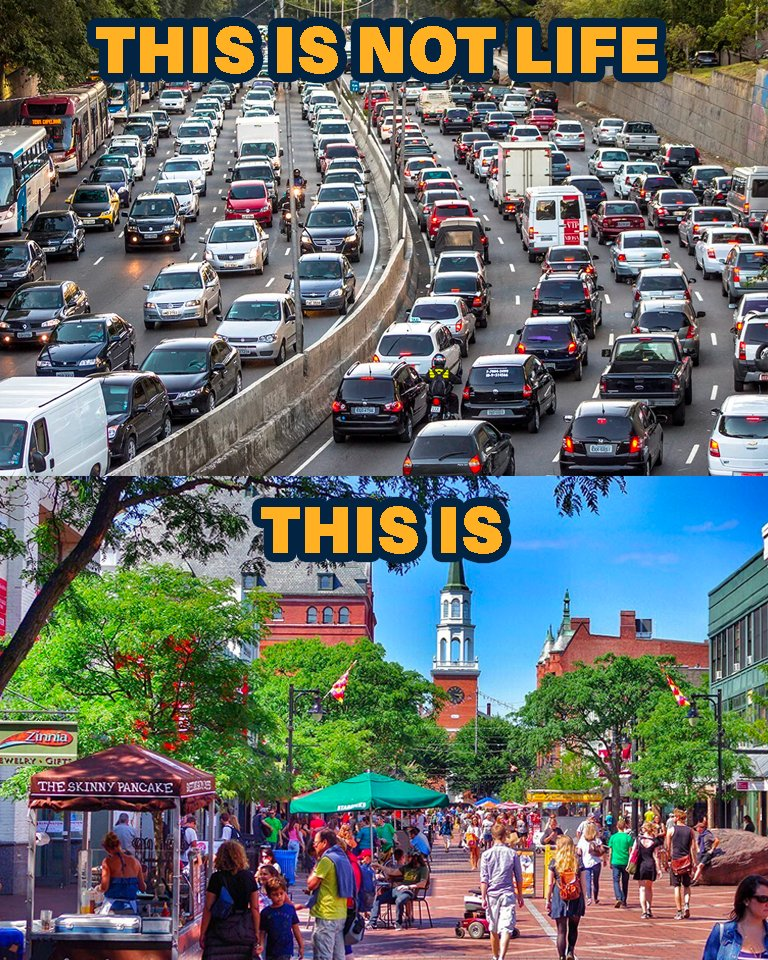

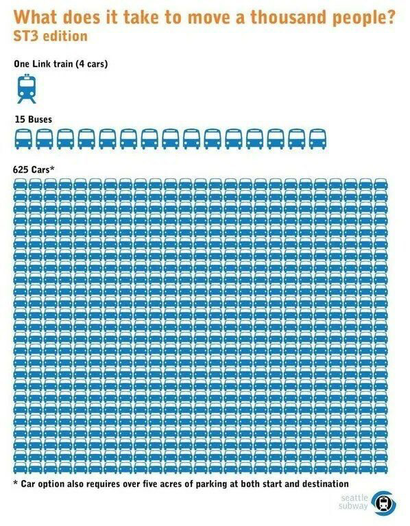

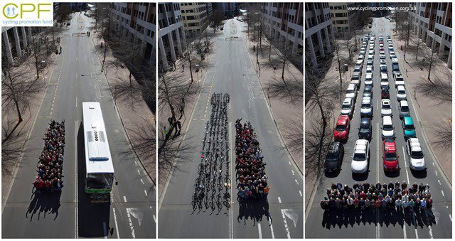

## Traffic in Gurgaon

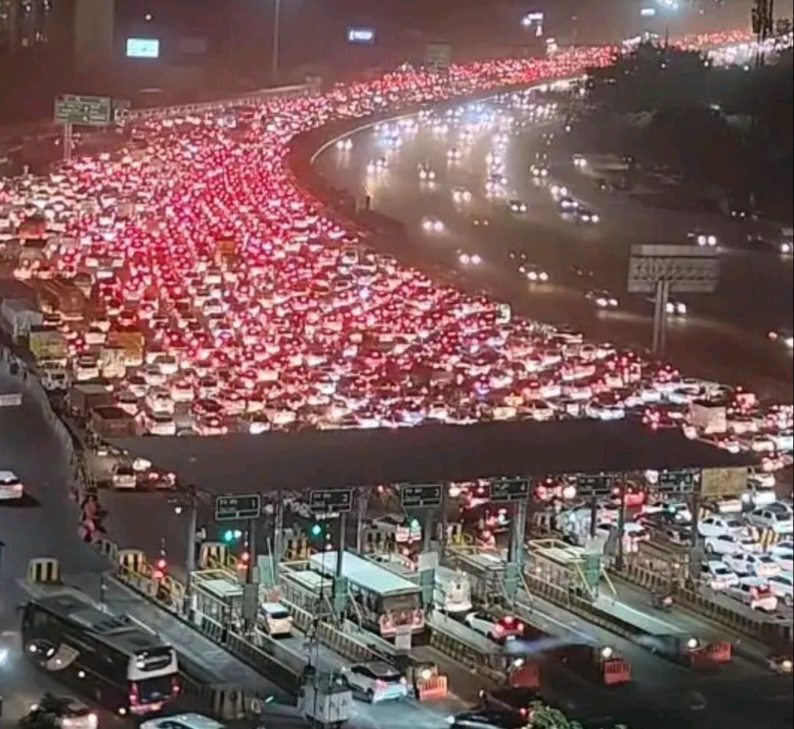

## Get your self a car, looser. What do you think you are?

<video width="100%" controls preload="none" poster="./images/bike_rails.png">
  <source src="https://bafybeif2zk6albeippcaugynwclhsiakl7t3eqcrcoi2vbbqunffphlfvq.ipfs.w3s.link/get%20a%20car%20looser.mp4" type="video/mp4">
</video>

## Effect of Media

> Picture a scenario where electric vehicles (EVs) in various countries incur a mere 5% tax, while cycles face a higher tax rate of 12%. Notably, electric cars benefit from subsidies and climate financing, whereas cycles, including e-cycles, do not enjoy any financial support. Economic policies lacking thoughtfulness, influenced by the Bandwagon effect—a narrative perpetuated by capitalists, advertisers, and the media, asserting that EVs and driverless cars are the ultimate solutions— inadvertently result in undesirable consequences.

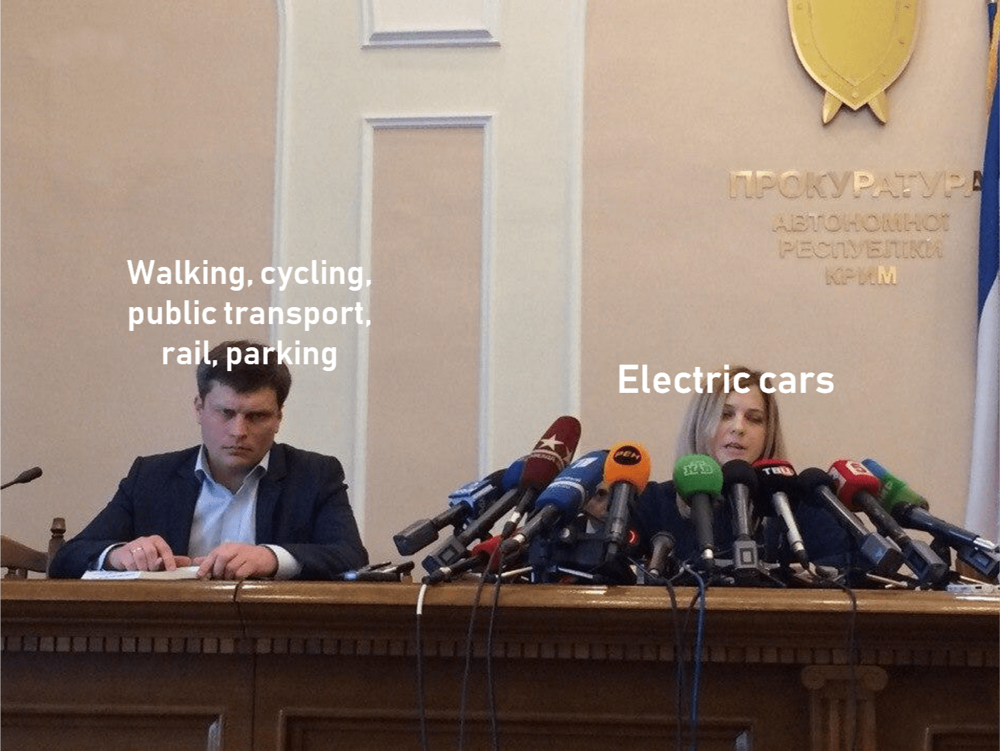

Here is a booklet for Street design manual:

[https://www.oslo.kommune.no/getfile.php/13441080-1646147194/Tjenester%20og%20tilbud/Plan%2C%20bygg%20og%20eiendom/Byggesaksveiledere%2C%20normer%20og%20skjemaer/Gatenormal%20og%20normark/Gate-%20og%20veinormaler/Street-design-manual\_ENG.pdf](https://www.oslo.kommune.no/getfile.php/13441080-1646147194/Tjenester%20og%20tilbud/Plan%2C%20bygg%20og%20eiendom/Byggesaksveiledere%2C%20normer%20og%20skjemaer/Gatenormal%20og%20normark/Gate-%20og%20veinormaler/Street-design-manual_ENG.pdf)

## [5 steps to making better cities](https://www.fastcompany.com/90278237/5-steps-to-making-better-cities)

Any city can push itself to be better, but they usually go through this learning curve first.

I’d rather have cities doing the right thing badly (at first), than continuing to do the wrong thing better.

## Accidents due to traffic: Addressing Road Safety

Approximately 1.5 lakh people die due to road accidents every year in India. While one may attribute road accidents to traffic, narrow roads, and bad driving, the main underlying reason is the presence of heavy vehicles, particularly cars, which occupy a significant amount of space, leaving little room for pedestrians and bikes. Car-centric roads also require [more maintenance](./economics/dismissing_return.md), increasing the likelihood that roads will not be repaired, so more accidents. By promoting the use of public transport, such as buses, accident rates can be drastically reduced.

## How Cars are Destroying India?

<iframe width="560" height="315" src="https://www.youtube.com/embed/XgCPOrRKiOM?si=hhj-zri9ZfzDM7_K" title="YouTube video player" frameborder="0" allow="accelerometer; autoplay; clipboard-write; encrypted-media; gyroscope; picture-in-picture; web-share" allowfullscreen></iframe>

Dhruv Rathee effectively outlined the detrimental impact of cars, yet he took a softer stance on the idea of banning them. While he asserted that an immediate ban would harm the economy, he fell short of providing a thorough explanation.

Banning cars is not analogous to demonetization, where 99% of currency was eliminated, resulting in the loss of at least one million jobs—all for the deceptive rhetoric of combating black money. Although a car ban may pose challenges for the Indian automotive industry, the benefits far outweigh the potential harm. Even tech giants like Google and Facebook have undergone mass layoffs, but displaced employees often find alternative jobs. Prioritizing job preservation at the expense of environmental degradation and pollution reflects myopic/ short-sighted thinking. Employment opportunities can be created by investing in green infrastructure and [generating green jobs](https://www.weforum.org/agenda/2023/01/renewable-energy-transition-green-jobs/), like in the public transport sector, which includes the development of electric buses.

Furthermore, a complete ban may cause some discomfort, but practical solutions can be implemented. For instance, a system could be established through a mobile app, allowing individuals to apply for a limited number of car usage instances based on emergencies or specific reasons. Implementing a quota system, such as allowing cars to run 10-15 times every six months, and facilitating car rentals through the app, would address concerns while promoting responsible car usage.

Approximately 5-10 percent of the Indian population owns cars. Therefore, an immediate car ban is unlikely to impact 90% of the population, who rely on public transport and bikes. While public autos may increase, they too need regulation. The wealthy have become a societal disgrace, a trend supported by data indicating that the world's richest 10% contribute to half of the global carbon emissions.
