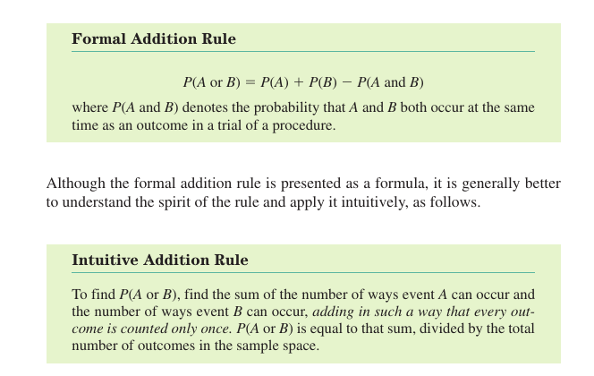
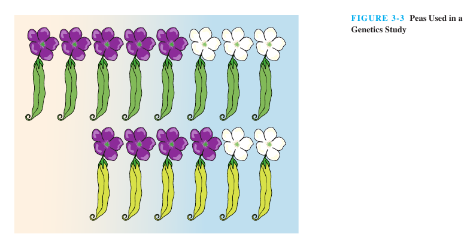

_**Solving by intuitive methods helps students to understand the working of the formula, which is most important to build strategies for different problems.**_  
  
**But our books and entrances only give most leverage to formula part without the intuitive part**. Take it physics, chemistry or mathematics. Students in coaching centers are mindlessly taught short cut formulas so that they can solve the problem in short time, as there is time limitation in entrances.  
  
Example of Intuitive vs Formula Based in probability (Addition Rule):  
  

  
  

  
Book: Elementary Statistics (Mario F. Triola)
