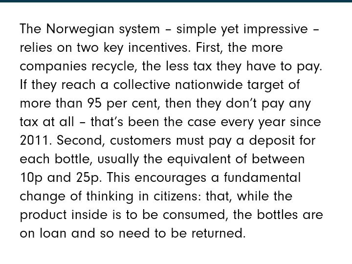

Suggestion for stopping the plastic menace

> Double or triple the rate of plastics and  
> Make counters for getting back the extra incurred charge by depositing the plastics

Any seller can make such counter, keep the plastic sorted and return back the plastic to the company who has produced it.

Generic plastic counters can also be made where any plastic can be deposited, and some incentives to the people, such as mobile recharge or money can be given.

**Questions and Answers:**

_**Will it work? Plastic crushing units were installed in the railway platform and 10 rupees mobile recharge was being offered for some time. But now these are not functional.**_

It didn't work because we are not charging plastic with double or triple rates, in other words, **we are not taxing for single-use plastic.**

> If people are charged extra, a lot extra for plastic, they will return back the plastic for recycling to get back their money.

Go on increasing the selling price of plastic, and return pricing of plastic till everyone starts depositing plastic. Collect the data, and fix the price.

**But will it be hard to implement?**

No, actually it's easy to implement, products with single-use plastic just have to declare the selling price and return price of the single-use plastic, that's all. The return price should be written on the product package. It's up to the policymakers to decide the return price with collecting data of its working.

**It may decrease the selling of products? So sellers can bear loss.**  

No, as it will impact every seller, i.e. it will also impact the seller competitors. **But it will add complexity to the seller, as they have to handle the recycling of plastic.**

But it will generate more employment and create a healthy economics.

> _Economics is not about just selling products and services without taking care of negative externality, it's about selling products and services that_ **adds value**_, including services that_ **eliminate** _negative externalities._  

Yes, it requires mature politicians or policy makers at work which we don't have. -- [Fair Democracy](https://iambrainstorming.blogspot.com/2019/01/from-hypocrisy-to-democracy-this-way.html)

Plastic Fish

Terminology:

**Negative Externality**

> In economics, an externality is the cost that affects a party who did not choose to incur that cost.

Costs are passed along to different members of society beyond the producer and consumer.

[https://mru.org/dictionary-economics/externalities-definition](https://mru.org/dictionary-economics/externalities-definition)

https://youtu.be/CpVf11f09Pk

Norway recycles 97 per cent of its plastic bottles. The key incentive system.

[https://www.positive.news/environment/norway-recycles-97-of-its-plastic-bottles-a-blueprint-for-the-rest-of-the-world/](https://www.positive.news/environment/norway-recycles-97-of-its-plastic-bottles-a-blueprint-for-the-rest-of-the-world/)
