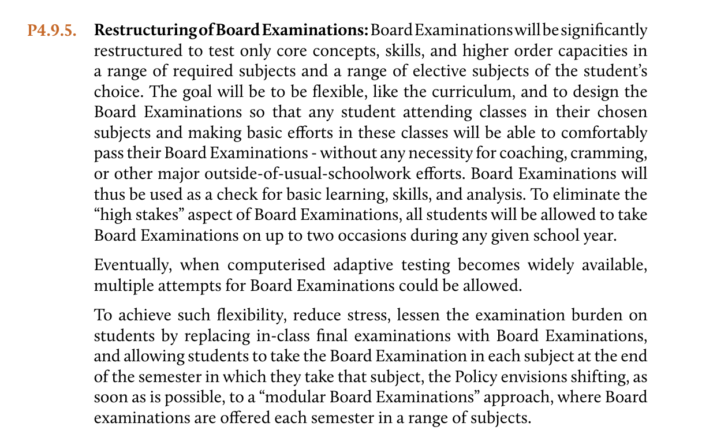
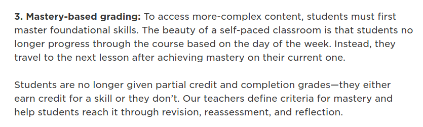
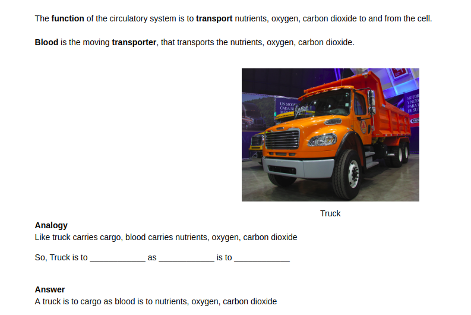

NEP2019 Draft

> Allowing multiple attempts for board exams of different subjects after semester end is unlikely to reduce the stress of students, it may further increase the burden of students, as they have to read all the chapters or topics of the subject again to score more.

It will be better if they make chapter wise or topic wise exams, with a pass and fail system so that they have reattempt only those chapters which they have failed.

> It not only reduces stress, but students will master the topics.

**Classrooms can have mastery-based grading**

[https://www.edutopia.org/article/blended-learning-built-teacher-expertise](https://www.edutopia.org/article/blended-learning-built-teacher-expertise)

In mastery-based grading each topic content should be linked with tests, that checks the conceptual understanding of topics.

Test shouldn't be used in isolation without content. No random test papers without content should be allowed in education system.

An example of guided notes, which prompts questions on every paragraph.

[https://nbviewer.jupyter.org/urls/book-amiyatulu.hashbase.io/Circulatory%20System.ipynb](https://nbviewer.jupyter.org/urls/book-amiyatulu.hashbase.io/Circulatory%20System.ipynb)

Chemistry Concepts and Learning by Clifford C. Houk and Richard Post
