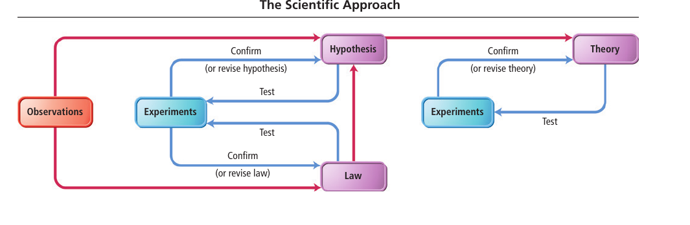
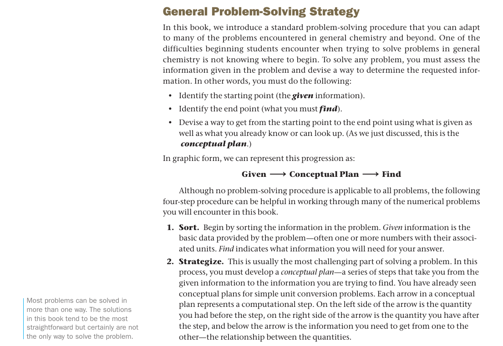

**Chemistry Book:**

NCERT Chemistry book requires a complete reinvention, with eliminating most units that are unrequired at the higher secondary level and making it more systematic with the flow of information and building new connections by using prior information.  
e.g. How quantum mechanical model is linked with explaining the properties of elements and molecules? And before explaining the quantum mechanical model, it's needed to explain what are model and theories.  
From Britannica:  
Scientific modeling, the generation of a physical, conceptual, or mathematical representation of a real phenomenon that is difficult to observe directly. Scientific models are **used to explain and predict the behavior of real objects** or systems and are used in a variety of scientific disciplines.

**The Higher secondary level is meant to know the basics first with the foundational understanding of the mechanism of concepts in detail. It should be relevant to students day to day life to know their surrounding and about themselves that makes them a better thinker and decision maker.**

Separate chapters Hydrogen, s-Block Elements, Some p-Block Elements in the 11th book and p-block elements, d and f-block elements in the 12th book of inorganic is unnecessary, as the chapter on periodic properties of elements and quantum mechanical models is enough to describe **what** _chemical and physical properties elements have_ and **why** _they have_.  
These two chapters must be studied in enough details.

Also separate chapter for Hydrocarbons, Haloalkanes, Haloarenes, Alcohols, Phenols, and Ethers, Aldehydes, Ketones and Carboxylic Acids, Organic Compounds containing Nitrogen is _completely irrelevant for students, as it contains only chemical reactions that are easily forgettable after exams are over,_ and **doesn't much contribute to deep thinking**.

So instead, organic chemistry chapter should be divided into two to three chapters which includes Bond-Line drawing, Resonance, Acid-Base Reactions, Geometry, Nomenclature, Conformations, Configurations, **_Mechanisms_**, and a _single small chapter for_ Alkanes,Alkenes, Alkynes, Aromatic Hydrocarbons, Alcohols, Aldehydes and Ketones, Carboxylic Acids and Esters, Ethers, Amines which describes the most important structural, physical and chemical properties. The _physical properties should include concrete real-world examples_, e.g. to explain saturated hydrocarbons, talk about hydrogenated vegetable oils, and why they are solid at room temperature and why unsaturated ones are liquid with examples. And _chemical properties should be always linked with the structure and mechanisms to describe a reaction_.

The chapter for Radioactivity and Nuclear Chemistry is missing and should be included in the book.

The chapter like solutions, chemical kinetics, solid states and other chapters that require numerical problems to solve are filled with short cut formulas that are unnecessary and they don't contribute anything towards students understanding.  
Please look at **openstax chemistry** (https://openstax.org/subjects/science) or **Nivaldo J Tro chemistry**, how formulas are kept minimum, and only first principle formulas that help in student comprehension are retained.

Also, the book lacks experimental techniques about **how scientists take measurements** such as Mass Spectroscopy(Atoms, Molecules, Ions), X-Ray Crystallography (Solid state), Chromatography, and should be included in their respective chapters.

**The beginning of the book:**  
The first chapter of the book should talk about different aspect of **scientific method** such as scientific inquiry, proposing and testing hypothesis, empirical and measurable evidence, testability, falsifiability, reproducibility, scientific reasoning (inductive and deductive), with working examples of chemistry and exercises to build scientific thinking among students.

_Nivaldo J Tro Chemistry_

  
It should also contain **general problem-solving strategies**, such as sorting what's given, building a conceptual plan for solving and checking answers.  
Solving problems using units as a guide (dimensional analysis), conversion factors should also be included in this chapter (it's already there in the book, but problems are not solved in that manner).

Nivaldo J Tro Chemistry

Please go through the blogpost:  
Features that a book should contain:  
[https://iambrainstorming.ml/all-books-that-dont-meet-the-learning-criteria-must-be-taken-off/](https://iambrainstorming.ml/all-books-that-dont-meet-the-learning-criteria-must-be-taken-off/)
