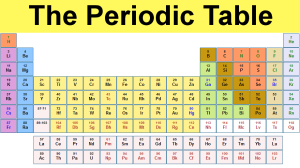

**Chemistry Book:**  
  
NCERT Chemistry book requires a complete reinvention, with eliminating most units that are unrequired at the higher secondary level and making it more systematic with the flow of information and building new connections by using prior information.  
e.g. How quantum mechanical model is linked with explaining the properties of elements and molecules? And before explaining the quantum mechanical model, it's needed to explain what are model and theories.  
From Britannica:  
Scientific modeling, the generation of a physical, conceptual, or mathematical representation of a real phenomenon that is difficult to observe directly. Scientific models are **used to explain and predict the behavior of real objects** or systems and are used in a variety of scientific disciplines.  
  
**The Higher secondary level is meant to know the basics first with the foundational understanding of the mechanism of concepts in detail. It should be relevant to students day to day life to know their surrounding and about themselves that makes them a better thinker and decision maker.**  
  
Separate chapters Hydrogen, s-Block Elements, Some p-Block Elements in the 11th book and p-block elements, d and f-block elements in the 12th book of inorganic is unnecessary, as the chapter on periodic properties of elements and quantum mechanical models is enough to describe **what** _chemical and physical properties elements have_ and **why** _they have_.  
These two chapters must be studied in enough details.  
  

  
  
Also, the book lacks experimental techniques about **how scientists take measurements** such as Mass Spectroscopy(Atoms, Molecules, Ions), X-Ray Crystallography (Solid state), Chromatography, and should be included in their respective chapters.  
  
**The beginning of the book:**  
The first chapter of the book should talk about different aspect of **scientific method** such as scientific inquiry, proposing and testing hypothesis, empirical and measurable evidence, testability, falsifiability, reproducibility, scientific reasoning (inductive and deductive), with working examples of chemistry and exercises to build scientific thinking among students.  
It should also contain **general problem-solving strategies**, such as sorting what's given, building a conceptual plan for solving and checking answers.  
Solving problems using units as a guide (dimensional analysis), conversion factors should also be included in this chapter.
