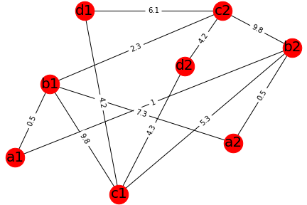

Competitive Collaboration Algorithm:

> It's a decentralized network where you compete to collaborate.

Edge weight represents difficulty to get connected. Difficulty depends on factors such as distance, location, quality, price.

> We need to choose subgraph containing all the required nodes (e.g. nodes containing a,b,c,d ) that has a minimum weight or optimal weight.

a,b,c,d can represent different services, whereas a1, a2 represents the same services from a different service provider. For example, 'a' can represent a student, 'b' can represent a teacher, 'c' can represent content provider such as a biology textbook and 'd' can represent a classroom or building. Similarly  'b1' represents teacher1, 'b2' represents teacher2, etc.

**So, For student1 (a1), _the optimum subgraph or subgraph with minimum weight containing all the required services_ are a1,b1,c2, d2 with weight 0.5+2.3+4.2 .**

**Usefulness of the model:** 1) Prediction: One can make a prediction using the model, to select the best subgraph or services for an individual. Entrepreneurs can use the data to set up new nodes, based on the requirements of people. Policymakers can use the data to evaluate the quality and provide suggestions for the optimal functioning of the network. 2) Equal chance to everyone: Its fairer and everyone can get an equal chance to reach their goals.  It will bring competition for quality. Equal chance means many selected subgraphs for many individual will have similar weight, the possibility of getting similar weight increases when we increase the nodes. 3) Continuous Improvement: If any single subgraph, even a node of subgraph gets upgraded and refined, it builds a pressure on other subgraph and nodes to upgrade through competition. 4) No burnouts: Nodes shall not suffer from burn out problems as there is a division of work time between people and a division of labor. 5) Non-hierarchical and autonomous: As different nodes are independent of each other and are free to connect to other nodes, there is no hierarchy or concentration of power or monopoly. No need for management, teachers, and students self-manage their work. 6) Updated and Validated information: Nodes are protected by game-theoretic incentive system, those who behave frivolously are punished.

**An implementation**: Avrit App:

[https://avrit.reaudito.com](https://avrit.reaudito.com)

Resources: Code: [https://github.com/amiyatulu/competitive\_collaboration](https://github.com/amiyatulu/competitive_collaboration)

Other Links: Public-private partnership schools & colleges and its implementation [https://iambrainstorming.blogspot.com/2017/06/public-private-partnership-schools-and.html](https://iambrainstorming.blogspot.com/2017/06/public-private-partnership-schools-and.html)
