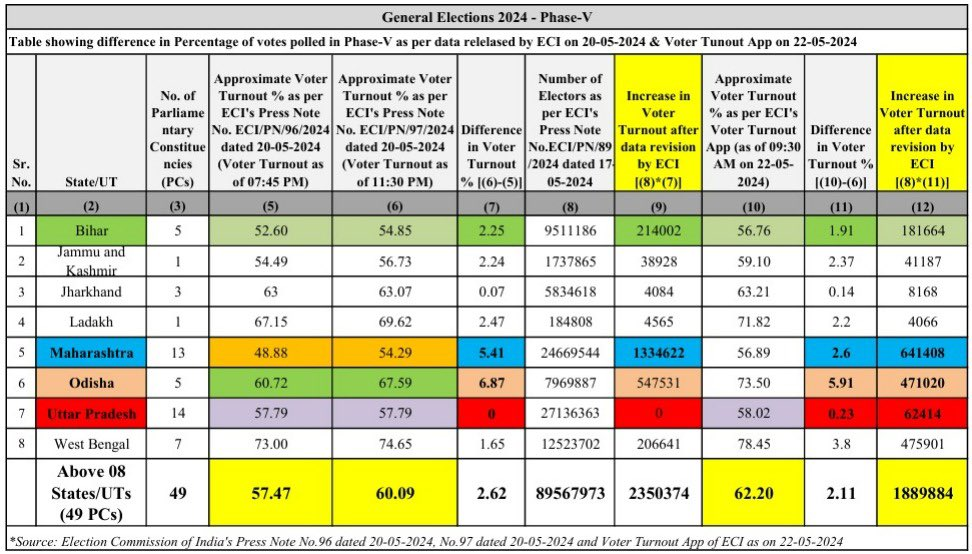
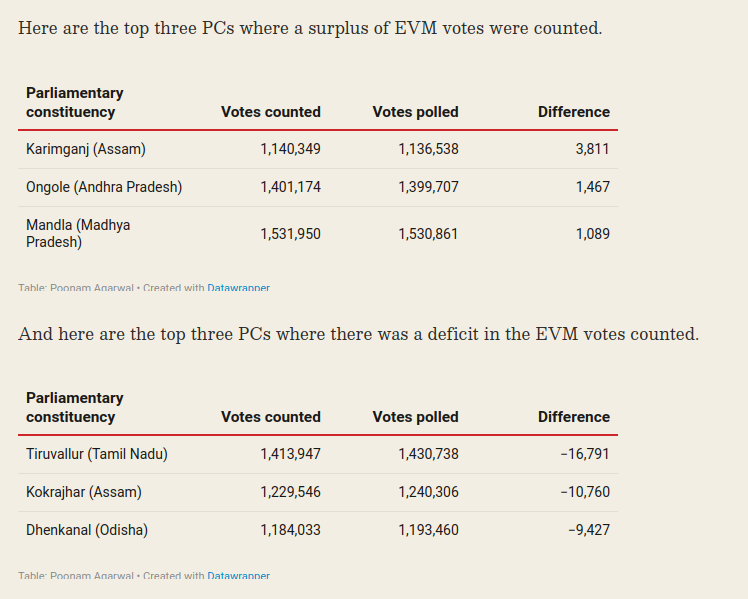

# The Lok Sabha election is about regional parties, third parties and independent vs one-party dictatorship.

## date: "2023-12-05"

---
categories:
  - "politics"
---

### Quiz

## Interactive Quiz Link:

You can use the quiz to spread awareness about EVM and test your knowledge of how much you know about EVM.

[Click on the link](https://interactive-five.vercel.app/evm)

#### Quiz for Indian election and EVM

{{#quiz election/evm.toml}}

#### Quiz on voting method

{{#quiz election/election-science.toml}}


What strategies has the BJP employed?

1. Casting Hindus as victims and promoting nationalism.

2. Positioning Congress as the opposition and trolling Rahul Gandhi. Portraying Modi as a supreme leader ( but a [cult leader](https://42683ff2b1a2ac5ad2fef0ee01995d78.ipfs.4everland.link/ipfs/bafkreifezrdzrlijxtzcoohi4k35ypa3aikfnrdkiqqw75clnd7xrsqism) in disguise) and discrediting Rahul Gandhi as unfit for the PM role. It's crucial to note that the opposition is not the Congress, which currently holds only 50 seats in the Lok Sabha and may at most reach 150. Moreover, Rahul Gandhi is not PM candidate; the INDIA bloc is a coalition of regional parties, requiring a nuanced narrative.

3. Propagating unrealistic dreams, such as inflating the GDP with excessive zeroes and aiming for a 5 trillion-dollar economy in five years.

4. Distributing freebies and money during campaigning/election.

More than 10,000 WhatsApp groups are actively involved in disinformation campaigns, leveraging national media for Hindu-Muslim narratives.

**[How to tackle disinformation?: Link](./how-to-tackle-disinformation.md)**

> People need to understand the intensity of the problem. We are just in a small margin to [dictatorship](./democracy/fascism.md). Opposition and people need to make no mistake. We need to break the brute force majority of one party. Lok Sabha and Rajya Sabha are safeguards of the constitution. Now, Lok Sabha is completely useless. Rajya Sabha is in a small margin. We need not give more than 20% of seats to BJP again.

[Necessary sources of political power](../chapters/democracy/fascism_power.md)

[From Dictatorship to Democracy: A Conceptual Framework for Liberation](https://www.nonviolent-conflict.org/resource/from-dictatorship-to-democracy-a-conceptual-framework-for-liberation/)

Data: [https://github.com/amiyatulu/election\_result/blob/main/2019\_loksabha/src/loksabha\_seats.json](https://github.com/amiyatulu/election_result/blob/main/2019_loksabha/src/loksabha_seats.json)

Total data: [data_analysis/analysis_data/lokshabha2019](https://github.com/amiyatulu/election_result/tree/main/2023_legislative_assembly_election/data_analysis/analysis_data/lokshabha2019)

Votes by percentage: [analysis_data/lokshabha2019/state_party_data_sorted_percentage/party_votes_by_state_percentage.json](https://github.com/amiyatulu/election_result/blob/main/2023_legislative_assembly_election/data_analysis/analysis_data/lokshabha2019/state_party_data_sorted_percentage/party_votes_by_state_percentage.json)

**State-wise analysis (2019 Lok Sabha election):**

## Hindi States

In Hindi states like Gujarat, Rajasthan, Chhattisgarh, Uttarakhand, Haryana and Himachal Pradesh, the BJP secured almost 100% of seats, with Congress only holding one or two seats. The absence of other opposition or regional parties in these states allows the BJP to effectively use the tactics of trolling Congress and promoting the Hindu victim narrative. Limited options for voters make these strategies particularly effective. Using Hindi states, the BJP managed a one-party dictatorship with 300 seats in the Lok Sabha, sidelining all opposition parties and democratic values.

## INC got 32% of votes in Gujarat, yet zero seats

So the case of other states:

```json
{
    "Gujarat": {
        "BJP": {
            "votes": 18091275,
            "percentage": 62.20788595983407
        },
        "INC": {
            "votes": 9337084,
            "percentage": 32.10609847395451
        }
    },
    "Rajasthan": {
        "BJP": {
            "votes": 18968392,
            "percentage": 58.47031404395368
        },
        "INC": {
            "votes": 11107910,
            "percentage": 34.240276459489735
        }
    },
    "Chhattisgarh": {
        "BJP": {
            "votes": 6902477,
            "percentage": 50.69962781464669
        },
        "INC": {
            "votes": 5569183,
            "percentage": 40.90640292342263
        }
    },
    "Uttarakhand": {
        "BJP": {
            "votes": 2954833,
            "percentage": 61.013395829999425
        },
        "INC": {
            "votes": 1520767,
            "percentage": 31.401828440456953
        }
    },
    "Haryana": {
        "BJP": {
            "votes": 7357347,
            "percentage": 58.016213493381244
        },
        "INC": {
            "votes": 3604106,
            "percentage": 28.42010620795462
        }
    },
    "Himachal Pradesh": {
        "BJP": {
            "votes": 2661281,
            "percentage": 69.11104174479034
        },
        "INC": {
            "votes": 1051113,
            "percentage": 27.29644649380949
        }
    }
}
```

**BJP got all the seats**

```json
{
    "Gujarat": {
        "BJP": 26
    },
    "Rajasthan": {
        "BJP": 24,
        "RLTP": 1
    },
    "Chhattisgarh": {
        "INC": 2,
        "BJP": 9
    },
    "Uttarakhand": {
        "BJP": 5
    },
    "Haryana": {
        "BJP": 10
    },
    "Himachal Pradesh": {
        "BJP": 4
    }
}
```

**Why is there no other opposition in these states?**
The First Past the Post (FPTP) voting method maintains a biparty political system. Even if Congress garners 30-40% of votes, it may end up with zero seats because only candidate with highest vote wins, and other votes get waste. What if these 30% seats would have gone only to few constituency? Manipulation of EVM is another variable. (Details about EVM below) A potential strategy for Congress could be targeting specific constituencies, especially those with weaker opponents, to secure a few seats. Winning a seat with just 1% of the vote is possible under FPTP, emphasizing the importance of strategic planning.

## States with Competitor

States with more opposition include Maharashtra, Uttar Pradesh, Bihar, and Delhi.
The INDIA bloc must address this challenge by avoiding vote splitting, fostering unity, and strategizing effectively. Leaders like Priyanka Chaturvedi in Shivsena, Akhilesh Yadav in Uttar Pradesh, and Arvind Kejriwal in Delhi play crucial roles.

```json
{
    "Maharashtra": {
        "BJP": {
            "votes": 14912139,
            "percentage": 27.58735969765187
        },
        "SHS": {
            "votes": 12589064,
            "percentage": 23.28968612918375
        },
        "INC": {
            "votes": 8792237,
            "percentage": 16.265580991835147
        },
        "NCP": {
            "votes": 8387363,
            "percentage": 15.516566737727999
        },
        "VBA": {
            "votes": 3743560,
            "percentage": 6.925561535453877
        }
    },
    "Uttar Pradesh": {
        "BJP": {
            "votes": 42858171,
            "percentage": 49.55767597558957
        },
        "BSP": {
            "votes": 16659754,
            "percentage": 19.263973970448536
        },
        "SP": {
            "votes": 15533620,
            "percentage": 17.96180491901854
        },
        "INC": {
            "votes": 5457352,
            "percentage": 6.310434528359497
        }
    },
    "Bihar": {
        "BJP": {
            "votes": 9619548,
            "percentage": 23.573474928517186
        },
        "JD(U)": {
            "votes": 8902719,
            "percentage": 21.81682789483805
        },
        "RJD": {
            "votes": 6270769,
            "percentage": 15.36702304557582
        },
        "LJP": {
            "votes": 3206979,
            "percentage": 7.858959594856339
        },
        "INC": {
            "votes": 3140797,
            "percentage": 7.696775288720634
        }
    },
    "NCT OF Delhi": {
        "BJP": {
            "votes": 4908541,
            "percentage": 56.55644905203495
        },
        "INC": {
            "votes": 1953900,
            "percentage": 22.51293119539413
        },
        "AAAP": {
            "votes": 1571687,
            "percentage": 18.109054348582536
        }
    },
}
```

```json
{
    "Maharashtra": {
        "BJP": 23,
        "IND": 1,
        "AIMIM": 1,
        "NCP": 4,
        "SHS": 18,
        "INC": 1
    },
    "Uttar Pradesh": {
        "BJP": 62,
        "BSP": 10,
        "SP": 5,
        "ADAL": 2,
        "INC": 1
    },
    "Bihar": {
        "BJP": 17,
        "JD(U)": 16,
        "LJP": 6,
        "INC": 1
    },
    "NCT OF Delhi": {
        "BJP": 7
    }
}
```
In Delhi, even if AAP wins the Assembly Election, people haven't traditionally voted for them during the Lok Sabha polls because they typically don't favor Congress at the center. However, this time things have changed. AAP is now part of a national party coalition. It's crucial to remember that the INDIA bloc is not synonymous with Congress. Congress currently holds about 50 seats, and it's unlikely to surpass 150 or 200 only after they win in Hindi states. The INDIA bloc is, in fact, a coalition of regional parties, characterized by decentralization and power-sharing. Nevertheless, winning in Hindi states remains crucial for achieving a majority. So, the INDIA bloc needs to work hard to secure Congress's victory and must address the situation if Congress doesn't cooperate.

## East India States

East India states, including West Bengal and Odisha:
West Bengal has leaders like Mamata Banerjee and Mahua Moitra, who align with the INDIA bloc. Odisha has Naveen Patnaik, though he has no alliance with anyone, but he is a bit pro-BJP and anti-Congress. The BJD party is a bit more opportunistic toward the state rather than involving itself in national politics. As long as the center benefits them, they hardly care about who is in power at the center.
Last Loksabha election in Odisha, the largest competitor was BJP, not Congress. So, if Naveen Patnaik wants to stop one-party dictatorship, they need to stop supporting BJP.

> All regional parties need to understand what is at stake. They may support BJP, but ultimately, Modi will ditch them after advantage is taken. Their [intentions are clear](./democracy/fascism.md). All need to protest against EVM.

```json
{
  "West Bengal": {
    "AITC": {
      "votes": 24757345,
      "percentage": 43.27679372529672
    },
    "BJP": {
      "votes": 23028517,
      "percentage": 40.25473571614763
    },
    "CPIM": {
      "votes": 3610645,
      "percentage": 6.311546689690433
    },
    "INC": {
      "votes": 3210491,
      "percentage": 5.612062067395416
    }
  },
   "Odisha": {
    "BJD": {
      "votes": 10174021,
      "percentage": 42.75854767828794
    },
    "BJP": {
      "votes": 9130768,
      "percentage": 38.374048851224686
    },
    "INC": {
      "votes": 3285339,
      "percentage": 13.807355446862044
    },
   }
}
```

```json
{
   "West Bengal": {
    "BJP": 18,
    "AITC": 22,
    "INC": 2
  },
  "Odisha": {
    "BJD": 12,
    "BJP": 8,
    "INC": 1
  },
}
```


## South States:

These states pose less of a threat.  In South Indian states Modi is hardly liked. You can analyse other states from the data.

## 2023 Legislative Assembly Election

I have already [discussed the impact of vote splitting and about vote wastage in FPTP voting](./do-we-need-a-supreme-leader-how-can-we-share-power-between-parties.md) and how it prevents third parties and independents from winning.

Here is real data on vote wastage in elections. In [Madhya Pradesh](https://github.com/amiyatulu/election_result/blob/main/2023_legislative_assembly_election/data_analysis/vote_wastage_data_madhay_pradesh.json) 109 out of 230 constituencies, the election outcome would be reversed if we consider the count of vote wastage. This indicates that the majority have voted against the winning candidate.

Similarly, in [Chhattisgarh](https://github.com/amiyatulu/election_result/blob/main/2023_legislative_assembly_election/data_analysis/vote_wastage_data_chhattisgarh.json) 46 out of 90 constituencies, [Rajasthan](https://github.com/amiyatulu/election_result/blob/main/2023_legislative_assembly_election/data_analysis/vote_wastage_data_rajasthan.json) 119 out of 199, [Telengana](https://github.com/amiyatulu/election_result/blob/main/2023_legislative_assembly_election/data_analysis/vote_wastage_data_telangana.json) 68 out of 119, and [Mizoram](https://github.com/amiyatulu/election_result/blob/main/2023_legislative_assembly_election/data_analysis/vote_wastage_data_mizoram.json) 36 out of 40.

Further dissatisfaction by voters, in the form of NOTA, is also evident. They cannot vote for independent candidates because they have almost no chance of winning, and they have preferred NOTA.

In [Madhya Pradesh](https://github.com/amiyatulu/election_result/blob/main/2023_legislative_assembly_election/data_analysis/nota_votes_madhay_pradesh.json), 193 constituencies recorded more than 1000 votes for NOTA. More than 2000 votes in 79 constituencies, more than 3000 votes in 35 constituencies.

In [Chhattisgarh](https://github.com/amiyatulu/election_result/blob/main/2023_legislative_assembly_election/data_analysis/nota_votes_chhattisgarh.json), 64 constituencies recorded more than 1000 votes for NOTA. More than 2000 votes in 46 constituencies, more than 3000 votes in 23 constituencies.

In [Rajasthan](https://github.com/amiyatulu/election_result/blob/main/2023_legislative_assembly_election/data_analysis/nota_votes_rajasthan.json), 178 constituencies recorded more than 1000 votes for NOTA. More than 2000 votes in 70 constituencies, more than 3000 votes in 30 constituencies.

In [Telangana](https://github.com/amiyatulu/election_result/blob/main/2023_legislative_assembly_election/data_analysis/nota_votes_telangana.json), 81 constituencies recorded more than 1000 votes for NOTA. More than 2000 votes in 22 constituencies, more than 3000 votes in 4 constituencies.

[Mizoram](https://github.com/amiyatulu/election_result/blob/main/2023_legislative_assembly_election/data_analysis/nota_votes_mizoram.json) has zero NOTA with more than 1000 votes. But it has worst impact on vote splitting.

- [*Rajastan, No data available for [S203 Karanpur - 3](https://github.com/amiyatulu/election_result/tree/main/2023_legislative_assembly_election/data_analysis/data/rajasthan)*]

Update the repository with Karnapur data of Rajasthan, it became 120 out of 200.


## Votes by Party in 2023 Legislative Assembly Election

Here is the list of total votes in all constituency by party.

[Data by Votes](https://github.com/amiyatulu/election_result/tree/main/2023_legislative_assembly_election/data_analysis/analysis_data/total_votes_by_party_data)

[Data by Percentage](https://github.com/amiyatulu/election_result/tree/main/2023_legislative_assembly_election/data_analysis/analysis_data/total_percentage_by_party_data)

### Madhya Pradesh

In Madhya Pradesh BJP got 48% votes, and INC got 40% of votes, where as BJP got 163 seats, INC 66 seats, which means BJP got 70.87% where as INC with 28.70% seats.

Difference in votes between BJP and INC = 8%

Difference in seats between BJP and INC = 42%

### Rajasthan

In Rajasthan BJP got 41% votes, and INC got 39% of votes, where as BJP got 115 seats, INC 69 seats (70 seats with karanpur), which means BJP got 57.50% seats where as INC got 35.00% seats.

Difference in votes between BJP and INC = 2%

Difference in seats between BJP and INC = 22.5%

### Chattisgarh

In Chattisgarh BJP got 46% votes and INC got 42% of votes, where as BJP got 54 seats, INC 35 seats, which means BJP got 60% of seats, where as INC got 38% of seats

Difference in votes between BJP and INC = 4%

Difference in seats between BJP and INC = 22%

### Telangana

In Telangana INC got 39% votes, BHRS got 37% of votes and BJP got 13% of votes, where as INC 64 seats, BHRS 39 seats, BJP 8 seats, which means INC got 53.78% of seats, BHRS got 32.77% of seats and BJP got 6.72% of seats.

Difference in votes between INC and BHRS = 2%

Difference in seats between INC and BHRS = 21%


## Other Legislative Assembly Election

Delhi is an outlier among all the parties, where they have own the true majority in 2020. [Only 17 constituencies where vote wastage own, out of 70](https://github.com/amiyatulu/election_result/blob/main/2023_legislative_assembly_election/data_analysis/analysis_data/vote_wastage_won_data/vote_wastage_data_delhi_legislative_election_2020.json).

In Uttar Pradesh 2022 election, [in 301 constituencies out of 403](https://github.com/amiyatulu/election_result/blob/main/2023_legislative_assembly_election/data_analysis/analysis_data/vote_wastage_won_data/vote_wastage_data_uttar_pradesh_general_election_2022.json), majority have not voted to the winning candidate.

Similarly, in [Punjab, 89 out of 117](https://github.com/amiyatulu/election_result/blob/main/2023_legislative_assembly_election/data_analysis/analysis_data/vote_wastage_won_data/vote_wastage_data_punjab_legislative_election_2022.json), the majority have not voted for the winning candidate. Punjab is a different case, as it has recently been taken over by AAP. One can imagine how difficult it is for a new party with a voting method like FPTP.


## List of Spoilers with decreasing order of votes:

[https://github.com/amiyatulu/election_result/tree/main/2023_legislative_assembly_election/data_analysis/analysis_data/independent_list](https://github.com/amiyatulu/election_result/tree/main/2023_legislative_assembly_election/data_analysis/analysis_data/independent_list)

In the First Past the Post (FPTP) system, a two-party system predominates, and third parties and independents are viewed as spoilers. People are hesitant to vote for them, fearing that it might result in a wasted vote and inadvertently contribute to the victory of the least favored candidate—someone whom the voter actively wishes not to see win.

There are 2303 spoilers in Madhya Pradesh, 1650 spoilers in Rajasthan, 1090 spoilers in Chhattisgarh, and 2053 in Telangana who have almost no chance of winning due to the use of the FPTP voting method.

In other words, FPTP doesn't give a fair chance to every candidate, which goes against the preamble of the constitution. This voting method can be considered unconstitutional.

## **Who is evil, whether it's the people or the voting method?**

In Madhya Pradesh, the BJP would have lost 63 seats, and the Congress would have lost 45 because in these constituencies vote wastage has won, or if we could consider the majority decision. In Rajasthan, the Congress would have lost 42 seats, and the BJP 65 seats. In Chhattisgarh, the BJP would have lost 24, and the Congress 21 if we consider majority decision.

### 2024 LokSabha Election

[286 candidates](https://github.com/silicology/election_data_analysis/blob/main/data/vote_splitting_won.json) would have lost out of 543 candidates if we take the majority votes, which are vote wastage. That's 52% of the seats.

Bharatiya Janata Party (BJP) would have lost 84 seats, and Indian National Congress (INC) would ahve lost 62 seats.

> Can you blame voters if you don't even provide the option and instead force them to vote tactically, thus preventing them from voting for their sincere preference?

[https://github.com/amiyatulu/election_result/tree/main/2023_legislative_assembly_election/data_analysis/analysis_data](https://github.com/amiyatulu/election_result/tree/main/2023_legislative_assembly_election/data_analysis/analysis_data)

## Are all politicians and parties are corrupt? Does it matters whom to vote?

The common argument is that all politicians and parties are corrupt, and it hardly matters whom to vote for. As you can see, there are more than 10,000 candidates who don't get any chance of winning, many of them are independent and are treated as spoilers due to vote splitting. Are all these politicians corrupt? Of course not. Our voting method simply doesn't give a fair chance.

## Pressure for Approval Voting

You can also advocate for a change in the voting method to single-winner Approval Voting in your constituency. However, independents and third parties need to collaborate and demand this change. You can [follow the link](./do-we-need-a-supreme-leader-how-can-we-share-power-between-parties.md) to learn about the benefits of Approval Voting and how it aids third parties or independents.

## How does the India bloc need to select constituency candidates?

India bloc has come a long way from partisanship to inclusiveness in the fight for a common cause. So, why do candidates need to be partisan? India bloc can also include candidates from Independent.

Here are some of the desirable attributes of a good candidate for an election:

1) Independent thinkers: Their goal needs to be to serve the constituency, state, or country, not strong loyalty towards parties. They work in a team or contribute to it, stay with the team even in difficult conditions, but that doesn't mean supporting the wrongdoing within the parties. They need to take an independent stand and ask for practical reform within the team if things go wrong. Their work is not that of a marketing agent for some cult leader or supporting whatever the party does.

2) Some education: Understanding how the world functions has become highly complicated. One can't decipher things without some education. Without a good education, you can't formulate policies, whether in economics, addressing social challenges, or foreseeing the unintended consequences of policy-making.

3) Perseverance: A person serious about politics should be willing to fight for years with steady persistence

4) Rejecting Far-Right Ideologies:
Candidates should steer clear of divisive ideologies such as racism, bigotry, xenophobia, or Islamophobia, as well as authoritarianism. Rejecting charismatic or cult-like leaders, like god-men or women, is essential. True leadership should prioritize democratic principles and the well-being of the people.

## Tackling Vote Splitting

In the First Past the Post (FPTP) system, when multiple candidates with similar ideologies run in a constituency, votes are likely to split, which can make the candidate lose. To address this issue, they need to manage vote splitting by endorsing a single candidate and employing other marketing strategies, such as spreading awareness among the people about the workings of voting methods. Additionally, efforts should be made to reform the constituency voting system, considering alternatives such as Approval Voting or Proportional Representation to effectively tackle vote splitting.

> With Single Winnner Approval Voting, if the INDIA bloc sends three candidates to contest an election in a constituency, the chance of any one of them winning increases substantially. However, with FPTP, the chance of any one of the three winning decreases due to vote splitting.

## Who benefits the most from First Past the Post (FPTP)?

Political parties are commonly categorized into two main types: right-wing and left-wing. To understand these terms, let's delve into their meanings. Right-wing and far-right-wing ideologies often lean towards radical conservatism, ultra-nationalism, and authoritarianism. On the other hand, left-wing politics is associated with principles of social equality and egalitarianism.

However, classifying political parties as strictly right-wing or left-wing can be an oversimplification. The distinction is more nuanced when we consider the diverse ideologies within parties. Political parties are composed of winning candidates, each with their unique set of beliefs and values. Consequently, a party may encompass a range of perspectives, making it challenging to neatly categorize the entire party as exclusively right-wing or left-wing.

**The FPTP voting method centers around the candidate who secures the majority of votes, but who gains the most advantage from this system?** Right-wing voters typically gravitate towards charismatic leaders, demonstrating strong and unwavering support for a single leader. Consequently, they are less likely to split their votes among multiple candidates. On the other hand, left-wing voters tend to embrace egalitarian ideals, expressing themselves more openly and not necessarily favoring a single leader. This makes them more prone to vote-splitting.

In light of these dynamics, it can be argued that FPTP disproportionately disadvantages left-wing leaders. The system, structured to reward the candidate with the most votes in each constituency, may not align with the diverse and expressive nature of left-wing voters. As a result, FPTP tends to favor the cohesiveness of right-wing voters, potentially impacting the representation of left-wing leaders in the political landscape.

## How will you explain FPTP to 5 year old?

Imagine you and your friends live in a hostel, and every day you all have to eat the same thing for lunch. The owner always serves upma, but most of the kids in the hostel don't like it every day. So, they decide to vote to change the menu and have different foods.

Now, the way they vote is a bit confusing. It's called FPTP, which means "First Past the Post." Each person gets to choose their favorite food, and the one with the most votes wins.

Here's how it went:

    50 friends voted for Upma.
    30 friends voted for Dahi Bada.
    10 friends voted for Puri Sabji.
    30 friends voted for Idli.
    40 friends voted for Paneer Curry.
    45 friends voted for Chicken Biryani.
    35 friends voted for Chilly Chicken.
    28 friends voted for Mutton Curry.

Even though most friends wanted a change and voted for different foods, Upma got the most votes. So, even though more friends wanted something else, Upma stays on the menu.

Unfortunately, nothing changed due to the use of the most terrible voting method called FPTP, even though most students desired a different menu.

## How will you explain tactical voting to a 5 year old in FPTP?

Imagine you and your friends are choosing a new game to play, but you have to pick just one game to play together. Each friend can only vote for their favorite game, and the game with the most votes wins.

Now, let's say your absolute favorite game is a bit unusual, and not many friends like it. If you vote for that game, it might not get enough votes to win. So, what do you do? You might decide to vote for a game that's not your favorite but is more popular among your friends, just to make sure it wins.

Tactical voting is like when you pick a game you don't love but think is more likely to win, just so you're not stuck with a game you really don't like. In elections, it's when people vote for a candidate who might not be their top choice but has a better chance of winning, to prevent a candidate they really don't want from winning.

## What should be implemented first: Approval Voting or Proportional Representation?

It is easier to change the voting method at the constituency or municipality level than at the multi-constituency, state, or country level. Proportional Representation requires a nationwide change, while for single-winner Approval Voting, one constituency or municipality election will suffice, paving the way for Proportional Representation. The tactical voting problem is also addressed through Approval Voting. Directly advocating for Proportional Representation can potentially delay the process.

According to the theory of diffusion, the less familiar an innovation is, and the more inconvenient, uncomfortable, or expensive it is, the greater the resistance will typically be, and the less likely it will be to diffuse. Approval Voting is the simplest and least expensive to implement, with fewer roadblocks.

Furthermore, Proportional Representation and Approval Voting are not mutually exclusive. Proportional Representation works better, becomes more [expressive](https://electionscience.org/voting-methods/spoiler-effect-top-5-ways-plurality-voting-fails/), and keeps bad actors out when used in conjunction with Approval Voting


## No EVM in Election

EVM is one of the most insecure system of voting.

> Without secure voting system, there is no point of constitution or democracy.

Paper ballot may take time for counting, but its much more secure. Counting is not a big problem, one can wait a bit for results, and it can also be automated with machine learning or optical scanner.

EVM is even more dangerous with FPTP voting method, because a single EVM manipulation can swing the result.

[The entire election machinery, from the manufacturing of EVMs to the software loaded onto them, to the committee appointed to evaluate the software, the so-called third-party auditing of this software and much more, is controlled by the Union govt.](https://thewire.in/government/the-anatomy-of-an-electronic-voting-machine-what-we-know-and-what-we-dont)

### EVM Vote count Mismatch

[EVM Vote Count Mismatch In 370+ Seats & EC Refuses to Explain. Mismatch in votes polled & counted in EVMs in multiple Parliamentary constituencies in LS Election 2019](https://www.thequint.com/news/india/lok-sabha-election-results-2019-mismatch-in-votes-polled-and-counted-in-evm-on-multiple-seats)

<iframe width="560" height="315" src="https://www.youtube.com/embed/PLY7ZwWFuhc?si=F8W8raYCgjacogE_" title="YouTube video player" frameborder="0" allow="accelerometer; autoplay; clipboard-write; encrypted-media; gyroscope; picture-in-picture; web-share" referrerpolicy="strict-origin-when-cross-origin" allowfullscreen></iframe>

[Why Did EC Destroy VVPAT Slips of 2019 LS Polls in Such a Hurry?](https://www.thequint.com/news/india/why-did-election-commission-destroy-evm-voting-machine-vvpat-slips-of-2019-lok-sabha-polls#read-more)

[Paper ballots are safest for our elections – on one condition.](https://edition.cnn.com/2018/11/05/opinions/to-keep-our-votes-safe-check-and-check-again-richardson-burke/index.html/)


## Even [VVPAT](https://en.wikipedia.org/wiki/Voter-verified_paper_audit_trail) are not the solution

### Security concerns

The introduction of malicious software into a VVPAT system can cause it to intentionally misrecord the voter's selections. This attack could minimize detection by manipulating only a small percentage of the votes or for only lesser known races.

Another security concern is that a VVPAT could print while no voter is observing the paper trail, a form of [ballot stuffing](https://en.wikipedia.org/wiki/Ballot_stuffing). Even if additional votes were discovered through matching to the voters list, it would be impossible to identify legitimate ballots from fraudulent ballots.

Alternatively the printer could invalidate the printed record after the voter leaves and print a new fraudulent ballot. These ballots would be undetectable as invalidated ballots are quite common during elections. Also, VVPAT systems that are technically able to reverse the paper feed could be open to manipulated software overwriting or altering the VVPAT after the voter checks it.

### Effectiveness concerns: Hardly Anyone In India checks the VVPAT

Also problematic is that voters are not _required_ to actually check the paper audit before casting a ballot, which is critical to "verifying" the vote. While the option to look at the paper may provide comfort to an individual voter, the VVPAT does not serve as an effective check on malfunction or fraud unless a statistically relevant number of voters participate.


### Demo hack in VVPAT with dark glass


<video width="100%" controls preload="none" poster="./images/vvpat_hack_demo.png">
  <source src="https://42683ff2b1a2ac5ad2fef0ee01995d78.ipfs.4everland.link/ipfs/bafybeibup4fyk7femmxbvvmxflukrqexk6amitrleec4lozpofby2zmery" type="video/mp4">
</video>

## Suggestion given by INDIA bloc

Here is a suggestion given by the INDIA bloc: "Instead of the VVPAT slip falling into the box, it should be handed over to the voter, who shall then place it in a separate ballot box after having verified their choice. 100% counting of VVPAT slips should then be done."

So basically, it means using an Electronic Voting Machine (EVM) as a printer to print out votes instead of using an ink stamp to vote on a paper ballot. However, it still has flaws. Like a printer, an EVM can be programmed to print as many votes for a party that manipulated the EVM. Therefore, the possibility of ballot stuffing can still exist, and it's may be hard to identify, as the voter may hide it while putting the vote in the ballot box. Remember, a few instances of ballot stuffing in FPTP can overturn the election result and cause the winning candidate to lose.

One way to solve vote stuffing is to allow only a single paper in the printer (VVPAT) during voting. Just like a secret ballot is provided by [tearing off the serial number and voter signature](./images/ballot_paper.webp), now the single secret ballot can go through the printer to print out the vote.

Also, voters, especially the uneducated ones, need to be trained to recheck their vote printed on the VVPAT. It's double work for them; first, they have to vote on the EVM appropriately, and then check if the vote is the same or not on the VVPAT. Furthermore, if you are supposed to count all the VVPATs, what is the need for EVMs at all, adding unnecessary complexities?

EVM may decrease spoilt or invalid votes. Although I couldn't find data on the number of spoilt votes in India.

The number of [spoilt votes](https://en.wikipedia.org/wiki/Spoilt_vote) in a First-Past-the-Post (FPTP) election using ink stamp paper ballots can vary widely based on factors such as voter education, clarity of instructions, and ballot design. The same problem also arises in EVMs, as they add unnecessary complexity. Voters may press the wrong button, may not check the VVPAT, and many other issues may arise. The more complicated the system is, the more ways it can be attacked. e.g. Have you thought before that ballot stuffing is possible with VVPAT? I don't think vote spoiling is a big issue until proper measures are taken. Some may intentionally spoil their votes as a form of protest.

>If you are supposed to count all the VVPATs, what is the need for EVMs at all, adding unnecessary complexities, why not just paper ballot?
The more complicated the system is, the more ways it can be attacked.

### Invisible Ink

Even the chemicals used in the ink of VVPAT need to be validated. Chemicals like [invisible ink](https://en.wikipedia.org/wiki/Invisible_ink) do exist, which can alter your votes after a few days.

### Thermal Printing in VVPAT

The VVPAT uses thermal printing, which tends to [fade over a few months](https://pandapaperroll.com/thermal-paper-fades-restore/). However, the [ECI's argument that placing reflective glass can prevent VVPAT slips](https://www.youtube.com/watch?v=zMXF8_tJN_4) from fading is quite ridiculous. While it's true that VVPAT slips will fade over time, a minute of exposure to light barely makes a difference.
The intentions of the ECI are highly questionable, despite spending a significant amount of money on VVPATs, they didn't invest in even a decent printer that produces prints lasting a year. Furthermore, they burn VVPAT slips within three months, even though there is a provision to keep them for a year.


## What about independence of election commission?

The Center is making desperate attempts to undermine the independence of the Election Commission. They have also passed a bill aiming to remove the Chief Justice of India (CJI) and the leader of the opposition from the Election Commission panel. Without an independent Election Commission, how can we ensure that fair elections are conducted?

There are numerous ways in which the ruling party at the Center can benefit, including engaging in corrupt campaigning practices such as bribing voters. In such cases, the Election Commission might turn a blind eye. Additionally, if Electronic Voting Machine (EVM) results are declared, there is a risk that the Election Commission might ignore the Voter Verified Paper Audit Trail (VVPAT). This raises concerns about the finality of results, especially in the presence of discrepancies. Which result will be considered final: the one from the EVM or the VVPAT?

In the past, the Election Commission has already overlooked VVPAT discrepancies. How can one ensure that VVPATs are counted correctly, particularly concerning their security? What if the Election Commission disagrees with the proposal put forth by the INDIA bloc? Are there contingency plans, such as mass protests?

## Belgium uses paper ballot printer

<iframe width="560" height="315" src="https://www.youtube.com/embed/DVNMyZTO_0s?si=_B03fsqy5vpAAcRw" title="YouTube video player" frameborder="0" allow="accelerometer; autoplay; clipboard-write; encrypted-media; gyroscope; picture-in-picture; web-share" allowfullscreen></iframe>

Its an ATM like voting machine where the printed votes placed in the ballot box after verification, in the Indian context, the user interface (UI) of the screen needs to be simplified. This is crucial as many voters may not be highly educated. Furthermore, voters should be trained with a demonstration before the election, illustrating how to double-check the vote on the printed paper and how to anonymously place the printed paper in the ballot box.

An advantage of this method is that vote spoiling is negligible, as the paper is computer-printed. However, there is still the risk that a voter may press the wrong button and cast an unintended vote. Another benefit is the flexibility to use any voting method, such as Approval Voting. This is challenging with Voter Verified Paper Audit Trail (VVPAT) systems because reprogramming all Electronic Voting Machines (EVMs) or even changing hardware is required to experiment with different voting methods.

>However, it has one significant drawback that can be a primary argument against using the system. There is a chance for voters to be tracked and their information retained, possibly even transmitted over the internet, thereby compromising the anonymity of votes.

## The Best Option: Paper ballot without any technology

> **A paper ballot, without relying on any technology or complications, appears to be the best option. To prevent vote spoiling, the paper can be made thicker to avoid ink spillage, and higher-quality ink can be used for the stamp. Furthermore, open-source machine learning models and algorithms can be employed for the accurate counting of votes, thereby reducing the cost of counting and faster result declaration.**
>
> Here is a demo and source code for recognizing numbers using machine learning. Similar classification training can be applied to vote counting.
>
> [MNIST Web Demo](https://ufal.mff.cuni.cz/~straka/courses/npfl129/2223/demos/mnist_web.html)
>
> [MNIST Web Demo Source code](https://github.com/tracel-ai/burn/tree/main/examples/mnist-inference-web)
>

> ### The paper ballot is the simplest solution.
>
> With paper ballots, every citizen, politician, or election nominee can understand what is actually happening. Everyone has the idea of how to secure the system without adding complexity that only technical experts can comprehend, making it difficult for the common citizen to identify the problems or technicalities of electronic voting machines.

## **EVM Hack Hypothesis**

There is no doubt that EVMs can be hacked. If it is indeed susceptible to hacking, it is in the best interest of politicians, especially for the incumbent party, as they hold the power at the state or center.

The problem with EVMs is that it is hard to prove whether they have been hacked or not, due to reasons associated with how EVMs are manipulated.

Let's consider the hypothesis: if parties can hack the EVMs, how will they change the ballot to ensure their candidate wins?

They can't substantially increase the total vote count of a constituency because it is already declared on the voting day itself. They may not do mass manipulation, as its likely to be caught.

Instead, they may make the candidate win with a small margin. They could increase the votes for the candidate they want to win, decrease the votes for the candidate they want to lose (first runnerup), and manipulate vote splitting (increase the votes of second, third etc runnerup) while keeping the total vote count of the constituency constant.

As given in data, there are many instances where the majority of people in a constituency have voted against a candidate, yet they have won. While it is very likely to happen with FPTP, EVM hacking can make it even worse.

You can also look the data where FPTP got worse, Madhya Pradesh BJP got 48% votes, and INC got 40% of votes, where as BJP got 70.87% where as INC with 28.70% seats.

It's better for us to stop using the EVM and reform our voting system by doing away FPTP.


## Security analysis of a real Indian EVM

You can watch a demo video by going through the link:

<https://indiaevm.org>

Here the the research paper with about security analysis of a real Indian EVM.

[Pdf Link](https://42683ff2b1a2ac5ad2fef0ee01995d78.ipfs.4everland.link/ipfs/bafybeihpuk27kya3cxhwr5vc64a5ei55fr7bnqikjpdwxlf3agitajfbvm)

### Abstract of the paper

Elections in India are conducted almost exclusively using electronic voting machines developed over the past two decades by a pair of government-owned companies. These devices, known in India as EVMs, have been praised for their simple design, ease of use, and reliability, but recently they have also been criticized following widespread reports of election irregularities. Despite this criticism, many details of the machines’ design have never been publicly disclosed, and they have not been subjected to a rigorous, independent security evaluation. In this paper, we present a security analysis of a real Indian EVM obtained from an anonymous source. We describe the machine’s design and operation in detail, and we evaluate its security in light of relevant election procedures. We conclude that in spite of the machines’ simplicity and minimal software trusted computing base, they are vulnerable to serious attacks that can alter election results and violate the secrecy of the ballot. We demonstrate two attacks, implemented using custom hardware, which could be carried out by dishonest election insiders or other criminals with only brief physical access to the machines. This case study carries important lessons for Indian elections and for electronic voting security more generally.

### Some Details about EVM Hack in the Paper

We demonstrate two attacks that involve physically tampering with the EVMs’ hardware. First, we show how dishonest election insiders or other criminals could alter election results by replacing parts of the machines with malicious look-alike components. Such attacks are made far simpler and cheaper by the EVMs’ minimalist design, and they could be accomplished without the involvement of any field-level poll officials. Second, we show how attackers could **use portable hardware devices** to extract and **alter the vote records stored** in the machines’ memory, allowing them to change election outcomes and violate ballot secrecy. This attack is technically straightforward because the **EVMs do not use even basic cryptography** to protect vote data internally. It could be carried out by local election officials without being detected by the national authorities or the EVM manufacturers’ agents.

Though EVM manufacturers and election officials have attempted to keep the design of the EVMs secret, this presents only a minor obstacle for would-be attackers. There are nearly 1.4 million EVMs in use throughout the country, and criminals would only need access to one of them to develop working attacks.

Dishonest insiders or other criminals would likely face less difficulty than we did in obtaining such access. There are many other possibilities for manipulating Indian EVMs, both with and without the involvement of dishonest election insiders. Depending on the local context and security environment, the nature and scale of potential manipulations may vary, but neither the machines’ simplicity nor their secret design keeps them safe.

### The Illusion of Secrecy vs Open Protocol

The common assumption is that a secret encryption algorithm adds an extra layer of security by making it more challenging for attackers to decipher sensitive information. However, this belief is built on the misconception that secrecy equates to strength.

Testing Strength Through Transparency:

The paradox lies in the fact that the only reliable way to determine the strength of an encryption method is to make it public and subject it to rigorous analysis by the cryptographic community. Public scrutiny and peer review play a pivotal role in identifying vulnerabilities and ensuring the robustness of an encryption algorithm.

### Lesson from Cryptography

> One important and counterintuitive fact in this situation is that both the encryption and decryption algorithms are publicly known. It seems that keeping the encryption algorithm secret should make the whole system harder to break. However, secret algorithms also mean untested algorithms: The only way to find out whether an encryption method is strong, i.e., cannot be broken by a determined attacker, is to make it public and have it analyzed by other cryptographers.
>
> *[Book: Understanding Cryptography: Christof Paar, Jan Pelzl]*

### Open source software are more secure

It's not that opensource software is necessarily better engineered...it is that without the sourcecode it is impossible to see what a program does. So opensource software is seen as more secure as it is the only kind of software that can be checked for security at all without needing to blindly trust someone...everything not open-source can't be checked and by this has to be seen as insecure.

> In a voting process, the ballot needs to be kept secret not the protocol or process.


## Securing Your Code

[Schneier on Security](https://www.schneier.com/crypto-gram/archives/1999/0915.html)

The exact same reasoning leads any smart security engineer to demand open source code for anything related to security. Let’s review: Security has nothing to do with functionality. Therefore, no amount of beta testing can ever uncover a security flaw. The only way to find security flaws in a piece of code—such as in a cryptographic algorithm or security protocol—is to evaluate it. This is true for all code, whether it is open source or proprietary. And you can’t just have anyone evaluate the code, you need experts in security software evaluating the code. You need them evaluating it multiple times and from different angles, over the course of years. It’s possible to hire this kind of expertise, but it is much cheaper and more effective to let the community at large do this. **And the best way to make that happen is to publish the source code.**


### Why should we trust proprietary or closed source software?

No one can be sure what the proprietary or closed source software does in the background. It can provide accurate results during testing, but after the election, it may switch votes when you turn on the EVM. Based on the current inquiry, it seems to also have a clock. This makes it easy to switch votes with precise date and time.

Please note that one can also use a timer based on process time using loops and conditionals, process time is a measure of the total CPU time consumed by an executing process. Process times are a count of CPU instructions or [clock cycles](https://en.m.wikipedia.org/wiki/Clock_signal) and generally do not have a direct correlation to wall time. Although it doesn't have a direct correlation with wall time, one can still use it approximately to **schedule tasks like vote switching or swapping** at specific timings.

Also, as said earlier, one also cannot know what it prints to the VVPAT; it may print multiple votes in the absence of oversight.

Even if the software is made open source, we still cannot be sure if the correct software is installed, especially if a corrupt official has manipulated it.


### Why Electronic Voting Is Still A Bad Idea

<iframe width="560" height="315" src="https://www.youtube.com/embed/LkH2r-sNjQs?si=65prPw8RWLM_J6Xk" title="YouTube video player" frameborder="0" allow="accelerometer; autoplay; clipboard-write; encrypted-media; gyroscope; picture-in-picture; web-share" allowfullscreen></iframe>

### The cost associated with replacing EVM with a paper ballot

There are almost no countries that utilize electronic voting machines (EVMs). One argument in favor of EVMs is cost efficiency. India, being a vast country with a sizable population, will it incur high expenses with paper ballots? Let's compare the costs associated with EVMs and paper ballots.

The initial setup, including the appointment of volunteers to manage booths, remains the same for both methods. The primary difference lies in the vote counting process. Given India's large population, there is a need for a substantial number of counting centers. But there are also large number of volunters in a large populated country. A significant portion of the adult population in India is unemployed, resulting in lower labor costs. Counting is a low-skill labour, so anyone can do it at a very low cost. To contribute to saving the country, most people would be willing to work for free for a week or a month. It wouldn't take a week to finish counting votes. Additionally, there are maintenance and manufacturing costs associated with EVMs, which are absent in the case of paper ballots. **Consequently, paper ballots prove to be a more cost-effective option.**

Counting with paper ballots can be conducted in a decentralized manner, constituency-wise, involving a large number of people. Moreover, the counting process can be automated using open-source machine learning, as demonstrated earlier. Anyone can develop the machine learning algorithm, and the validation and accuracy checks can be performed by the community.

### How much time does it take to print a ballot paper?

Printing presses are available in every locality. Each ballot paper's size will not be more than 6-10 inches, and consequently, each ballot paper will not even cost 25 paise in Indian currency. It won't take a day to print the ballots. If government is not ready to pay for that; we can crowd fund 1-10 rupees. Most people will be ready to contribute in Rs. 100s and 1000s because it safeguards our constitution and democracy.

### Environmental cost of printing paper ballot

The environmental cost of paper printing has been a topic of discussion, with some arguing that it contributes to deforestation. However, it's important to note that paper production utilizes raw materials such as wood pulp, bamboo, salai and sabai grass, as well as waste products like molasses and bagasse. So, it's mostly grass and manufacturing waste that is used in making paper.The amount of paper consumed by a family of two children in a year, approximately 100 notebooks and 50 books. Don't we waste paper anyway? So, will you stop educating your children because of that?
Voting, on the other hand, requires just a single sheet of paper per person. Additionally, paper is recyclable up to 5-7 times, ensuring its reuse for packaging, notebooks, and other purposes. Therefore, the argument against paper ballots on environmental grounds is not compelling, especially when considering the minimal paper usage and the potential for recycling.

### Booth Capturing in Paper Ballot

Booth capturing, also known as booth looting, is electoral fraud in which party loyalists or hired criminals "capture" a polling booth and vote on behalf of legitimate voters to ensure a particular candidate's victory. One argument is that Electronic Voting Machines (EVMs) help decrease booth capturing by enabling a five-minute delay in voting process, polling officer can also press a close button to deactivate the EVM. However, this measure doesn't entirely prevent booth capturing. Examples of booth capturing date back to the 1990s, but with the advancement of media, surveillance technology and redundant camera based mobile phones, it has become increasingly difficult to conceal such activities. Since booth capturing is a criminal offense, re-elections can be conducted in places where it occurs.

Regarding the time delay, we can now implement secure robotic ballot boxes that open and close at specific intervals with the press of a button by polling officers. The slit or hole can be thin enough so that a single ballot can enter. A robotic ballot box can include a serial number cutter, which removes the serial number from the ballot paper. This is provided to the polling officer to prevent multiple ballot insertions or ballot stuffing while maintaining voter anonymity. It is a simple machine. Such a device will be much cheaper than an EVM assembly. **While booth capturing can be detected, it remains challenging to ascertain what the EVM software is doing in the background.**

The time delay for starting the counting process needs to be reduced and can be initiated the day after polling. This minimizes the need for prolonged ballot box surveillance, reduces surveillance resources, and makes ballot box replacement by criminals significantly more difficult.

Courts cannot disregard the use of [ballot papers by simply stating](https://www.barandbench.com/news/is-there-any-punishment-tampering-manipulating-evms-supreme-court-asks-eci), "We all know what happened when there was ballot papers. You may have but we have not forgotten." This statement is vague and does not provide a specific reason of the potential vulnerabilities of ballot papers in modern times. The world is dynamic, and the past is not the same as the present. It is true that past instances of ballot paper misuse have occurred, but it is essential to evaluate the current situation with consideration for advancements in technology and security measures. For instance, the widespread availability of cheaper CCTV cameras and camera phones has significantly improved the monitoring capabilities of polling stations. This is not how courts should argue. They need to talk by evidence and citation like how are paper ballots vulnerable to booth hacking, and how do EVMs protect against booth hacking?


### Role of courts

In the event of booth hacking, what we need are an independent judiciary and an independent election commission that can declare [the election void](https://www.hindustantimes.com/india-news/sc-overturns-mandate-theft-in-chd-mayor-poll-101708452822779.html) and ensure the conduct of [free and fair elections](./democracy/free-and-fair-election.md). An analogy could be drawn to cricket: if the umpire is corrupt, the integrity of the game is compromised.

If people and opposition parties don't want EVMs, who are the CJI or the courts to force people to vote through EVMs? EVMs are an opaque voting system that can't be falsified, and there is enough  evidence through computer science. These are not theoretical evidence, but evidence from many decades of [computer science practices](./programming/foss_philosophy.md#proprietary-software-is-often-malware). So, why are the courts forcing people to vote through EVMs and reject PILs against EVM? Courts are failing to conduct free and fair elections and protect our constitution.

### Is paper ballot voting archaic?

The ballot paper is the gold standard of voting. Your votes don't disappear in the ballot box; that goes beyond the laws of physics. However, with Electronic Voting Machines (EVMs) that support read, write, and delete functions, your votes can disappear without trace, and you can't even prove it. Furthermore, one can use technology to automate and secure ballot voting by implementing robotic ballot boxes and employing open-source, tested machine learning algorithms to automate the counting process, as mentioned above.

### How can we achieve secure automated vote counting through open source machine learning software?

One method involves utilizing a high-capacity auto-feed scanner to scan votes.

Scanned images need to be made public. This action promotes transparency and allows anyone to verify the count using various open-source machine learning programs.
To mitigate reliance on a centralized scanner, opposition leaders or other stakeholders can independently verify the results using their own scanners. Since the process is automated, this verification task is not cumbersome.

Manual counting can be prone to human errors; typically, runner-up leaders request multiple recounts to validate the results. Automated counting simplifies the recounting process, and well-trained machine learning algorithms can offer greater accuracy in counting.

Vote counting is a simpler model, akin to handwriting number recognition, so machine learning can achieve a high level of accuracy [as demonstrated](https://ufal.mff.cuni.cz/~straka/courses/npfl129/2223/demos/mnist_web.html). It also provides probabilities, indicating when the machine learning is unsure of labeling by giving a low probability. In such cases, human intervention can be involved.

As for the ballot paper design, using thicker paper without folds and placing it directly into the ballot box simplifies the scanning process.

Placing the unfolded ballot directly into the ballot box aids in feeding it into the scanner without requiring manual effort to open the ballot paper.

To preserve anonymity without folding the ballot, a separate piece of paper can be provided to conceal it from cameras or observers before placing the voted ballot in the ballot box.

In terms of paper costs, paper can be sold and recycled, which reduces expenses. Additionally, paper costs are significantly lower than those associated with electronic voting machine (EVM) assembly.

For a constituency with one lakh voters, three to six scanners are typically sufficient to provide results within a day. Increasing the number of scanners reduces the processing time further. Many scanners boast scanning speeds of up to 20 pages per minute.

Using this method, the cost of voting will be significantly lower than EVM assembly, and it is also one of the most secure methods.

Currently I am trying out [image classification](https://github.com/reaudito/custom-image-dataset-classification). Typically, it takes 5-10 hours to train the model.

#### False positives and false negatives in machine learning

A false positive is an error in classification in which a test result incorrectly indicates the presence of a condition, while a false negative is the opposite error, where the test result incorrectly indicates the absence of a condition when it is actually present.

In classification problems like vote counting or identifying handwritten numbers, there are chances of false positives. For example, [identifying a sketch as a number when it should be none of the numbers from 1 to 9](https://ufal.mff.cuni.cz/~straka/courses/npfl129/2223/demos/mnist_web.html). Machine learning doesn't work best when the given data is very different from the trained data, so it may fail to identify spoiled votes, which can occur in many different and unpredictable ways. Therefore, some human caution is required to check the probability values.

As scanned images can be made public, humans can check them later on, within a week.

> ECI cannot claim the cost of counting or the space or the time required for counting. If you make the scanned image public, we will count it for free.

### How can we be sure that the scanner software is not hacked?

The software installed on a laptop can be Linux-based, and the scanner software can be open source; for example, [HP drivers are open source](https://github.com/OpenPrinting/hplip-printer-app ). [We shouldn't trust Windows or other closed-source software](./programming/foss_philosophy.md). However, what about the software installed in the scanner hardware itself? It's usually proprietary. Therefore, it's advisable not to use a scanner that has firmware installed. Many scanners are just motors and some buttons; there is no CPU or memory chip for firmware to reside on. Only the driver is needed installed on computer, which can be open source. The Linux OS and driver software need to be installed on the laptop under proper surveillance, and the checksum of the Linux OS and driver software needs to be checked.

### Randomization of EVMs

Randomization of EVMs to be supplied to constituencies and randomized recounts of VVPATs to detect possible malfunctions or fraud. Is randomization transparent?

Randomization is not conducted transparently. Why should we trust a video and a server controlled by a system administrator to generate random values? Secure random number generation involves drawing from shuffled papers, not relying on software controlled by a system administrator.

To draw a three-digit random number, one can use paper or balls on which the numbers 0-9 are written, and then draw three numbers in sequence, ensuring that the drawn number is replaced in the drawing box before the subsequent number is drawn.

A letter from Mehmood Pracha, who is running as an Independent candidate in the Rampur, Uttar Pradesh, Lok Sabha Constituency:

> Randomization process for EVM-VVPAT machines by you, was at best a videographed demonstration of a pointless, illegal, opaque, and surreptitious fiddling of the machines being presented as a technical exercise. The very fact that I was not permitted to access the actual machines, or even see them physically, is sufficient to discredit the entire process, and to shatter my confidence, and that of the electorate, in the veracity and trustworthiness of the EVM-VVPAT machines and the polling process in which they are to be used. The entire process lasted less than half an hour, and was very evidently conducted purely as a matter of formality without inviting or permitting any actual participation by me.

[Letter link 1](images/evm/randomization1.jpeg)


[Letter link 2](images/evm/randomization2.jpeg)

### Chances of Match-fixing

The chances of match-fixing increase when elections can be manipulated. Opposition parties may be negotiated with to cease protests against Electronic Voting Machines (EVMs) or to treat the protests casually, giving the appearance of opposition to EVMs.

Thus, there is a high likelihood of election fixing when election results are determined by EVM machines.

This undermines competition, eliminates third parties, and stifles independent thinking leaders. It can be detrimental to any representatives, regardless of party affiliation, including the ruling party. Those dissatisfied with the current regime have a high risk of losing, whether they belong to the BJP or the Congress. Additionally, many Congress leaders have switched parties due to threats from investigative agencies like the Enforcement Directorate (ED) or out of greed for money.

If the BJP is targeting 370 seats, then there are 173 seats that they would have to lose. One can assume who will lose those seats in the case of match-fixing.

### Probability of Hacking

Those who argue the probability of hacking is non-existent, firstly, the EVM is an opaque system. Nobody knows what is installed on the EVM except the software maker who has installed it. There is no way to trace it because everything is happening behind the screen. If you are inside a room, how can someone outside know what's happening inside? Light can't pass from outside to inside; walls are opaque. That's beyond the laws of physics to know what is happening inside the room through our eyes when outside. It's a complete [pseudoscience argument of lack of falsifiability](./reasoning/pseudoscience.md). The software installed is proprietary or closed source. EVMs are also not made public to be scrutinized by ethical hackers. So why should we trust a middleman to take care of our votes? People have the right to directly vote, not give their vote to a middleman to vote for them.

When there is so much control by the software maker and installer, the probability of rigging elections becomes extremely high, not low.


### Shooting the messenger

A whistleblower is an individual who exposes information about wrongdoing, illegal activities, or unethical behavior within an organization. Unfortunately, whistleblowers may face backlash, retaliation, or legal consequences for bringing such information to light.

"Shooting the messenger" is a critical perspective on the unfair treatment that whistleblowers may experience for their courageous actions in exposing the truth.

> The government should prioritize the safeguarding of whistleblowers rather than resorting to punishing the messenger.

<iframe width="560" height="315" src="https://www.youtube.com/embed/1-L9eiUQCRY?si=eZcejKWUgdZHr59u" title="YouTube video player" frameborder="0" allow="accelerometer; autoplay; clipboard-write; encrypted-media; gyroscope; picture-in-picture; web-share" allowfullscreen></iframe>

[Researcher Arrested in India After Disclosing Problems With Voting Machines](http://web.archive.org/web/20230203033338/https://www.wired.com/2010/08/researcher-arrested-in-india/)

### The Supreme Court didn't give a judgment on 100% VVPAT counting.

There's no bigger irony than the fact that they can't tally votes for 12 days. Counting is such a low-skilled job that even a 10th-grade student can do it, yet the Supreme Court rejected the counting, as predicted, as we don't trust the judge.

Why can't counting be as decentralized as polling booths? Each polling booth typically serves [300 to 700 voters](https://42683ff2b1a2ac5ad2fef0ee01995d78.ipfs.4everland.link/ipfs/bafybeiej6x2jlkjar34t4ag7adsdvz3scewk34igwgiqbvbq3k2xin7mxy). Therefore, if we establish similar decentralized booths for counting, it would only take an hour or two to count the paper ballots.

There are no free and fair elections; it's all a rigged game.

The silence of the people equates to accepting dictatorship, allowing the government to control your taxes, economy, and the monopoly of violence.

People need to stand up collectively; it can't be done by individuals alone. If 50% of the population doesn't trust the election commission and EVMs, then why elections with EVM? Don't be afraid; peacefully protest and take to the streets. They can't imprison 50% of the populace.

Understand how a [fascist government operates](./democracy/fascism.md).

### Voter turnout

About [40% of voters are not voting](https://www.indiatoday.in/elections/lok-sabha/story/lok-sabha-elections-2024-phase-1-voting-bjp-congress-dmk-tamil-nadu-up-bengal-assembly-annamalai-2528964-2024-04-19). About [5-10% decrease in voter turnout](https://www.hindustantimes.com/india-news/64-turnout-in-lok-sabha-phase-1-elections-most-states-see-dip-from-2019-101713544427755.html) than 2019 election.

[Voter turnout image](./images/9_pm_turnout_phase1.webp)

With such a low voter turnout, one can assume there is high distrust in elections and politicians. The Supreme Court's decision has made it worse.

The population of India is increasing, so absolute voter turnout number is expected to increase. [However, it is showing the opposite trend, with absolute voter turnout number actually decreasing.](./images/voter_turn_out_analysis.jpeg)


### Should we vote or not vote?

EVMs have VVPATs installed even if VVPAT slips are not counted. People must check and also be trained to inspect what falls into the VVPAT. It's hard to say how many votes will be manipulated. It can range from 5% to even 30% of vote manipulation. But if mass manipulation occurs, it is likely to be caught if VVPATs are counted. One needs to also be aware of VVPAT ballot stuffing i.e. EVM printing the ballot when no one is watching. The Election Commission of India (ECI) is already changing or manipulating the voter turnout data and not providing the full details of actual numbers of voter turnout in each booth or constituency; instead, [they provide percentages](https://42683ff2b1a2ac5ad2fef0ee01995d78.ipfs.4everland.link/ipfs/bafybeigcvw4psyce2kch7efv5lj3zgkkqb3zohqr6phofw3ks65bd72jxe). There's no transparency at all levels of voting, from the calculation of voter turnout to EVM black box. We can still request people to vote. We can still defeat the government with sufficient votes against them and VVPAT are counted. Don't press NOTA. We will see what happens next. The fight for 100% counting needs to continue, though the Supreme Court is unlikely to allow counting. We need to be ready for mass protests during and after the election for 100% counting of VVPAT.

### Ensuring Election Integrity: A Call to Action for Indian Political Parties

To the political parties and alliances of India, it is imperative that we take the necessary steps to ensure a secure and fair election process, including the prevention of election fraud.

One crucial step is to compile and thoroughly examine the actual voter data from each booth and constituency, as recorded in Form 17C. This data will provide a comprehensive overview of voter turnout and patterns, enabling us to identify any discrepancies or anomalies.

Additionally, maintaining a strong and vigilant presence at the strong rooms where the electronic voting machines and VVPAT are stored is essential. This will help deter any potential tampering or unauthorized access, thus ensuring the integrity of the election results.


### Voter turn out anomalies are so evident now



There appears to be a significant anomaly in the voter turnout data for 02 Dhule PC. Notably, there was an increase of 85,943 total votes polled within a 24-hour period.

[Twitter/X Link](https://x.com/mahacpimspeak/status/1793093810010083716)


[Turnout data dhule on poling day](./images/dhule_1.jpeg)

[Turnout data dhule  after 24 hours](./images/dhule_2.jpeg)


### ECI released voter turnout numbers

After so much criticism, the ECI [released the actual voter turnout numbers](https://42683ff2b1a2ac5ad2fef0ee01995d78.ipfs.4everland.link/ipfs/bafybeih6dqab6uiw5ol5rs4voj2zzwyzbgwanbs4jxivpxafo35tlbev6i) just a week before the election was to end.


### About strong rooms of EVM and VVPAT storage

[ECI Link](https://old.eci.gov.in/files/file/15143-arrangements-of-strong-rooms-for-safe-storage-of-evms-vvpats-and-other-election-papers-before-and-after-counting-of-votes-reg/)

CCTV cameras with sufficient storage facility shall be installed. CCTV Camera should cover sealed doors of Polled EVM Strong Room and Election Paper Strong Room, security and corridor etc. A proper system to take back up of CCTV footage shall be ensured. Such video data shall be in the custody of the District Election Officer.

Videography shall be made at the time of the opening and closing of Polled EVM Strong Room and Election Paper Strong Room. Proper log books shall also be maintained.

> Courts can ask for a 100% counting of VVPATs at any time if protest continues, and those involved can be caught if any manipulation occurs, provided that proper security measures are taken to protect the VVPATs.

### Microcontrollers are ported with firmware by BEL/ECIL with directors affliated with BJP

[A former bureaucrat has raised concern with the Election Commission on the nomination of 'at least' four persons allegedly having 'affiliation with the BJP' as independent directors on the board of state-run BEL that manufactures EVMs, prompting opposition leaders to attack the government.](https://www.deccanherald.com/india/ex-bureaucrat-asks-ec-to-ensure-party-affiliated-persons-removed-from-board-of-bel-which-manufacture-evm-2871211)

### Can EVMs be Hacked or Tampered With? | The Debate over VVPAT Matching

<iframe width="560" height="315" src="https://www.youtube.com/embed/NXb5Cuwl6LE?si=yDqZmvZMfTjTvw9S" title="YouTube video player" frameborder="0" allow="accelerometer; autoplay; clipboard-write; encrypted-media; gyroscope; picture-in-picture; web-share" allowfullscreen></iframe>

The video connected all the dots of EVM. However, I have a conflict with the solution given.

### EVMs demand protection for 365 days every year

> EVM is a useless machine, and there is no need for EVM at all. It adds extra unnecessary complexity, maintenance, and costs.
>
> Using paper ballots is more cost-effective, requires less maintenance than EVMs, and EVMs demand protection for 365 days every year, whereas ballot papers need protection for only about few months, hardly 3-6 months after the election. Any unprotected EVM at any time is susceptible to hackers manipulating it and installing malware. Manufacturing of new EVM is another additional cost associated with EVMs. Paper ballots have fewer steps to maintain and are also considered the gold standard.
>
> So, instead, we can just use paper ballots. Paper ballot counting can be automated in the future using an open-source machine-learning algorithm, as I have already said and demonstrated. If you want the results in one day, it can also be done with paper ballots.
>
> **Lets end the voting scam**.
>
> To be clear, parties at the center will always want EVMs to select their own government through a flawed and opaque voting system that they have full control over. It is the responsibility of people to protest and return to paper ballot-based voting.

### The myth that Electronic Voting Machines can't be hacked before elections

The argument that Electronic Voting Machines (EVMs) cannot be hacked long before an election is based on the premise that EVMs do not recognize political parties or candidates. The names of candidates are only associated with specific serial numbers just before the election, making it highly challenging for a hacker to know which serial number to target in advance.
However, it is important to note that knowing the serial number is not the only method of hacking EVMs. Malicious actors could potentially install or replace hardware components with microscopic wireless or Bluetooth devices, which could be used to switch votes during the result declaration. The challenge lies in thoroughly inspecting the internal mechanisms of lakhs of machines. As a result, the security of EVMs largely depends on the integrity of the manufacturers and the protection against unauthorized access. It raises a valid question: Why do we entrust the safety of our votes to third parties like manufacturers?


## A ghost in the machine? On EVMs, democracy deficit and its constitutionality

<https://theleaflet.in/a-ghost-in-the-machine-on-evms-democracy-deficit-and-its-constitutionality/>

Fundamental flaw no.1: The Black box technology

The primary objection to EVMs is that the technology deployed is the ‘black box technology’

Fundamental flaw no. 2: Technical scrutiny of EVMs impossible

The German court struck down the use of EVMs as unconstitutional simply because no accessible public or judicial scrutiny of EVMs was possible without the intervention of technical experts.

Fundamental flaw no. 3: VVPAT precedes the recorder

Flaw no. 4: A near-zero paper trail

The ECI, employing bizarre logic, revealed: “Verification of VVPAT paper trail of 479 (randomly selected) EVMs would generate 99 percent accuracy in election results.

## Statistics behind VVPAT verifiability

### The Multiplication Rule of Probability

If you consider the multiplication rule in probability, often used in quality control, such a minuscule sample will show a high probability or a plausible outcome that all samples are good. Getting all samples as good will not be a rare outcome, if some 0.1% or 1% manipulation is done.

Some other assumptions can be made, such as hacking being done in a few constituencies rather than all constituencies as a whole.

For example, if a [Parliamentary Constituency (PC)](https://42683ff2b1a2ac5ad2fef0ee01995d78.ipfs.4everland.link/ipfs/bafybeih6dqab6uiw5ol5rs4voj2zzwyzbgwanbs4jxivpxafo35tlbev6i) has 1,200,000 voters, the total number of Electronic Voting Machines (EVMs) needed would be  1,200,000/ 2,000, resulting in a total of 600 EVMs. If you consider that 1% percent of the total EVMs are scrutinized, then 6 EVMs in the constituency fall under scrutiny.

### An example of multiplication rule

[Multiplication Rule Explanation](https://42683ff2b1a2ac5ad2fef0ee01995d78.ipfs.4everland.link/ipfs/bafybeicpgfmasyo4nc7bwn4psnn4pr4jvpt7f6wga7hp2i4jyuprvfxjxa)

An example of using the multiplication rule of probability: Suppose 200 EVMs are used for scrutiny. Remember, 200 is an assumption. Currently, between 0 to 6 EVM per constituency is falls for scrutiny if we take the percentage.

Also, in the following example, we consider a large sample, but in a constituency, the sample is as small as 600 EVMs.

The probability of no manipulation is the same as the probability of all 200 EVMs being good. Therefore, we want to find P(all 200 EVMs are good). Assuming the manipulation rate of EVMs is 1%, the probability of a good EVM is P(good EVM) = 0.99.

P(1st is good and 2nd is good and 3rd is good . . . and 200th is good)

= P(good EVM) * P(good EVM) * . . . * P(good EVM)

=  0.99 * 0.99 * . . . * 0.99

Thus, P(all 200 EVMs are good) = (0.99)^200 = 0.13397.

The probability is still high and not a rare outcome. There is still a high chance that all 200 EVMs are found to be good, even with 1% manipulation.


### Realistic Scenario Example

Now let's run the example with a smaller sample of 600 EVMs. It will be a more realistic scenario.

If one percent of EVMs are hacked, the number will be 6 EVMs, and 6 * 2000 = 12000 votes are compromised.


If we check 200 EVMs:

P(1st is good and 2nd is good and 3rd is good . . . and 200th is good)

= 594/600 * 593/599 * 592/598 * 591/597 * 590/596 ...... till 200th

= 0.0866925812

If we check 100 EVMs:

P(1st is good and 2nd is good and 3rd is good . . . and 100th is good)

= 594/600 * 593/599 * 592/598 * 591/597 * 590/596 ...... till 100th

= 0.3332163812


The probability of finding all good EVMs is still high if we check 100 EVMs. To be very sure, the probability needs to be minuscule, like less than 0.01.

[Rust code](https://github.com/silicology/multiplication-rule/blob/main/src/main.rs)

In the First-Past-The-Post (FPTP) system, every vote matters, and candidates can lose by just a few votes. Even the methodology of randomization is questionable and is opaque, as mentioned above.


Do recall the data how many lost by just few votes.

[Runner up lost by strength, 2023 legislative assembly](https://github.com/amiyatulu/election_result/tree/main/2023_legislative_assembly_election/data_analysis/analysis_data/runner_up_lost_by_strength)

### For example, 2023 Legislative assembly election, Madhya Pradesh

As you can see, just manipulating one EVM (2000 votes) in different constituencies can cause 18 candidates to lose the election. It can be terribly hard to detect one EVM manipulation. 1% EVM manipulation (about 6 EVMs manipulation `6 * 2,000 = 12,000 votes` out of 600 EVMs with total 12 lakh votes) will completely reverse the outcome of the election result.

```json

{
  "number_of_places_runner_up_less_than_1000": 12,
  "number_of_places_runner_up_less_than_2000_more_than_1000": 6,
  "number_of_places_runner_up_less_than_3000_more_than_2000": 11,
  "number_of_places_runner_up_less_than_4000_more_than_3000": 5,
  "number_of_places_runner_up_less_than_5000_more_than_4000": 8,
  "number_of_places_runner_up_less_than_6000_more_than_5000": 7,
  "number_of_places_runner_up_less_than_7000_more_than_6000": 4,
  "number_of_places_runner_up_less_than_8000_more_than_7000": 4,
  "number_of_places_runner_up_less_than_9000_more_than_80000": 4,
  "number_of_places_runner_up_less_than_10000_more_than_9000": 4,
  "number_of_places_runner_up_greater_than_10000": 165,
  "number_of_places_runner_up_less_than_20000_more_than_10000": 57,
  "number_of_places_runner_up_less_than_30000_more_than_20000": 49,
  "number_of_places_runner_up_less_than_40000_more_than_30000": 28,
  "number_of_places_runner_up_greate_than_40000": 31,
  "No of constituency": 230,
}
```


## Vague arguments of Supreme Court

The Supreme Court judge seems to be utterly corrupt. He is making all the [same vague arguments to justify the security of EVMs](./images/EVM_arguments.png) that have already been debunked. According to Justice Khanna, EVMs are not re-programmable. It may be [one time programmable memory](https://reversepcb.com/what-is-one-time-programmable-memory/), but votes are not in non-volatile memory. Votes are readable and rewritable. As mentioned earlier, attackers could use portable hardware devices to extract and alter the vote records stored in the machines' memory, thereby enabling them to change election outcomes and violate ballot secrecy. As per previous analysis by hacker, **EVMs do not use even basic cryptography** to protect vote data internally. Furthermore, judge says that the source code couldn't be disclosed and that EVMs can't be made public for a hackathon because they will be prone to misuse. This is completely opposite to the principles of computer science and security experts. What are they scared of, if it's one-time programmable memory? No one can change its code, right? Why should we believe what you said is true if it hasn't been tested by independent security experts? The argument that EVMs don't recognize political parties and candidates is completely misleading. VVPATs contain information about political parties through symbol uploading. There is a [free flow of information](./images/EVM_information.png) between VVPATs and the control unit. This makes the EVM aware of political parties and candidates.

### What is the name of Microchip used in EVM?

BEL had shared this information under RTI in May 2019. [The microchips from our EVMs are supplied by NXP, a reputed Americal firm](https://www.youtube.com/watch?v=LDrhK7TIdDo). But the more crucial RTI revelation was this, while the Election Commission has always claimed that the EVM microchip is one-time programmable only, experts went on to the NXP website and found that its microchips have FLASH memory which are *not just one time programmable*. Meaning, if accessed, then can be re-programmed opening the EVM to manipulation.

## Court Decision of Verifiability

1st and 2nd runner-ups can ask the Supreme Court to verify the internals of just 5 percent of EVMs, which will be about 30 EVMs. Such a minuscule check is statistically insignificant. Furthermore, it doesn't allow independent verification. All runners-up need to petition the courts to count VVPAT for not less than 300 randomly selected EVMs per constituency (probability value = 0.0152356880) to check more than 1-5% of EVM are manipulated or to conduct a 100% VVPAT count to check if a single EVM is manipulated. Yes, a single EVM matters. Remember, [proper randomization](#randomization-of-evms) must be done by drawing from paper, not through software.

As court cases can take longer, proper care needs to be taken to secure the VVPAT under surveillance after the election result declaration, in order to prevent any manipulation during this period.

As there is also a chance of ballot stuffing, since the VVPAT can print ballots when no one is watching, this can also be detected by comparing the voter turnout recorded in the 17C form.

## On Couting Day

On the counting day, the EVM counts need to be matched with all 17C forms of voter turnout booth-wise. Any discrepancies found can be questioned regarding the integrity of the EVM. Also, a [proper randomization method](#randomization-of-evms) is used for VVPAT that are supposed to be counted on voting day.

Check [the video](https://www.youtube.com/watch?v=IrQVWmS3pj8) what to do when you don't have 17C form, and how to fill and collect 17C part 2 on the counting day.

<iframe width="560" height="315" src="https://www.youtube.com/embed/oWpJLgjdx0Q?si=dgwaxTysW-yVmxx5" title="YouTube video player" frameborder="0" allow="accelerometer; autoplay; clipboard-write; encrypted-media; gyroscope; picture-in-picture; web-share" referrerpolicy="strict-origin-when-cross-origin" allowfullscreen></iframe>


## Loksabha Election 2024 Results

[In 140+ LS Seats, More EVM Votes Were Counted Than EVM Votes Polled. What's the Magical Mystery Behind it?](https://thewire.in/government/in-140-ls-seats-more-evm-votes-were-counted-than-evm-votes-polled-whats-going-on)



Here is the code and data for election analysis.

[Analysis Data](https://github.com/silicology/election_data_analysis/tree/main/data)

The data for EVM votes and Postal votes are here.

[EVM & Postal Votes](https://github.com/silicology/election_data_analysis/blob/main/data/2024_loksabha_election_evm_postal_data.json)

Data of all discrepancies is here.

[Discrepancies EVM votes during polling and evm votes during counting](https://github.com/silicology/election_data_analysis/blob/main/data/voter_turnout_data/evm_turnout_matching/evm_voter_turnout_comparison.json)

```json
[
  {
    "constituency_name": "Andaman & Nicobar Islands",
    "difference": -26,
    "evm_turnout_votes": 201992,
    "evm_turnout_votes_polled": 202018,
    "state": "Andaman & Nicobar Islands"
  },
  {
    "constituency_name": "Srikakulam",
    "difference": -5216,
    "evm_turnout_votes": 1208912,
    "evm_turnout_votes_polled": 1214128,
    "state": "Andhra Pradesh"
  },
  {
    "constituency_name": "Vizianagaram",
    "difference": -6176,
    "evm_turnout_votes": 1278710,
    "evm_turnout_votes_polled": 1284886,
    "state": "Andhra Pradesh"
  },
  {
    "constituency_name": "Visakhapatnam",
    "difference": -3689,
    "evm_turnout_votes": 1366795,
    "evm_turnout_votes_polled": 1370484,
    "state": "Andhra Pradesh"
  },

```

[Percentage data by party in each state](https://github.com/silicology/election_data_analysis/blob/main/data/percentage_votes_state_wise.json)

```json
{
  "Andaman & Nicobar Islands": [
    {
      "party": "Bharatiya Janata Party",
      "percentage": 50.58218197260437,
      "votes": 102436
    },
    {
      "party": "Indian National Congress",
      "percentage": 38.53560741479601,
      "votes": 78040
    },
    {
      "party": "Andaman Nicobar Democratic Congress",
      "percentage": 4.0757676012522595,
      "votes": 8254
    },

```

## WiFi in EVM

It's not surprising when Wi-Fi is installed on EVMs and controlled by mobile phones. The inefficient ECI is not even able to count all the VVPATs, which only takes a week or two. How can one expect that they will check the internals of each EVM microscopically? It's even more technologically challenging. An illegal confiscation of an EVM for one hour at any time within the lifespan of the EVM allows them to replace parts and install duplicates. Only a few EVM manipulations can switch the result in FPTP, as candidates usually win by a small margin.

[OTP to unlock the voting machine](https://thewire.in/government/explained-a-news-report-an-alleged-otp-and-an-evm-controversy-in-maharashtra)

## Manipulation in strong room

<video controls width="500">
    <source src="https://42683ff2b1a2ac5ad2fef0ee01995d78.ipfs.4everland.link/ipfs/bafybeifldklawqjcnwgufpsh3yhgiopsme3vax4vval2euxlq7gjmo77em" type="video/mp4">
    <!-- Add additional source elements for different video formats if needed -->
    Your browser does not support the video tag.
</video>

## General Elections 2024: Explosive Footage Reveals Troubling Reality


<iframe width="560" height="315" src="https://www.youtube.com/embed/2-50ivh_H2o?si=5uAt-FaHUscStWQf" title="YouTube video player" frameborder="0" allow="accelerometer; autoplay; clipboard-write; encrypted-media; gyroscope; picture-in-picture; web-share" referrerpolicy="strict-origin-when-cross-origin" allowfullscreen></iframe>

## Astounding amount of money for DVDs

Officers in Balasore, Odisha have requested an astounding sum of ₹12,77,100 to provide 4,257 DVDs of EVM surveillance footage.

Why can't they provide the data on a hard disk?

4,257 DVDs would require 4,257 × 4.7 GB, equating to approximately 20 TB of data. A 4 TB hard drive costs around ₹10,000, so the cost for 20 TB of hard drives would be approximately ₹50,000.

## If EC’s EVM-VVPAT Machines are Secure, Why the ‘Cloak of Secrecy’? | The Quint

<iframe width="560" height="315" src="https://www.youtube.com/embed/LDrhK7TIdDo?si=Dr0JF2mOlhwGEl1f" title="YouTube video player" frameborder="0" allow="accelerometer; autoplay; clipboard-write; encrypted-media; gyroscope; picture-in-picture; web-share" referrerpolicy="strict-origin-when-cross-origin" allowfullscreen></iframe>

## Automated counting of VVPAT

If parties find it too hard to bring paper ballots, they may request a 100% automated counting of VVPAT slips, with the slips handed to voters and placed in the ballot box. Automated counting through OCR is possible, and with parallel counting, it can be completed in a few hours.

Such a request is even more effective, as opponents will have no argument to make. The purpose of VVPAT is for counting and matching with the EVM results, right? So why aren't they counting it? Just make the paper slips compatible with OCR machines so they can be counted through them.


### Give missed call to 9667722062 to Ban EVM

If you want to support Ban EVM Movement... Just give Miss Call- 9667722062- Adv. Rajendra Pal Gautam

2 Lakh 30,000 have already given missed call in 48 hours

<iframe width="560" height="315" src="https://www.youtube.com/embed/sHmpEv4dWDA?si=Y2z8PgCtPJKz-YbH" title="YouTube video player" frameborder="0" allow="accelerometer; autoplay; clipboard-write; encrypted-media; gyroscope; picture-in-picture; web-share" allowfullscreen></iframe>


### Share on social media for missed call to 9667722062 to Ban EVM

### Message 1

```
If you want to support Ban EVM Movement... Just give Miss Call- 9667722062

2 Lakh 30,000 have already given missed call in 48 hours

https://youtu.be/sHmpEv4dWDA?si=Zm1ISm6WOzhFPyB2

#EVM_Hatao_Desh_Bachao
#BanEVM_Save_India
#EVM_हटाओ_लोकतंतर_बचाओ
#EVM_Hatao_Loktantra_Bacho

```

### Message 2

```
If you want to support Ban EVM Movement... Just give Miss Call- 9667722062

2 Lakh 30,000 have already given missed call in 48 hours

https://42683ff2b1a2ac5ad2fef0ee01995d78.ipfs.4everland.link/ipfs/bafybeifofj2zgq5wnb2juvyj3nyf23wdizpqtsfmbmidoqsxau3js7biyq

#EVM_Hatao_Desh_Bachao
#BanEVM_Save_India
#EVM_हटाओ_लोकतंतर_बचाओ
#EVM_Hatao_Loktantra_Bacho
```


### Message 3

```
Ban EVM Movement... Give Miss Call- 9667722062

2024 election will be without EVM.
Farmers, the army, and everyone needs to come together to ban it.

https://42683ff2b1a2ac5ad2fef0ee01995d78.ipfs.4everland.link/ipfs/bafybeicjvqn3ksjfys7cmpqu7msap2vvnlqbbejilv4jtjuztrkpennule

#EVM_Hatao_Desh_Bachao
#BanEVM_Save_India
#EVM_हटाओ_लोकतंतर_बचाओ
#EVM_Hatao_Loktantra_Bacho
```


### Message from the Army officer

When an army officer dies for their nation on the border, it is often seen as a sacrifice made to protect the country from external threats and maintain its sovereignty. This act highlights the significance of safeguarding national borders and reinforces the idea that a nation must be prepared to defend itself against potential dangers.

Similarly, having a secure voting system within a nation is equally important for preserving democracy and ensuring the stability and safety of the country. A secure voting system guarantees fair elections, which are essential for reflecting the will of the people and upholding the principles of representative government. When citizens cast their votes with confidence, knowing that their choices will be accurately recorded and counted, they contribute to the legitimacy and strength of the political process.

A vulnerable or compromised voting system can lead to various issues such as voter fraud, manipulation, or suppression, all of which undermine the democratic foundation of a nation. Such situations not only erode public trust but also create social unrest, instability, and potentially even violence. Therefore, investing time, resources, and efforts into developing and maintaining a robust and reliable voting infrastructure should be considered a priority for any democratic nation.


<video width="100%" controls preload="none" poster="./images/army_message.png">
  <source src="https://42683ff2b1a2ac5ad2fef0ee01995d78.ipfs.4everland.link/ipfs/bafybeid2cqvrjnc3fzimjyqopiujq4ssbzakvjvikddkrztc3ofxe5yyti" type="video/mp4">
</video>


### Timer in EVM

<video width="100%" controls preload="none" poster="./images/evm_timer.png">
  <source src="https://42683ff2b1a2ac5ad2fef0ee01995d78.ipfs.4everland.link/ipfs/bafybeiaydqvgnah3ncz2eeeuyzguomv5bdpdn2blwy6n6tfqbchzebdgpq" type="video/mp4">
</video>


### Impact of EVM on our country

<video width="100%" controls preload="none" poster="./images/evm_impact_on_nation.png">
  <source src="https://42683ff2b1a2ac5ad2fef0ee01995d78.ipfs.4everland.link/ipfs/bafybeifsxwvuejck4mulnriy24evfjoiuqbyisj24nsi4cixea4wcipk2u" type="video/mp4">
</video>

### EVM manipulation in loksabha 2019 election and state assembly

<video width="100%" controls preload="none" poster="./images/evm_manipulation.png">
  <source src="https://42683ff2b1a2ac5ad2fef0ee01995d78.ipfs.4everland.link/ipfs/bafybeiaw6uy5iq77gcinx4vhefjpwfm2ebox6usz5f7srqblfvlny7tpeu" type="video/mp4">
</video>

### Duplicate voter lists in lakhs

In FPTP, a single vote matters, as a candidate can lose by a few votes.

<video width="100%" controls preload="none" poster="./images/duplicate_votes.png">
  <source src="https://42683ff2b1a2ac5ad2fef0ee01995d78.ipfs.4everland.link/ipfs/bafybeias3k43og5ohauchspj2iboz74uihomvvisamr5bfyik3eoolydw4" type="video/mp4">
</video>

### Courts on EVM

Stop watching corporate TV news and protest against EVMs in front of all courts. The government cannot pressure courts to not ban EVMs.

<video width="100%" controls preload="none" poster="./images/courts_evm.png">
  <source src="https://42683ff2b1a2ac5ad2fef0ee01995d78.ipfs.4everland.link/ipfs/bafybeicfzgpsvcnvffq5ois4r2dlaok64tmogggk5qg3s2ncaaoydyik5i" type="video/mp4">
</video>

### The resignation of an Election Commissioner

There needs to be a body of three members in the Election Commission, but only one election commissioner is left. Arun Goel has resigned ahead of the 2024 Lok Sabha elections. Will only one election commissioner be able to conduct the Lok Sabha election? How are election commissioners appointed, what are the guidelines and criteria for their appointment? How have they been appointed so quickly overnight? Will the government appoint another election commissioner now, who will follow the government's orders rather than staying neutral and independent to all parties? Will the new election commissioner, if appointed, listen to the people and consider eliminating the use of EVMs?


<video width="100%" controls preload="none" poster="./images/election_commision_resignation.png">
  <source src="https://42683ff2b1a2ac5ad2fef0ee01995d78.ipfs.4everland.link/ipfs/bafybeihgb3wkyjuiabbnuyseuksl63sizjrjoq3u735luwmzmh7uuyj3rm" type="video/mp4">
</video>
