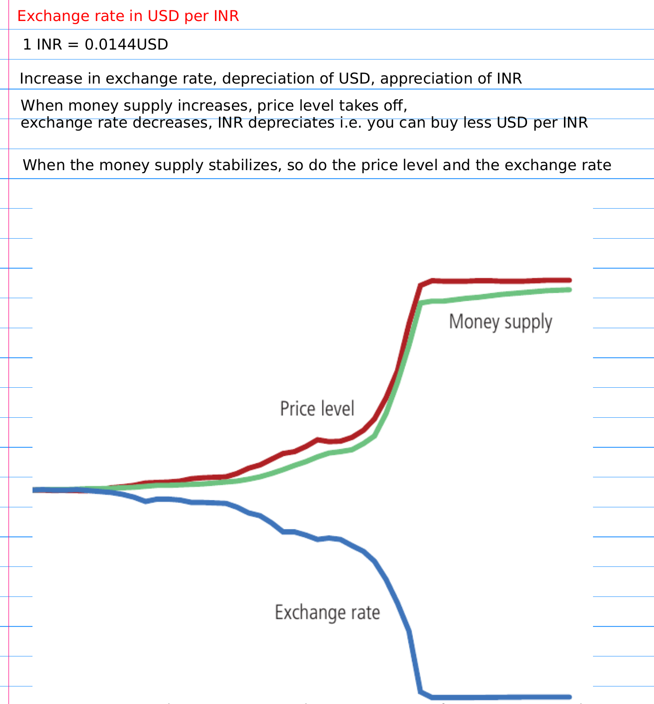
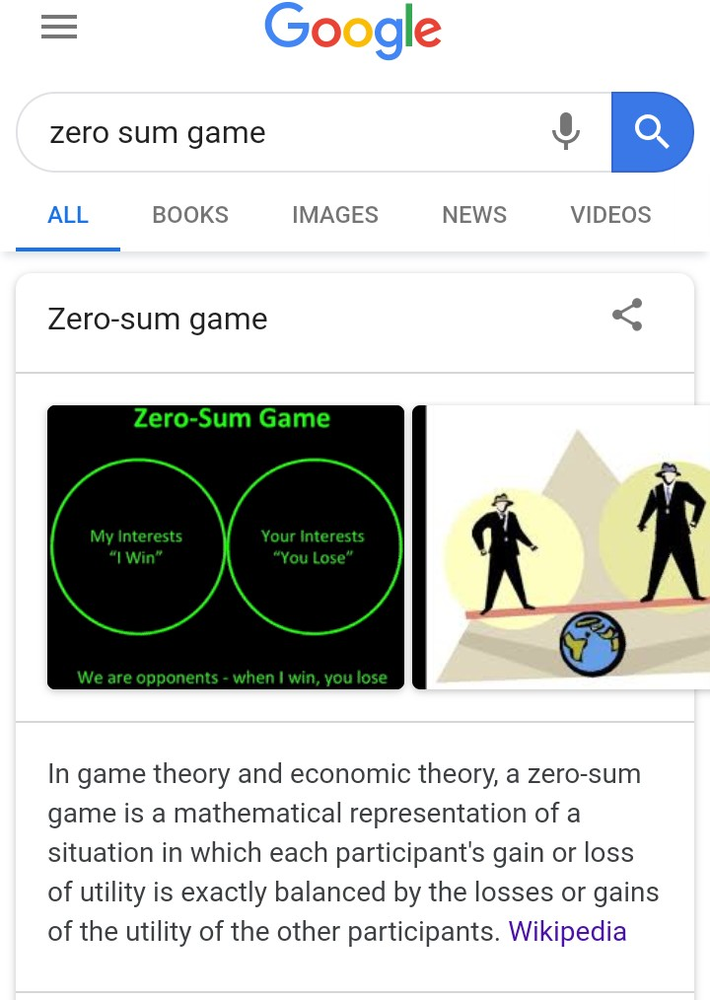

### **Using cryptocurrency and blockchain**

**perfect competition**

_noun_

_the situation prevailing in a market in which buyers and sellers are so numerous and well informed that all elements of monopoly are absent and the market price of a commodity is beyond the control of individual buyers and sellers._

[https://en.wikipedia.org/wiki/Perfect\_competition](https://en.wikipedia.org/wiki/Perfect_competition)

**A large number of buyers and sellers** – A large number of consumers with the willingness and ability to buy the product at a certain price, and a large number of producers with the willingness and ability to supply the product at a certain price.  
**Perfect information** – All consumers and producers know all prices of products and utilities they would get from owning each product.  
**Homogeneous products** – The products are perfect substitutes for each other, (i.e., the qualities and characteristics of a market good or service do not vary between different suppliers).  
**Well defined property rights** – These determine what may be sold, as well as what rights are conferred on the buyer.  
**No barriers to entry or exit**  
**Every participant is a price taker** – No participant with market power to set prices  
**Perfect factor mobility** – In the long run factors of production are perfectly mobile, allowing free long term adjustments to changing market conditions.  
**Profit maximization of sellers** – Firms sell where the most profit is generated, where marginal costs meet marginal revenue.

https://www.youtube.com/watch?v=W-GEZAthjCk

How Much to Produce? The Story of Marginal Revenue and Marginal Costs

**Rational buyers**: Buyers make all trades that increase their economic utility and make no trades that do not increase their utility.  
**No externalities** – Costs or benefits of an activity do not affect third parties. This criteria also excludes any government intervention.  
**Zero transaction costs** – Buyers and sellers do not incur costs in making an exchange of goods in a perfectly competitive market.  
**Non-increasing returns to scale and no network effects** – The lack of economies of scale or network effects ensures that there will always be a sufficient number of firms in the industry.  
**Anti-competitive regulation** - It is assumed that a market of perfect competition shall provide the regulations and protections implicit in the control of and elimination of anti-competitive activity in the market place.

**A country or organization can have a coin and a parallel tax coin of the same value.**

For example, the organization or country has PAX cryptocurrency. [Policymaker](https://iambrainstorming.wordpress.com/2019/01/11/the-whole-process-of-voting-in-a-dpos-country/) can make a smart contract with minting PAX-TAX coins, that will have equal value to PAX coin by law, and can also be used in alternative to PAX coin. These PAX-TAX coins can be used to produce more competitors of PAX coins, or for other purposes such as transferring to Universal Basic Income, Universal Health Care or Universal Education.

For example,

Teachers get fund which can be used to pay students. Escrow services on blockchain smart contract can be created with KYC, so that teachers can’t use those funds. And teachers can be paid using [UBI coins](https://iambrainstorming.wordpress.com/2018/03/21/universal-basic-income-and-education-a-beginning-to-a-continued-resilient-human-ecosystem/) that everyone gets.

> Escrow services build for UBI on smart contract can allow transactions only for utilitarian services like education, grocery or other utility bills like electricity, or the internet. People can't use the UBI for non-meaningful purposes like buying cigarettes or wine. The smart contract can register the authentic smart contract address of different service providers. It will create healthy economics without any demerits of free money.

But these TAX coins have **a special property**, some tokens of balance will start disappearing with every transaction you make and it doesn't create any negative impact on an individual due to its special property of disappearing as disappearing is slow. Minting TAX coins (PAX-TAX coin, for example) will not impact the exchange rates of the main coin (PAX coin, for example) as the total count will remain same due to its special property of disappearing. Neither it will cause inflation.

What happens when the money supply increases?  
Reference: Principles of Economics, Mankiw

**For example,**

India has rupees coin. The population of India is 1,374,632,000. And you want to pay ₹ 10,000 per month as UBI. So you need to mint Rupee-Tax coins that are pegged with the same value that of Rupee. Let's take the expiry date of Rupee-Tax coins is 24 months.

So, you need to mint,  
10,000 \* 24 \* 1,374,632,000 Rupee-Tax coins. It's equal to 3.2991168×10¹⁴ Rupee-Tax Coins.

So every month, each person will be paid 10,000 Rupee-Tax coins.

But rupee tax coins has the special property of disappearing. More time you keep the money, the more will be the transaction cost.  
The amount of money lost per time is equal to 10,000/ 24 months in minutes.  
An analogy can be the speed, the distance covered is 10,000 and speed will be 10,000/24 months in minutes.

So, if you keep 10,000 Rupee-Tax coins a day, you will lose 13.888 (10,000/(24months\*30days)) Rupee-Tax coins.

**The benefits:**

The benefits of the model are it will not only eliminate poverty but will increase GDP growth by creating more entrepreneurship.

https://www.youtube.com/watch?v=ydKcaIE6O1k

According to the quantity theory of money, it will increase the velocity of money, as no one will try to keep the money and always try to spend it due to the special property of disappearing.

https://youtu.be/q59tZKP0HME

**A caution:**

The price level will not increase if you mint the coins slowly. That is, increase the UBI amount with time. Like, 500 Rupee-Tax coins in the first month, 1000 in the second month, 1500 in the third month, till it reaches 20,000  
It can also create inconvenience because more you keep Rupee-Tax coins, more you will lose with time. So, before making a transaction, the maths of tax coins should be kept in mind.  
Also, exchanges should add Rupee-Tax coins to provide the best liquidity.

## Qs and As

**How new entrepreneurs will be created in a perfect competition market in the following example?**

An entrepreneur wants to start a business that requires high-end equipment. The price of high-end equipment is very high because it includes the labor cost of many people. But to run that high-end equipment, only one person is needed. How will the person buy the equipment?In perfect competition, every participant is a price taker, and marginal costs should meet marginal revenue. But how both can be possible in this situation?If the entrepreneur takes a loan (some labor cost) of other participants, how will he/she repay the amount? As the entrepreneur can't set the price for his/her service, and the market price for the service is already low because the labor cost to run the equipment is too small. 

**Proposed Suggestion:**

Competitors themselves can pay for the equipment, and the price gets adjusted according to it. Tax coins of different competitors producing homogenous products can be given to buy for the equipment. The competitors with the same specialization will also have the responsibility to confiscate the equipment, in case the entrepreneur who gets the equipment is found to be a frivolous or involve in any kind of fraud, as the competitors are the one who will bear the cost of equipment. It can act as a decentralized way to scale the system.

> It creates healthy economics where people work collaboratively, rather than competition. Economics is no more a zero-sum game, where one profit is others loss. Here competitors with expertise will help to build other competitor experts in the same field.

**What are negative externalities and how it can be handled?** 

https://www.youtube.com/watch?v=CpVf11f09Pk

In economics, an externality is a cost or benefit that affects a party who did not choose to incur that cost or benefit.

**Proposed Solution for adverse externalities:**

Pigovian Tax:

[https://en.wikipedia.org/wiki/Pigovian\_tax](https://en.wikipedia.org/wiki/Pigovian_tax)

And this tax can be added into UBI (Universal Basic Income) or to those who work on reversing the bad externalities. 

**How to collect the tax?**  
**_By increasing the number or minting of tax coins. As tax coins are destroyed slowly with every transaction, it won't make any impact on an individual._**

**How can there be universal basic income in perfect competition?**

By minting tax coins of all different coins, and then paying a fixed and equal amount of deposit to all citizens in this interdependent world.

**How to set the price?**  
Price is inverse of mean value obtained from the different organization for the number of units produced per unit time (days or months etc) per employee with collaboration and using time not more than 5 hours per day per employee + Raw material cost calculated by the same principle.

Its a useful model that helps you think about prices, but can't be implemented as it will make the process centralised. The current price setting through demand and supply can be used. Algorithmic laws can be used to handle externality with appropriate incentive models.

The details in separate blogpost:

[https://iambrainstorming.wordpress.com/2019/01/18/price-takers-in-perfect-competition/](https://iambrainstorming.wordpress.com/2019/01/18/price-takers-in-perfect-competition/)

**It will increase efficiency without monopoly or inequality.**

> _Working hours to be as 5 hours per day or 30 hours per week in the Labor Law. Other time should be used in creativity and learning with daily chores._ 

**How there will be a technological improvement if sellers are price takers?**

Sellers can earn more by increasing their productivity and efficiency through technological improvement for example. More production in less time means more earning with the same price per unit. But if some entrepreneurs or researchers managed to do technological improvement, they have to hide the protocol in order to make the profits. This will create a disadvantage for society as a whole. So, competitors can provide incentives to the seller or entrepreneur who improved the technology, e.g. psychological appreciation and monetary support for many years. After the contract, entrepreneurs can make the technology open source. It will be easy with blockchain, as the same type of competitors will have the same coins, and some coins can be given to the entrepreneurs.

Note:  
One can also make a profit, by assigning more employers with less wages. But this is even not possible because all consumers and producers know all prices of products and utilities each person would get from owning each product. So approximate wages can be easily computed and made public. **A democratic autonomous organization that has more productive and skillful employees can make a win in this situation, so it creates positive reinforcement to develop skills.**

**How can we pay for things that we can't measure or are meant to be free?**  
For example, Open source and open access products.

**How to pay for the high-end Research and Development sector?**  
All high-end equipment and salary for the researcher can be paid through taxpayer money, but auditing system should be robust enough to hold them accountable.

**How to pay for the education sector?**

**References:**

[https://en.wikipedia.org/wiki/Blockchain](https://en.wikipedia.org/wiki/Blockchain)  
[Bancor](https://support.bancor.network/hc/en-us/sections/360002084771-Whitepaper-)  
[https://www.ethereum.org/](https://www.ethereum.org/)  
[https://en.wikipedia.org/wiki/Game\_theory](https://en.wikipedia.org/wiki/Game_theory)
