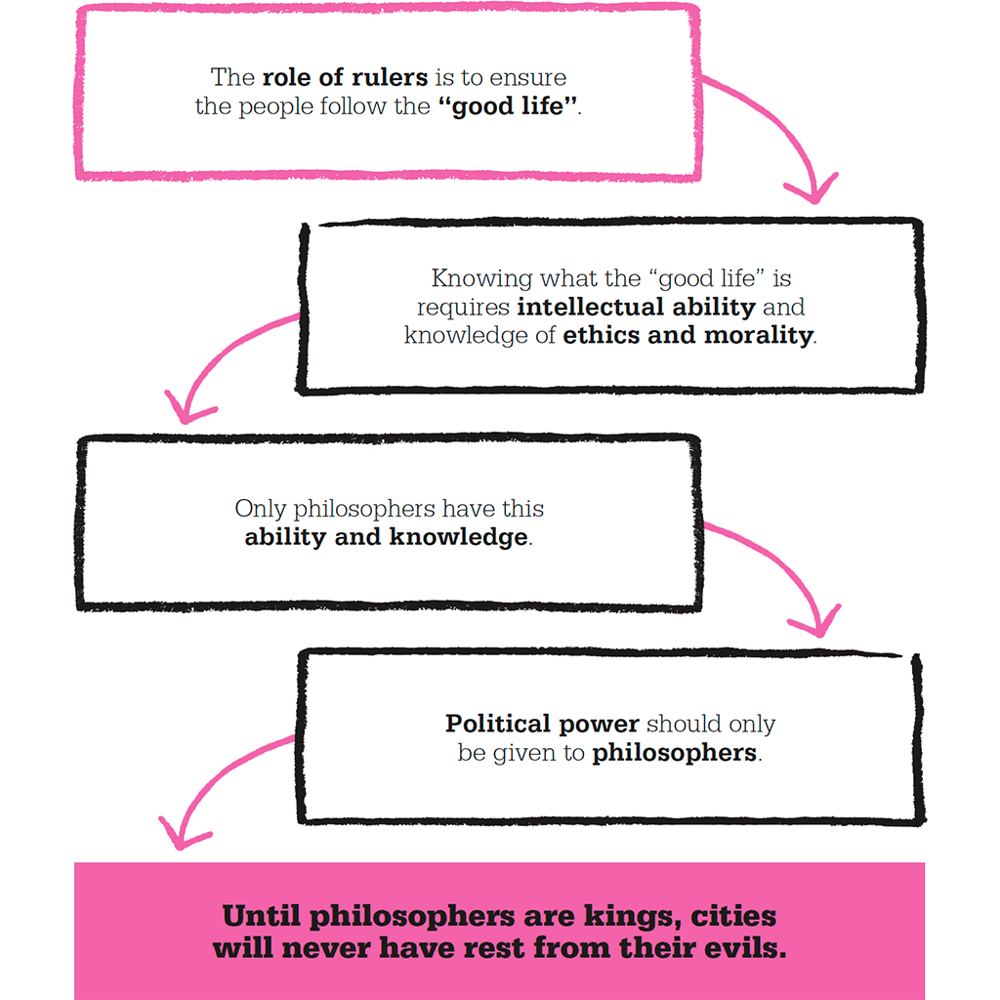

  
**The overview of fair democracy:**  
[https://iambrainstorming.wordpress.com/from-hypocrisy-to-democracy-this-way-delegated-proof-of-stake-2/](https://iambrainstorming.wordpress.com/from-hypocrisy-to-democracy-this-way-delegated-proof-of-stake-2/)

> **Evolutionary democracy using hierarchical specialization with adapted delegated proof of stake algorithm, where different specialized departments are in a symbiotic or mutually beneficial relationship.** 

<table style="margin-left:auto;margin-right:auto;text-align:center;" cellspacing="0" cellpadding="0" align="center"><tbody><tr><td style="text-align:center;"><figure></figure></td></tr><tr><td style="text-align:center;">The Tree of Democracy Each funnel is a department with its subdepartments</td></tr></tbody></table>

<table style="margin-left:auto;margin-right:auto;text-align:center;" cellspacing="0" cellpadding="0" align="center"><tbody><tr><td style="text-align:center;"><figure></figure></td></tr><tr><td style="text-align:center;">A Department</td></tr></tbody></table>

For example, the education department can have its sub-departments such as kid education, adult education, research, entrepreneurship.

_Each department consists of **large outer** representatives and **a few inner** representatives. These large outer representatives are the grand total of all its sub-department outer representatives and the few inner representatives are the grand totals of all its sub-department inner representatives._

> **Inner representatives of center and state are _policy approver,_  and inner representatives of all the regions (center, state, district, and small administrative regions) are task assigner to outer representatives of their regions for implementation of policies.** 

> _Representatives are leaders who collect evidence, data, and feedback, design policy on evidence, test and improve it or implement it through collaboration, without conflict of interest._

> Policy can be approved by inner representatives of the concerned departments only after addressing the conflict of interest with other departments.

> **International democracy**, where the origin of representatives is irrelevant, what matters is the availability of representative in the concerned region and expertise to implement policies and solving the problems of departments. But the location of voters do matter, a voter can only vote for their concerned regions.

> **Evolutionary democracy**, where the tree of democracy or departments can grow into any complexity, can include any number of representatives with the scalable voting system, and can include all possible or required departments, and can adapt and refine with time through new evidence.

**The whole process of voting and questions like:**  
**How voters can be informed about the contribution of their representatives, in order to vote? and How to hold the representatives accountable?**

We’ll consider accountability through the lens of five core principles: **responsibility, explainability, accuracy,** **auditability****, and fairness.**

Responsibility is not about legal responsibility but, rather, a focus on avenues for redress, public dialogue, and internal authority for change. This could be as straightforward as giving someone the internal power and resources to change the system.  
In a country, there are various departments or branches such as education (with sub-branches such as kid education, adult education, research, and entrepreneurship),

transportation (with sub-branches such as railways, road transport), health, environment (with sub-branches such as air pollution, water pollution, water supply, cleanliness, drainage system), energy (with sub-branches such as solar, wind, bioenergy, nuclear, petroleum), social justice (with sub-branches crime, family planning, human rights, philosophy), economics, agriculture, industry (with sub-branches such as manufacturing, mining, housing), biodiversity (with sub-branches such as forest, wildlife, domestic animals, aquatic life, afforestation), Entertainment (with sub-branches sports, television, movies), Information Technology, Defence, Foreign Relationships etc.

The Politics Book  
Big ideas simply explained

> These departments are complex in nature with further sub-branches and many times intersect with each other.

**How there will be** **ab** **initio** **assignment of representatives into these departments?**  
People with interest with the departments can stand for election, after showing some evidence of their expertise in understanding the departments. Evidence can include their research work, proposed achievable solutions, a detailed sketch of the plans and blueprints and a portfolio that a common citizen can understand. Then people can vote for the first round of outer representatives, to select some 500. And these outer representatives can vote for the inner representatives those who will hold the responsibility of the departments which can count to somewhere between 30-50. The outer representatives should provide valid data about why they voted for the particular representative.

**Who will decide whether to form new departments or join or remove departments?**  
Its the job of all inner representatives of concerned departments, when the consensus is reached after taking feedback from outer representatives and voters.

**How new policies can be made?**  
First, a draft can be made by inner representatives, and should be submitted publicly and should be asked for feedback, inner representatives and outer representatives of other departments can provide their conflict of interest and after addressing to different specific problems and argumentation to the line numbers or paragraphs, and rebuttals, explanation to the public, inner representatives can pass the final draft as policy. Inner representatives can provide incentives to outer representatives for their contributions.

> Policy can be approved by inner representatives of the concerned departments only after addressing the conflict of interest with other departments.  Departments can interact not just top down or bottom up but even side ways to know the conflict of interests of all the departments.

**What about the availability and contribution of inner and outer representatives?**  
Representatives should be available in the classroom with whiteboards and presentations for brainstorming and collaboration or they can be available in the community to collect information and check the implementation. _Individual contributions of each person and collaborative contribution should be made available for each day or week linked to the calendar in a website, it can include drafts, flowcharts, videos etc._  

> Take your time before uploading your contributions, for processing the data into useful information, and to think, analyse and write reviews containing your premise, argumentation, with a conclusion where needed and references to back your argumentation. No specific format is required, but the information need to be elaborative, concise and valuable.

**How can a voter know about the contribution of representatives and vote to remove or assign new representatives?**  
Voters can track the availability and contributions from the website with the calendar and can make the decision based upon their contributions.

> The voting process is "difficult in but an easy out process" for representatives.

Its difficult to become a representative in a department without expertise, but its easy to remove the frivolous one.

Voters will vote for outer representatives and outer representatives will vote to assign inner representatives. _But voters can remove any representative by giving negative votes._ So there will be two kinds of voting, _vote to assign_, and _votes to remove_. In votes to remove, a voter needs to give a dichotomous vote of KEEP or REMOVE, if it's 33% REMOVE for all votes, he or she will be removed. The new representative will be assigned by voting replacing those removed.  
Per voting process held in 6 months, _more than 16% can't be removed to keep the stability of the government._ If more than 16% representatives get 33% negative votes, those with the highest number of negative votes will be removed. If the last threshold is a tie, and reach more than 16% they all will stay. One can't enter again after removal within two years.

If the department representatives think, they are not getting better candidates through the election, and they have evidence for it, they can take over up to 33% of _**new** appointments_ and ask to pass or fail those new candidates. Candidates with _more than 60% pass votes_ by the people will be considered as pass, and the new representative can join the outer representatives.

**What about states and districts?**  
The same principle can be applied to different states, districts and smaller administrative regions without conflict of interest. Voters need to be local, but representatives can be nonlocal, but must have the necessary expertise and must be available in locality till he or she is in the job. States can have the same departments that of center. But districts and smaller administrative regions can have only required departments.  
In the case of districts and smaller administrative regions, per voting process held in 6 months, more than 33% can't be removed instead of 16% (as in case of center and states) because the stake for instability is low.  
_Responsibilities:_  
Inner representatives of districts and smaller administrative regions are **not law approvers**, (but inner representatives of center and states are law approvers), but they can assign the task for implementing policies to their outer representatives.

**How new policies be implemented?**  
Implementation will be done by both outer and inner representatives, and inner representatives can assign different task to outer representatives where needed.  
All inner representatives of center, state, district, and smaller administrative regions per department can help each other to assign a task for implementation.

> Representatives are leaders who collect evidence, data, and feedback, design policy on evidence, test and improve it or implement it through collaboration, without conflict of interest.

> **There is also an _extended outer group_, where common citizen can work part-time to provide solutions for the government and get incentives after approval form inner representatives of concerned departments. Extended outer group work will also come under open auditing.** 

**How to scale and simplify the election?**  
_Ab initio election_ requires about 500 representatives (number depends on the type of department) to be selected for every lower level department (with its sub-departments). Applicants can be some 2000 or more for a department. OMR sheets can be given to voters with only one circle or square per candidate. The circle or square represents as ASSIGN. Voters should shade the circle or square only those whom they want to select as their representatives. An index book with every applicant's portfolio analogous to question paper can be given. This index book should be available 2-3 months before the election so that voters get enough time to evaluate the applicants. In the voting sheet QR code that contain links to the profile details of all applicants or representatives can be given.

> Voters need to analyze the applicants and fill the OMR voting sheets at home and drop it in the locker at the polling booth during the voting day. There can be 3-4 voting days for submission of voting sheets.

<table style="margin-left:auto;margin-right:auto;text-align:center;" cellspacing="0" cellpadding="0" align="center"><tbody><tr><td style="text-align:center;"><figure></figure></td></tr><tr><td style="text-align:center;">
Assignment Voting Sheet for&nbsp;Country: Peace

&nbsp;
</td></tr></tbody></table>

Some 500 representatives with the highest votes will be selected per department.

After ab initio, the process will be more simple and will take less time. The election should be held every 6 months so that enough time is available (before removing them) for the representatives to search and understand the environment and then design the policy and implement. There will be two kinds of the election after ab initio, _removal_ and then _assignment_ to fill those who are removed.

_In the removal process_, OMR sheet will have two circles or squares per representative, the first circle or square represent KEEP and the second circle or square represent REMOVE.  You have to shade one of it, REMOVE in case you are willing to remove the representative because of bad performance, and KEEP in case you willing to keep the representative as you are happy with the performance. If no shading is done for the candidate, the vote will not be counted (i.e. counted as NOTA). After election representatives with more than 33% REMOVE votes can be computed.

In case, more than 16% of representatives come under 33% removal threshold (remember, we cannot remove more than 16% of representatives per election session), than NOTA vote of the representative will be counted and 1/3rd of it will be added to the REMOVE votes of the representative to keep preference of all the voters, as the number of voters per representative will differ without NOTA. The representatives with the highest number of negative votes (includes REMOVE count and 1/3rd NOTA count, per representative) coming under a margin of 16% representatives will be removed.

<table style="margin-left:auto;margin-right:auto;text-align:center;" cellspacing="0" cellpadding="0" align="center"><tbody><tr><td style="text-align:center;"><figure></figure></td></tr><tr><td style="text-align:center;">
Removal Voting Sheet for&nbsp;Country: Peace

&nbsp;

&nbsp;
</td></tr></tbody></table>

Example voting OMR sheets with code:  
[https://github.com/amiyatulu/evolutionary\_democracy](https://github.com/amiyatulu/evolutionary_democracy)

> People should be requested to get all contribution details of all representatives and vote everyone per department or sub-department.
> 
> All should analyze the contribution and expertise of the representatives in solitude and collaboration with other experts and data analysts and then fill the voting sheet and all should participate in voting and should avoid voting or submitting the filled voting sheet of a department or sub-department without knowing about it and representatives contribution.

_Assignment process_ will be the same that of ab initio, but with fewer number applicants.

**How to select the final applicants?**   
A website can be made for applicants, where they can vote to select those final candidates participating in the election process.  Voting can be done after KYC. The website (in the future) can be decentralized with open source code so that data can't be manipulated by any central authority.

**Sequel to**   
[From hypocrisy to democracy, This way: Delegated Proof of Stake](https://iambrainstorming.wordpress.com/from-hypocrisy-to-democracy-this-way-delegated-proof-of-stake-2/)  
[https://iambrainstorming.wordpress.com/from-hypocrisy-to-democracy-this-way-delegated-proof-of-stake-2/](https://iambrainstorming.wordpress.com/from-hypocrisy-to-democracy-this-way-delegated-proof-of-stake-2/)

**Questions for fair democracy:**  
[https://iambrainstorming.wordpress.com/qs-for-alternate-and-fair-democracy/](https://iambrainstorming.wordpress.com/qs-for-alternate-and-fair-democracy/)  
References:  
****[https://www.technologyreview.com/s/602933/how-to-hold-algorithms-accountable/](https://www.technologyreview.com/s/602933/how-to-hold-algorithms-accountable/)****

**Why will experts join the democracy network in the beginning? What are the Incentives??**

[https://iambrainstorming.wordpress.com/2019/12/10/why-scientists-will-join-the-democracy-app/](https://iambrainstorming.wordpress.com/2019/12/10/why-scientists-will-join-the-democracy-app/)

<table class=""><tbody><tr><td><figure></figure></td></tr><tr><td>
The tangled web of life: Campbell's Biology

&nbsp;

&nbsp;
</td></tr></tbody></table>

<table class=""><tbody><tr><td><figure></figure></td></tr><tr><td>Linnean classification (Campbell's Biology)</td></tr></tbody></table>
