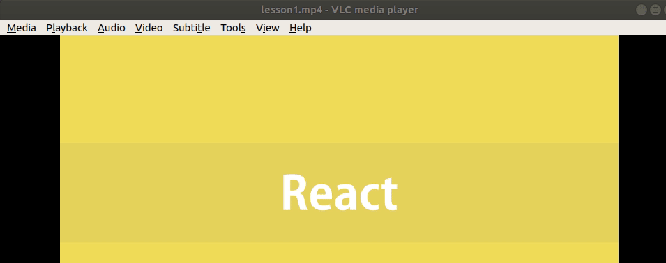

To revise the video lessons that you think, you have forgotten, run the videos faster, really faster.

> Remember, it doesn't work for exams, exams are meant for rote learning of concepts, it is for learning the hard way, i.e. revise lesson when you are applying or using its content to develop solutions.

Don't waste students time.

https://iambrainstorming.ml/how-much-does-retrieval-practice-help-in-learning/
