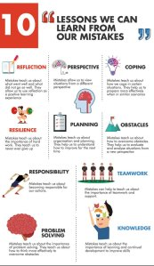
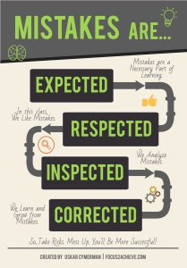

**The problem with grades:**  
  
1) Grades are an **oversimplification** of achievements that say very little about it. They are just numbers which say nothing about what you know or about your working skills.  
2) Grades are often **biased** and are done based upon the **context of questions**. Sometimes questions are not well made, most often they are just repeats of previous year questions. Because of this they really don't check the critical high order thinking of the children.  
3) **Malpractice**. It is also rampant in our education system.  
4) Too much of **psychological pressure** from parents, teachers to score more, that leads them to depression and sometimes even they take drastic steps like suicide.  
5)Grades **shift the goal from learning to just marks**, which can be achieved by many many means with our inefficient education system.  
  

With collaboration, all types of difficulties are fixed. **Competition is beneficial only when it helps in decreasing the scarcity of resources, not increasing**. (There is a limit to it, because creating resources require resources or raw materials which gets depleted) E.g. In economics, when there is demand/ scarcity of a resource, different suppliers compete with each other to meet the demand. Even that requires collaboration i.e. collaboration of people of the suppliers. Different suppliers are analogous to interspecies competition.  
  
  
Yes, we have limited seats (actually limited number of seats in good colleges). But that can be fixed by increasing the number of colleges that bring excellence in education, not mediocrity. Again it requires collaboration, not competition.  
  
So with grading students stop to collaborate, don't help each other and become selfish.  
  
**Students learn best NOT by competition, but through collaboration and inspiration from peers.**  
  
**Problems with classroom grading:**  
1) **Teacher biases.** While grading in class they give marks more to the students they like and less if they don't like or thinking they are incompetent.  
2) **Regular exams without proper feedback.** Many schools and colleges are obsessed with anytime regular exams. They think, more they conduct exams, more students will read, out of fear. But if you look at statistics, those who s**core well always score well**, and those who **score less always scoreless**. Many who are unable to tackle these exams just **bunk classes out of fear.**  
If students who scoreless are not improving, what's the point in the exam?  
The reason behind scoring less is they simply try to rote memorize the notes which they themselves don't understand. Also, too much of pressure on memorization, as they have to remember all formulas, reactions, and many questions that only require **just memorization without any thinking to get the answers.**  
And also they don't give any specific feedbacks. Just marks and answers, many a time without answers in the case of short or long answers that lack **any specific one-word answer.**  For example, compare and contrast, writing paragraphs for a topic etc. They just cut marks without giving any proper reason to it. When you ask for the reason, they just reply, you should have written it little better. Also, some illogical reasons like, it's not required to write such a long answers.  
Also, it doesn't matter whether a child does the problem set again which he/she was unable to solve.  
Assessment needs to be done in a systematic manner, not like anytime exam. Also, exams need to be personalized, repetitively giving them solved and unsolved problems, first clearing the fundamental concepts, then going to the advanced application based questions, not giving both types of questions in a single exam. **New information/knowledge is built over using previous information/knowledge, not in a haphazard manner.**  
  
**Problems with the final state board and center board exams:**  
1) Exams are conducted after two-**year end** in case of 12th board. So, mostly many students just don't read in the first year. All most all are less accountable (students and teachers) in the first year than the second year.  But the problem is most concepts of the second year are linked with the first year course. So students just can't cope up in the second year.  
Even in engineering colleges and higher education, students don't learn the whole semester, collaboration among students only occurs before the exam night (**cramming**) where the topper explains the other students.  
2) The **difference** in difficulty level, courses of studies, materials in different boards, also different marking schemes. Some boards are liberal in marking while others are not. Content and quality of the books also greatly differ. So the result is some are more fortunate and others are less just by the board they choose.  
3) The **opaqueness of the marked answer scripts**.  Marked answer scripts are just not publicly available. Teachers do, don't check the scripts properly and have their own biases, also don't know the answers. For example, simple handwriting can bring an impact in the marking. So forget that your marks are authentic without error.  
Also, many topics in literature are just qualitative with no perfect answers, difficult to quantify with grades. Even it is true for other subjects based upon questions.
