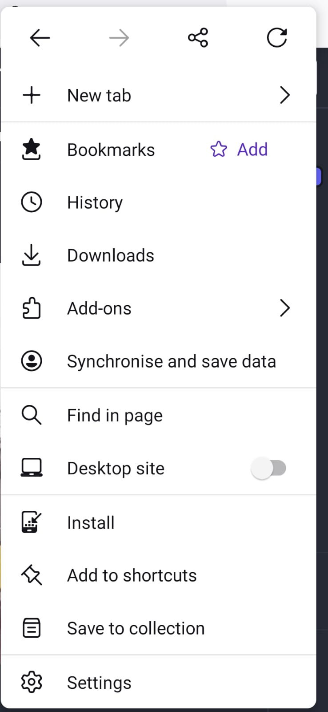
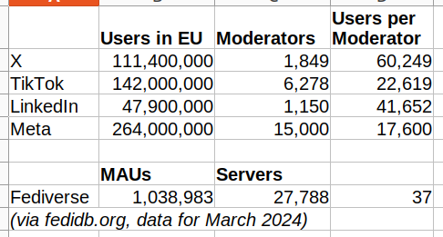
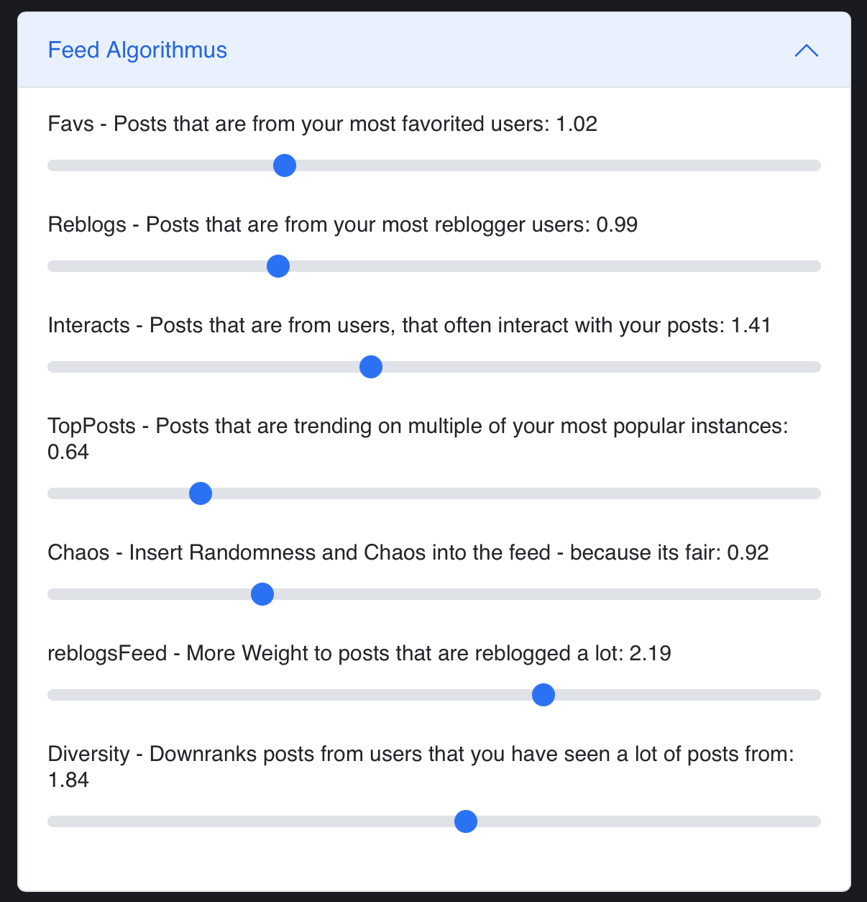
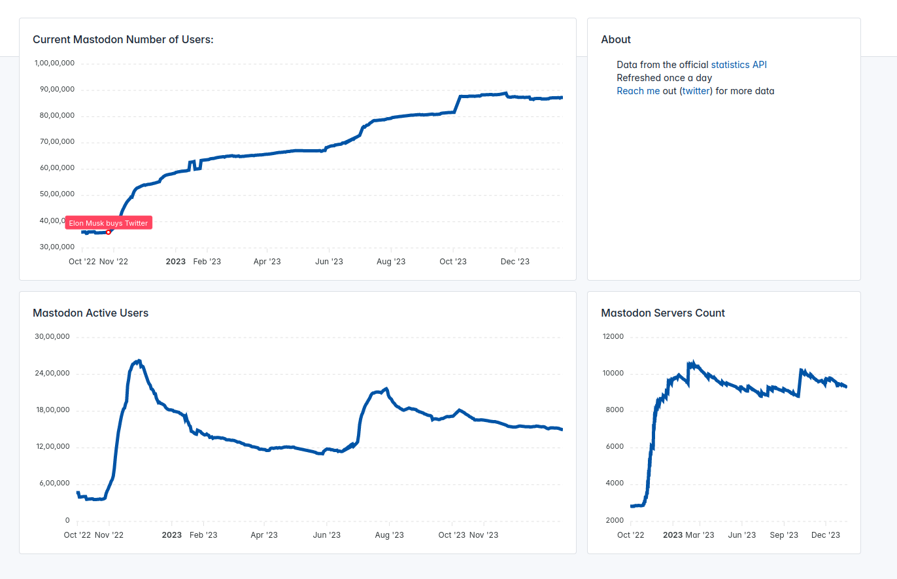
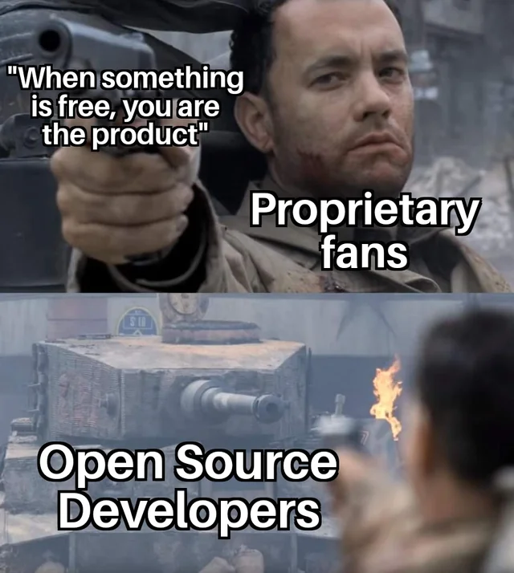

# What do we need to decentralize in the coming years?

## date: "2023-09-01"

---

categories:

- "blockchain"
- "social media"
- "search engine"

---

Research on new blockchain decentralized algorithms, scalability, composability, and ability of build complicated systems on blockchains has brought us new possibilities.

Blockspace & Blockspace Ecosystems: How Polkadot is Unlocking the Full Potential of Web3

[Blockspace & Blockspace Ecosystems: How Polkadot is Unlocking the Full Potential of Web3](https://www.polkadot.network/blog/blockspace-blockspace-ecosystems-how-polkadot-is-unlocking-the-full-potential-of-web3/)

## **De-googling our internet.**

I have already switched from the Google search engine to Brave Search, thanks to its fully independent search indexing of Brave. There are no more misleading ads in search results or low-quality marketing information optimized by Google SEO.
  
With Brave Goggles, search results remain in the hands of users rather than being controlled by the algorithms of the host search engine, like Google.

### **GOGGLES: Democracy dies in darkness, and so does the Web**  

[https://brave.com/static-assets/files/goggles.pdf](https://brave.com/static-assets/files/goggles.pdf)

There are goggles to remove Pinterest posts, remove pages found on the top 1,000 most-viewed websites, rerank results to remove “copycat” content, news indexing from authentic sources, and deranking sites spreading disinformation.

Developers need not stop here; we need to decentralize the computing servers and place them in public hands. Google has about million servers, what if we put these servers in public hands with offchain blockchain computing.

Here are the brave goggle and it links that I created:

[https://github.com/reaudito/collection_goggle](https://github.com/reaudito/collection_goggle)

## Decentralized Presearch

<https://presearch.com/>

I was an early adopter of Presearch in 2019, but after a few months of trying, I decided to quit using it. However, as of 2024, Presearch has successfully launched a decentralized nodes with its own index, runned by community consensus. The results now surpass those of Google and differ significantly, offering uncensored information that authoritarian governments and capitalists attempt to conceal through censorship laws and intellectual property rights, or by downranking certain content and promoting advertiser's content. The quality of the results is also notably superior.

> Over time, an even more decentralized search engine, designed with a superior algorithm based on community preferences and owned by the community, is set to be launched.

## Digital colonialism is threatening the Global South

[https://www.aljazeera.com/opinions/2019/3/13/digital-colonialism-is-threatening-the-global-south](https://www.aljazeera.com/opinions/2019/3/13/digital-colonialism-is-threatening-the-global-south)

### What is digital colonialism?

Under classic colonialism, Europeans dispossessed native peoples of their land, exploited their labour, exercised extraterritorial governance, and perpetuated dependency and plunder through strategic underdevelopment. Corporations like the East India Company played a pivotal role in this process. In their pursuit of profit and power, Europeans took ownership and control of critical infrastructure, including ports, waterways, and railroads.

> It is for this reason that American software programmer Richard Stallman started advocating for Free and Open Source Software in the early 1980s. “A nonfree program is a yoke, an instrument of unjust power,” Stallman reasoned.

### The concentration of data is concentration of power

“Feedback effects” of Big Data make the situation worse: Those who have more and better data can create the best artificial intelligence services, which attracts more users, which gives them even more data to make the service better, and so on.

Network effects, economies of scale, and vast resources for infrastructure, training, and product development further concentrate corporate power. Silicon Valley can hire the best computer engineers, purchase startups and competitors, and lobby governments for favours.

### Some of the network that keeps computing and data decentralized

Akash Network

<https://akash.network/>

Akash is an open network that lets users buy and sell computing resources securely and efficiently. Purpose-built for public utility. 
Akash democratizes secure, censorship-resistant app deployment, open to all innovators. 
Peer-to-peer communication guarantees data privacy, payment transparency, and immunity from central control, reinforcing dependability. 

[ThreeFold Decentralized Autonomous Cloud](https://www.threefold.io)


Phala Network is leading in building computation space for Computation as it’s meant to Be.

[Phala Network](https://docs.phala.network/introduction/readme) is designed with multiple layers of security guarantees to provide fully verifiable computation. The network is backed by numerous decentralized workers and a significant amount of staked tokens. Phat Contracts are protected by both hardware Secure Enclaves and cryptographic evidence published and verified on the Phala blockchain, seamlessly extending blockchain-level security to the off-chain realm.

There other alternative like [Integritee](https://github.com/integritee-network).

Off-chaining Models and Approaches to Off-chain Computations

[Article Link](https://cloudflare-ipfs.com/ipfs/bafybeicykr5y3ags5vdjnf5i66ijvng4wqq22hcwn2jsvywxwndpgoo24e/Off-chaining%20Models%20and%20Approaches%20to%20Off-chain%20Computations.pdf)


Adventures of an Enclave (SGX / TEEs)

[https://hackernoon.com/adventures-of-an-enclave-sgx-tees-9e7f8a975b0b](https://hackernoon.com/adventures-of-an-enclave-sgx-tees-9e7f8a975b0b)

Blockchains can also try [RISC-V](https://www.computer.org/publications/tech-news/trends/reasons-to-adopt-risc-v) CPUs and GPUs with Keystone to move towards a fully open-source system. [Keystone](https://keystone-enclave.org/) is an open-source TEE framework for RISC-V processors.

Crust files 

<https://crustfiles.io/>  
Your personal Web3.0 storage


## **Energy consumption by servers of capitalism**

AI's Electricity Use Is Spiking So Fast It'll Soon Use as Much Power as an Entire Country

[https://futurism.com/the-byte/ai-electricity-use-spiking-power-entire-country](https://futurism.com/the-byte/ai-electricity-use-spiking-power-entire-country)

Capitalism makes use of user data to perform unnecessary computations that are typically not required. For example, Facebook, Google, and many other companies employ centralized data servers that utilize machine learning for predicting personalized ads and feeds based on terabytes of user data. This poses not only a threat to your privacy but also a misuse of data for capitalist profit. Even a simple [algorithm like fedifeed (explained below)](https://github.com/pkreissel/foryoufeed) can solve the problem of personalization without compromising your privacy.

While cryptocurrencies like Bitcoin, which use proof of work, consume excessive amounts of energy, proof of stake algorithms, as seen in systems like Polkadot, are more efficient. One can run Polkadot on a Raspberry Pi.

As for storage, the [decentralized IPFS protocol](https://iroh.computer/) is efficient because it localizes storage. If your neighbor has already downloaded a file, you can obtain it from them instead of fetching it from the other side of the internet (which also saves on power usage, considering routers). Content addressing allows you to avoid downloading a lot of duplicate data, which can be particularly beneficial in data centers and clusters that need to distribute mostly identical Docker/machine images.

Blockchain data centers can utilize renewable energy, and we can design systems to be more localized, make most apps work offline (e.g., with the ability to download music or movies, so that you don't have to redownload them from the internet all the time and save energy), performing [machine learning on local computers](https://huggingface.co/) or local servers using open-source models only for what's necessary. The capitalist system disallows offline download and local sharing, as they can't make profits without copyright. Further sustainable housing designs that rely on renewable energy for computing are also viable. Additionally, we can penalize unsustainable blockchains using [decentralized price discovery](./what-if-crypto-token-prices-are-discovered-through-consensus-rather-than-demand-and-supply.md).

## **Interoperability**: Dismantle the tech platforms.

> We can - we must - dismantle the tech platforms. In _The Internet Con_, Cory Doctorow explains how to seize the means of computation, by forcing Silicon Valley to do the thing it fears most: interoperate. Interoperability will tear down the walls between technologies, allowing users leave platforms, remix their media, and reconfigure their devices without corporate permission.
> 
> [Book: The Internet Con:How to Seize the Means of Computation](https://www.versobooks.com/en-gb/products/3035-the-internet-con)

## Security of Phone

> Interoperability extends beyond just software compatibility; it also encompasses hardware compatibility. For instance, smartphones, regardless of whether they run on the Android or Apple operating systems, often hinder interoperability and pose challenges for supporting alternative operating systems like privacy-focused GrapheneOS or other Linux distributions. This situation poses a significant threat to user privacy, as it leaves devices vulnerable to state-sponsored or large tech companies' surveillance efforts.
> 
> Additionally, smartphones typically come with preinstalled bloatware that can be difficult to remove. These preinstalled applications are not only intrusive and annoying but also pose security threats and grant undue advantages to a select few companies. In 2021, Google made $146 billion in search advertising and gave a [$26 billion cut](<https://www.cnbc.com/2023/10/27/google-paid-26-billion-in-2021-to-become-a-default-search-engine.html>) to phone manufacturers and carriers in exchange for default status. That’s nearly 18 percent. It is crucial that we exert pressure on manufacturers to promote interoperability.
> 
> Phone manufacturers should consider supporting the Android Open Source Project (AOSP), which would entail adhering to standardized hardware specifications. This standardization would enable users to switch to any operating system of their choice with greater ease. Furthermore, if manufacturers opt for custom hardware, they should make their device drivers open source and contribute to the AOSP.

Google makes Android easy for privacy and security attacks by design. Enforcing hardware interoperability can assist developers in addressing these issues.

Notifications are on by default when you install the app. Instead, notifications need to be off by default. It's very annoying and requires extra work, making it hard to disable for common users.

There's no way to change an app's internet access permissions. For instance, if you want to restrict internet access within the app, you can't do so. This makes tracking easier and allows advertisements to be shown all the time in the app. To stop internet access for the app, you have to disable mobile internet or Wi-Fi. Allowing users to control internet access would encourage offline and offline-first apps.

File access needs to be limited to only a particular folder that the user can set. Apps shouldn't have the ability to search and access all the files on the phone.

More personalization of permissions is needed, such as allowing users to set a time to automatically remove all app permissions after a given period. This could include disabling permissions after 5 minutes, after closing the app, after a day, or after a week.

The security measures in the Linux system are implemented through the use of [firejail](https://firejail.wordpress.com/). Additionally, there is a user interface (UI) called [firetools](https://github.com/netblue30/firetools).

e.g.
To stop internet access one can use:
```bash
firejail --net=none vlc 
```

### Apple against Interoperability

[Apple argues against right-to-repair bill that would reduce its control](https://www.theverge.com/2024/2/9/24067957/apple-right-to-repair-oregon-bill-parts-pairing-ban)

[Mozilla says Apple’s new browser rules are ‘as painful as possible’ for Firefox](https://www.theverge.com/2024/1/26/24052067/mozilla-apple-ios-browser-rules-firefox)

[Apple appears to be breaking iPhone web apps in the EU](https://www.theverge.com/2024/2/14/24072764/apple-progressive-web-apps-eu-ios-17-4)

### Enhancing Privacy and Security in Offline App Design with WebAssembly

[Link to: Enhancing Privacy and Security in Offline App Design with WebAssembly](https://amiyatulu.github.io/blog/linux/Offline_centric_apps.html)

## **De-Facebook the Internet**

Capitalistic social media has become a threat to our democracy.

Misinformation on Facebook got six times more clicks than factual news during the 2020 election, study says

[https://www.washingtonpost.com/technology/2021/09/03/facebook-misinformation-nyu-study/](https://www.washingtonpost.com/technology/2021/09/03/facebook-misinformation-nyu-study/)

It is worrying that the societies which are most vulnerable to the impact of fake news are at the same time the least concerned about the spreading and the impact of disinformation.

[https://www.usnews.com/news/best-countries/articles/2023-01-27/finland-most-resistant-to-fake-news-report-finds](https://www.usnews.com/news/best-countries/articles/2023-01-27/finland-most-resistant-to-fake-news-report-finds)

Also far right billionaire can take over these social media sites, and use it for their interest.

Under Elon Musk, Twitter has approved 83% of censorship requests by authoritarian governments.  
The social network has restricted and withdrawn content critical of the ruling parties in Turkey and India, among other countries, including during electoral campaigns

[https://english.elpais.com/international/2023-05-24/under-elon-musk-twitter-has-approved-83-of-censorship-requests-by-authoritarian-governments.html](https://english.elpais.com/international/2023-05-24/under-elon-musk-twitter-has-approved-83-of-censorship-requests-by-authoritarian-governments.html)

Twitter has always been a hotspot for climate change misinformation. On Musk's watch, it's heating up.

[https://www.usatoday.com/story/tech/2023/01/10/twitter-climate-change-misinformation-surge-elon-musk/11002993002/](https://www.usatoday.com/story/tech/2023/01/10/twitter-climate-change-misinformation-surge-elon-musk/11002993002/)

Twitter slammed by LGBTQ rights groups after quietly removing line in hate speech policy that protected transgender users

[https://www.thestar.com/business/twitter-slammed-by-lgbtq-rights-groups-after-quietly-removing-line-in-hate-speech-policy-that/article\_dfd588ca-45a5-5055-868c-6b51b95e86f7.html](https://www.thestar.com/business/twitter-slammed-by-lgbtq-rights-groups-after-quietly-removing-line-in-hate-speech-policy-that/article_dfd588ca-45a5-5055-868c-6b51b95e86f7.html)

We can build a decentralized social media platform using decentralized moderation and governance to combat fake news. Various decentralized algorithms, such as [sequential Phragmén](https://wiki.polkadot.network/docs/learn-phragmen), Schelling point games, or a simple system like re-ranking users, similar to the Brave Goggle protocol, can be effective in addressing disinformation. We can go further to incentivize or pay the unbiased journalism.

## Desirable Social Media Features

**Some of the features social media needs to have:** 

1) **FOSS (Free and open-source software):** Anyone is freely licensed to use, copy, study, and change the software in any way, and the source code is openly shared so that people are encouraged to voluntarily improve the design (e.g security or bugs, UX, new features) of the software. 

2) **Open Protocol:** The protocol needs to be open and decentralized so that you don't have to be tied to a single app. For example, Mastodon uses [ActivityPub](https://activitypub.rocks/); different Mastodon instances can communicate with each other, and you can create instances that suit your needs.

3) **Composable and Modular Design:** Adding new features should not only be easier for developers but also for users with no coding experience. Users without coding skills can customize the app by adding or removing features themselves simply by including addons. For instance, if someone wants a personalized feed, they can include the feature; if someone doesn't like it, they can remove it. Likewise, if someone wants to try both options, that can also be accomplished by them. [WebAssembly](https://extism.org/docs/write-a-plugin/rust-pdk/) (Wasm) can prove beneficial for constructing a modular design.

4) **Monetary Incentive System:** Applications should establish their governance and [cryptocurrency funding](https://polkadot.polkassembly.io/opengov) for continued development without depending on insufficient donations of users or money given to cater to the interests of advertisers, large corporations, or corrupt governments. Additionally, there can be an incentive system at the user level to encourage the invitation of more users, along with the fair distribution of tokens based on their contributions to the app. For instance, applications can reward skilled and ethical journalists for their contributions to public interest local or international news. Designing a monetary system can be a tricky task that requires careful consideration to [avoid any unintended adverse effects](./democracy/tyranny_of_the_majority.md).

## Funding Open Source

> As money is controlled by the commons through a blockchain built by the FOSS community, it can provide an enormous benefit for open-source software, hardware, and open-access work. Funding open source becomes more accessible, and developers no longer have to rely solely on altruistic donations or corporate philanthropy; they can directly compete more effectively with big tech and potentially replace them.

**Can we build a precarious system just like big tech social media using blockchain/cryptocurrency?**

Blockchain is open source, and no one controls it. Anyone can fork and change it. A single owner can't benefit from it. Users can free to move to other updated versions, splitting the users. Even if someone builds a bad system, scams can only last for a year or two, after which prices are dumped, unlike big tech closed-source, monopolized scam apps that still last for 20 year. For example, imagine an open source facebook app with ads. As source code is available, a developer will fork it and release it without Ads, now users will start moving to new app, ending profit of Facebook.

## Why to transition to Mastodon?

Mastodon is a federated social media platform that is designed as an alternative to centralized social media networks like Twitter. The primary goal of Mastodon is to provide users with a decentralized and more privacy-focused social networking experience.

Here's how Mastodon works:

1. **Instance**: Instead of a single, centralized server or website like Twitter, Mastodon consists of many independent servers called "instances." Each instance is operated by its own administrators and has its own set of rules and community guidelines. Users on an instance can communicate with users on other instances, making it a federated network.

> As there are multiple instances spread throughout the world, it's challenging for fascist governments in different regions to censor content. Most instances operate through consensus, so if an instance misbehaves by promoting hate speech or disinformation, it's likely to be added to the blocked list by other instances.
And if you run an instance on decentralized servers like the [Akash network](https://akash.network/), it's almost impossible to shut down the server. System administrators can run the instance anonymously.

2. **User Accounts**: Users create accounts on specific Mastodon instances. These accounts have handles (similar to Twitter usernames) and profiles where they can provide information about themselves, upload avatars, and post content.

3. **Toots**: Instead of tweets, Mastodon uses "toots" as the term for posts. Users can write and share toots with text, images, links, and videos. These toots can be public, meaning they are visible to anyone on the federated network, or they can be restricted to specific groups of users (followers, followers of followers, etc.), depending on the user's preferences.

> In Mastodon, you can edit your toots. So, if you make a mistake, you can edit and improve it. When I make some mistakes in toots which is common, I edit it. On Twitter, only premium users are allowed to edit. So, in Mastodon, you have premium features available for free. 😀 Furthermore, the word limit in Mastodon is also longer.

4. **Following**: Users can follow other users from their own instance or from other instances. This creates a connection between the users, allowing them to see each other's toots in their timelines. The federated nature of Mastodon means you can follow and interact with users on different instances as if they were all part of the same network.

> It's a bit hard to find your followers on Mastodon, especially if they are on a different instance because name search is unlikely to yield results on a different instance. Also, it will not provide personalized AI suggestions like on Twitter for followers. Although such tools could be built into Mastodon, Mastodon is not a big tech platform; it relies on donations and volunteer developers, and building such features can be costly in terms of server cost. You need to do some extra work, such as finding followers using hashtags, retweeting from other users, federated timeline, or communication through other platforms to get handle etc. Personally, I don't need AI suggestions for followers. It may also be problematic if the user has no control over what AI suggests as in Twitter. I am fine without it.

5. **Timeline**: Mastodon users have a timeline that displays toots from users they follow. This timeline can be customized to show different types of content, such as the local timeline (toots from users on the same instance) or the federated timeline (toots from across the entire Mastodon network). Users can also create custom timelines to filter content based on hashtags and keywords.

6. **Privacy Controls**: Mastodon places a strong emphasis on user privacy and control. Users can choose who can follow them, who can see their toots, and who can interact with their content. This allows for a more tailored and secure social media experience.

7. **Moderation**: Instance administrators have the authority to set and enforce rules within their own instances. They can moderate content, suspend or ban users, and establish community guidelines to ensure a safe and respectful environment.

8. **Open Source**: Mastodon is open-source software, which means the code is available for anyone to view, modify, and run their own Mastodon instance. This open nature encourages innovation and diversity within the Mastodon ecosystem.

9.  **Interoperability**: Mastodon is part of the ActivityPub protocol, which enables interoperability with other federated social media platforms. This means that Mastodon users can interact with users on other platforms like Pleroma, PeerTube, and Pixelfed.

> Interoperability makes it a different kind of beast, which means it's adaptable and future-proof. You can adapt it to use different decentralized protocols with many new features (e.g., using blockchain consensus to incentivize journalism) without destroying the existing network.

In summary, Mastodon works by decentralizing social media, allowing users to create accounts on independent instances, follow others, post content, and customize their experience while maintaining control over their privacy and interactions. The federated nature of Mastodon promotes diversity, moderation, and user choice, making it an appealing alternative to centralized social media networks.

## **How to move to Mastodon?**

- Choose your instance from [https://joinmastodon.org/](https://joinmastodon.org/) and register your account.

Don't overthink which instance to choose; you can change your instance anytime if you're not satisfied. Occasionally, certain instances may not permit new registrations due to reaching full capacity. Additionally, some instances might be unreliable in terms of speed and bandwidth performance. Register on an instance that allows new registrations, or if you don't have time to research servers, consider joining mastodon.social and change it at your preferred time if you wish.

- To use on mobile, you can use Android apps or just the website. I prefer the website because it provides a better user experience with quicker updates, and there are more websites available with different features.



- If you want Android apps, there are about tens of apps. Install [F-Droid](https://f-droid.org/en/), a repository for open-source apps, and you can get all the apps to run Mastodon.

Use the 'Install' shortcut so that the website functions like an Android app, and you won't have to remember the URL.

### Moderators per user in fediverse

Assuming that Monthly Active Users (MAUs) are the relevant quantity, and assuming further that there is at least one admin or moderator per server, the ratio is (1 million) to (27 thousand) which is approximately 1/37. Though it's a very crude estimate which averages over wildly differently-sized instances.



[Data Shows X Has Significantly Fewer Moderation Staff Than Other Platforms ](https://www.socialmediatoday.com/news/x-has-significantly-fewer-moderation-staff/714650/)

### Personalized Feeds

> For personalized feeds, you can use `foryoufeed`. With `foryoufeed`, you have control over personalization, not big tech companies that dictate what you see.



[Website Foryoufeed](https://foryoufeed.vercel.app/)

[Github link](https://github.com/pkreissel/foryoufeed)

> You can also create lists in mastodon, to create personalization. 

It's not just with Mastodon that you can get PubActivity; you can also access a decentralized Reddit-like experience with Lemmy

[https://github.com/LemmyNet/lemmy](https://github.com/LemmyNet/lemmy)

[https://join-lemmy.org/](https://join-lemmy.org/)


# What should you do if your followers are on Twitter?

There are two main reasons for not joining Mastodon. Firstly, people may not be aware of it and its benefits. Secondly, your followers are already on Twitter. Due to the authoritarian nature of Twitter, third-party access to apps has been restricted. This makes cross-posting challenging using a single app. However, Mastodon has an open API, allowing users to automate their posts. No one can take away or censor your access to the API. If a system admin censors you for any reason, you can quickly shift your account to a different server, taking your followers with you.

If you're concerned about losing followers, you can create two accounts and cross-post. Automation is much more straightforward and easy on Mastodon than on Twitter. Additionally, due to the network effect, the number of Mastodon users is growing.

> Thousands of accounts are now censored by authoritarian governments. It's the right choice to move away from Twitter.



<https://mastodon-analytics.com/>


# Mastodon clients for automation

- Rust client
<https://github.com/h3poteto/megalodon-rs>
- Python client
<https://mastodonpy.readthedocs.io/>

# Downfall of Elon Musk.

> Trust, inclusivity, transparency, everything is compromised.

<iframe width="560" height="315" src="https://www.youtube.com/embed/q1STT9_XdUw?si=5KtFqYlxhScSNRyC" title="YouTube video player" frameborder="0" allow="accelerometer; autoplay; clipboard-write; encrypted-media; gyroscope; picture-in-picture; web-share" allowfullscreen></iframe>


## OpenSource



