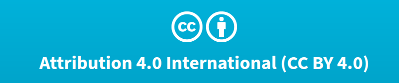

  
  

  
Attribution 4.0 International (CC BY 4.0)  
You are free to:  
Share — copy and redistribute the material in any medium or format  
Adapt — remix, transform, and build upon the material  
for any purpose, even commercially.  
  
  
What happens when you limit the voicing of these two important words?  
**1) Nescience : (Ignorance is a lack of knowledge)**  
Our eyes and senses are limited by many ways. _We are adapted to view the world perfectly only at a particular zooming level_. The world becomes blurred when we increase or decrease the zooming level. We can't know what is happening in another country just by our senses. Increasing and decreasing the zooming level requires indirect measurements that are tedious and sophisticated. You need to learn the outcomes of the research, and techniques to make measurements by bringing it down to texts and tools that are compatible with our zooming level.  
Without sharing these texts, using and adapting it, our knowledge will be limited to our zooming level and will be ignorant in all other levels.  
**2) Inequity**  
Ignorance creates apathy,  apathy creates isolation, and isolation creates inequity. We treat differently to some people because there is a mismatch in our thoughts or believe that we lack the commonness. But we can identify the commonness only if we look deeper, outside our zooming level. Lack of sharing and adapting also _gives unfairness in the opportunity to learn_.  
**3) Lack of Creativity and deceleration of research**  
We don't build anything from scratch, _we build things by reusing what its already don_e. Lack of sharing and adapting will disallow us to improve things that are already done.  
**4) Lack of Judgement**  
We make decisions by validating our ideas with different experts and knowledgeable people. Implementing without validation is often disastrous. _Sharing allows us to confirm our ideas_, get feedback from experts through discussion.
