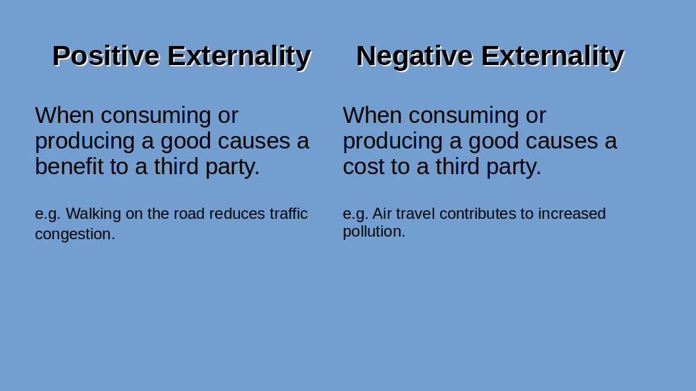
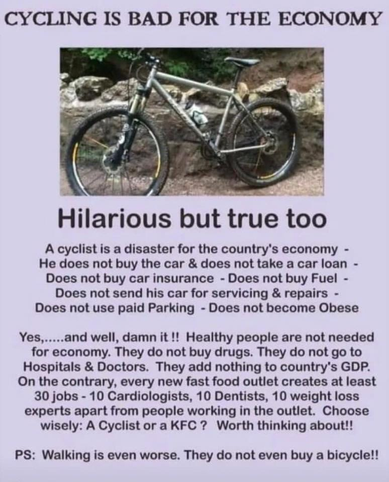

# What would we gain from eliminating the national fiat currency?

## date: "2022-10-16"

---
categories:

- "blockchain"
- "cryptocurrency"
- "democracy"
- "economics"

---

When India was under British rule, Gandhi started a movement to quit British goods and use Swadeshi products to help the country's people become self-sufficient. The movement aided in breaking free from British control and achieving independence.

Things are not much different today. Today we are in the clutches of big corporations and banks.

Let's check out what gonna change if we quit our national currency and implement [shivarthu protocol](https://github.com/amiyatulu/shivarthu/blob/main/docs/Shivarthu.md).

Also, take a look at the various governance issues here:

[Tyranny of the Majority, Minority, Representatives, Shareholders and Democratic trilemma](https://amiyatulu.github.io/blog/shivarthu/tyranny_of_the_majority.html)

**No more debt economy**
Banks transfer wealth from people to capitalists by issuing debt or printing money. e.g. In India, Adani group has a debt of ₹2.2 trillion, which is near to the GDP of many big states in India. Many times, debt is issued for economic reasons that are detrimental to society. For example, the Adani group's primary source of income is fossil fuel, which contributes to climate change and pollution.

> UN: 3.3 Billion People – almost half of humanity – Live in Countries Spending More on Debt Service Than Education, Health. The report revealed that Public debt has also spiked more than five-fold since 2000.
>  [https://unctad.org/publication/world-of-debt](https://unctad.org/publication/world-of-debt)

## [Yard-sale Model](./economics/yard-sale-model.md)

Here is simulation of [Yard-sale model](https://www.jstor.org/stable/27857715) that explains why do super rich people exist in a society?

[https://pudding.cool/2022/12/yard-sale/](https://pudding.cool/2022/12/yard-sale/)


**UBI and decreasing income inequality**
Shivarthu governance may charge 1% - 20% of taxes per year of the total market cap. About 1%- 5% of taxes can be used to provide universal income.
Here is a simulation where UBI will decrease the wealth inequality.

[https://github.com/amiyatulu/randomised\_tax\_collect\_ubi/blob/main/tax\_collection\_ubi.py](https://github.com/amiyatulu/randomised_tax_collect_ubi/blob/main/tax_collection_ubi.py)
Calculation of the required market capitalization for a $125 (₹10,000) UBI per month.

```python
population = 45_429_399
print(f"{population:_}") # Odisha population 45_429_399
# If each person get ₹10_000 per month as UBI, which means approx. $125
total_money_needed_per_year = 45_429_399 * 125 * 12
print(f"{total_money_needed_per_year:_}") # 68_144_098_500
# If you tax 1% per year total market cap needed.
total_market_cap_needed = total_money_needed_per_year * 100
print(f"{total_market_cap_needed:_}") # 6_814_409_850_000
market_cap_of_bitcoin = 369_910_000_000
print(f"{market_cap_of_bitcoin:_}") # 369_910_000_000
# 2021 estimates show there are 64 million active wallets . A minuscule .01% of Bitcoin holders control nearly a third of the supply
ratio = total_market_cap_needed / market_cap_of_bitcoin
print(ratio) # 18.42 times
```

> Though the example is given for a single currency, in the real world, we would have thousands or even lakhs of coins with many different supply chains. With each supply chain, one can earn at least $1-10 as UBI, resulting in a total of $100, $500, or even more per month.

## **Implications of a deflationary and inflationary currency**

You will spend less and hold money since deflationary currency increases in value over time. Natural resource depletion and environmental pollution are two drawbacks of consumerism. The consumer society is not sustainable in its current state. More than 70% of Earth's natural resources are currently being overused.

It appears that businesses are more focused on generating new demands than filling old ones. They frequently prey on our vanity and insecurities during this process. "You will feel better about yourself if you get this" "Purchase this and people will respect you.", "Buy this and you will succeed". These are a few of the messages that sellers try to get across to us so that we will buy things we don't really need.

But many economists criticize deflationary currency as it will slow down the economy and bring unemployed, hence poverty. Yes, it's true when wealth is concentrated in a few hands, like in the current scenario, where 1% holds 90% of the wealth.

> Money circulation is the fundamental principle for a thriving economy. It is true that a deflationary currency can reduce circulation, as people tend to hoard it, which in turn can lead to increased poverty and wealth concentration. On the other hand, inflationary currency can be beneficial if money is distributed fairly, ensuring continuous circulation. However, it is crucial that this distribution is managed in a way that does not create negative externalities. With smart contracts and decentralized ownership, we can achieve better control over fund distribution and ensure it is done more fairly.


### **No to Bullshit Jobs**

A bullshit job, as defined by David Graeber, was a concept coined by the late anthropologist and author in his book "Bullshit Jobs: A Theory." Graeber describes a bullshit job as a type of employment that is essentially meaningless, unfulfilling, or unnecessary, yet it exists within a system that assigns it a high societal value and rewards it with a decent salary.

According to Graeber, bullshit jobs are often characterized by the following traits:

1. Lack of meaningful impact: These jobs do not contribute significantly to the well-being or betterment of society. They are often seen as pointless or even counterproductive.

2. Busywork and bureaucracy: Employees in bullshit jobs often find themselves engaged in excessive paperwork, pointless meetings, or other tasks that do not require their skills or expertise.

3. Low autonomy: Workers in such jobs have little control over their tasks or decision-making processes. They are often subject to micromanagement and strict rules and regulations.

4. Lack of productivity measurement: Bullshit jobs are often difficult to measure in terms of productivity or output. It becomes challenging to evaluate the actual contribution of these jobs to the organization or society.

5. Sense of guilt or shame: People with bullshit jobs often feel guilty or ashamed because they recognize the pointlessness of their work but are compelled to continue doing it due to societal expectations or economic necessity.

Graeber argued that the prevalence of bullshit jobs in modern economies is not only detrimental to the individuals performing these jobs but also to society as a whole. He highlighted the potential for increased dissatisfaction, mental health issues, and a loss of human potential when people are stuck in unfulfilling and meaningless work.

> With [decentralized price discovery](./what-if-crypto-token-prices-are-discovered-through-consensus-rather-than-demand-and-supply.md), and [decentralized self-managed organizations](https://en.wikipedia.org/wiki/Reinventing_Organizations) like shivarthu, workers will have autonomy over their decision-making process, and jobs that have meaningful impact on society are incentivized and bullshit jobs are eliminated.

## **UBI and positive externality**



Shivarthu will incentivize positive externality, validated by score Schelling game and elected representatives. Your UBI (Universal Basic Income) can increase by 2 to 5 times if you produce a positive externality, but it can also drop if you produce a negative externality.

Some of the positive externalities are

- Learning and gaining knowledge (https://avrit.reaudito.com/#/)

- Teaching your child or neighbor kids.

- Planting trees

- Exercising, yoga, mindfulness, and assisting others in doing so for mental and physical health.

- Taking care of animals and pets

- Volunteering and keeping your city clean

- Avoiding single-use plastic and littering the road

- Take part in governance

- Doing scientific activism and mobilizing people for social justice (DEI: Diversity, equity and inclusion) or climate justice

and many others

Some examples of negative externalities include:

- Littering on the road, park or beach

- Consuming drugs, alcohol or cigarette

- Participate in domestic violence

- Taking part in some criminal activities

> Users with more positive externality will have more voting weight as a result they possess greater voting influence. Consequently, voters who prioritize environmental protection elect like-minded candidates. These representatives bring forth fresh concepts concerning renewable energy and clean air, collaborate to enact enduring and egalitarian policies, and promptly address pressing matters such as climate change. Voters express concern for clean air, clean water, and climate action. Shivarthu protocol has the potential to transform their values into tangible realities. It will create a vicious cycle of positive outcomes..

**Is Shivarthu a demurrage currency?**

Demurrage is the cost associated with owning or holding currency over a given period. It is sometimes referred to as a carrying cost of money.

Shivarthu is not a demurrage currency. Users are taxed at a certain percentage, but it doesn't depend on how long you hold the currency. The tax rate remains the same whether you hold it for a year or just a few months. A token can be inflationary, but you [receive rewards for staking or holding it](https://www.reddit.com/r/Polkadot/comments/ij5ect/comment/g3bhut1/?utm_source=share&utm_medium=web3x&utm_name=web3xcss&utm_term=1&utm_content=share_button), which cancels out the devaluation caused by inflation.

**Problems with demurrage currency:**

It compels you to spend money even if you don't need goods or services.

In economics, when you spend more, there is greater money circulation, resulting in increased economic activity and more employment. This concept is based on the belief that a single currency, whether local or national, can solve all our problems.

While it may seem appealing, it has its downsides. Increased economic activity often leads to the exploitation of natural resources and issues like climate change and pollution. But less spending can create unintended consequences such as unemployment or poverty.

Here is an example how it works, why cycling is bad for the economy.



However, these challenges can be addressed through controlled money circulation, using [different currencies for different supply chains.](./what-if-crypto-token-prices-are-discovered-through-consensus-rather-than-demand-and-supply.md) This approach allows for fine-grained control over supply chains, including taxing or disincentivizing negative externalities and subsidizing or incentivizing positive externalities in different supply chains.

While shitcoins cryptocurrencies needs to be eliminated, we envision a multi-cryptocurrency system. Furthermore, unemployment can be addressed through the provision of Universal Basic Income (UBI), which can also be implemented at the supply chain level. For instance, individuals could receive a monthly allocation of 50 apples for free.

Secondly, because there are no incentives to hold a demurrage currency, it is likely to be abandoned, and people may shift toward other currencies. In most successful cryptocurrencies, hoarding is incentivized, for example, through staking to earn more tokens for providing security or other services such as decision-making.

## We can use gold pegged cryptocurrency, but they are hard to decentralize.

Gold cryptocurrency can provide hedge against inflation and fluctuating prices of or other cryptocurrency. For example, from 2004 to 2022, the price of an [ounce of gold in rupees](https://goldprice.org/gold-price-charts/20-year-gold-price-history-in-indian-rupees-per-ounce) has changed from Rs. 20,000 to Rs. 160,000. Gold has a history of being the best and most well-tested currency since 700 BC.

Here are the few [gold backed cryptocurrency:](https://www.softwaretestinghelp.com/gold-backed-cryptocurrency/)

1. Tether Gold (XAUT)

2. DigixGlobal (DGX)

3. PAX Gold (PAXG)

4. Gold Coin (GLC)

5. Perth Mint Gold Token (PMGT)

6. Meld

But these currencies are not fully decentralized, and depends on centralized regulators. If you're considering investing in gold crypto, diversify your portfolio by exploring various gold stable coins to avoid the risk of losing all your money if one stable coin fails.

There can be a way for secure and safe decentralized stable coin. [But its a part of active research.](./love-for-usd-pegged-stable-coin-by-the-crypto-community-must-end.md)

e.g Govt causing hyperinflation, devaluing all your money:

[https://mru.org/courses/principles-economics-macroeconomics/zimbabwe-currency-inflation](https://mru.org/courses/principles-economics-macroeconomics/zimbabwe-currency-inflation)

Or a dictator can demonetize 99% of the currency overnight:

> The figures suggest prime minister Narendra Modi’s demonetisation policy, which likely wiped at least 1% from the country’s GDP and cost at least 1.5m jobs, failed to wipe significant hordes of unaccounted wealth from the Indian economy — a key rationale for the move.
>
> [https://www.theguardian.com/world/2018/aug/30/india-demonetisation-drive-fails-uncover-black-money](https://www.theguardian.com/world/2018/aug/30/india-demonetisation-drive-fails-uncover-black-money)

Banks can also stop you to withdraw your own money when you need it.

## Decentralized Finance

The blockchain space also has open-source DeFi lending platforms like [Compound](https://compound.finance/) and [Aave](https://aave.com/), where interest rates are determined by the market, rather than being controlled by banks and governments. This approach helps mitigate the unintended consequences of price ceilings and floors, as explained in the video below.

## **Zombie Banks (Run!)**

This video discusses four **reasons why financial intermediaries can fail**: insecure property rights, controls on interest rates, politicized lending, and loss of trust. It’s hard to decide which is scariest! 

[https://mru.org/courses/principles-economics-macroeconomics/failure-financial-intermediaries](https://mru.org/courses/principles-economics-macroeconomics/failure-financial-intermediaries) (Video can be downloaded)

Cryptogovernance is no longer purely experimental. For example, [OpenGov](https://polkadot.polkassembly.io/opengov) on Polkadot is currently operational, and more versions are likely to emerge in the coming years. It can be adapted to numerous supply chains, including education, housing, agriculture, and transportation.

## Manifesto

More points to cover, treat it like a manifesto:

- No debt economy, unlike the large debts taken on by capitalists.

- UBI with no income inequality

- Implications of  minimalism

- [Emotion and empathy rather than materialism](./relationships-emotions-and-happiness.md)

- [No Entrance culture, and rate race, rote learning education system](./how-avrit-learning-solves-our-education-puzzle.md)

- Elimination of bullshit jobs

- [Remote jobs or work from home with less working hours](./rethinking-work-culture.md)

- [Gender parity in workplace](https://hbr.org/2021/09/the-problem-with-greedy-work)

- No unpaid care work for women

- Wildlife conservation e.g protection of elephants, mangroves. No climate change, more trees and honey bees

- Pay for positive externality and tax negative externality with accurate prices discovery, People producing positive externality will get more UBI

- Nutritious food and health

- [Clean energy like roof top solar and wind energy](./demand-for-50-subsidy-for-solar.md)

- [Banning single use plastic](./ban-plastic-bottles-of-coca-cola-and-water-bottles.md)

- [No hate or polarization](./do-we-need-a-supreme-leader-how-can-we-share-power-between-parties.md)

- Better judiciary and police governance

- Funding to the public good and open source. Share on the capital and automation and [Decentralized supply chain](./what-if-crypto-token-prices-are-discovered-through-consensus-rather-than-demand-and-supply.md)

- [No intellectual property rights](https://www.youtube.com/watch?v=TWYHmkmctb8)

- Ads free entertainment, demerits of ads and consumerism, only informative, decentralized, expert audited ads.

- [Accountable social media and news](./what-do-we-need-to-decentralize-in-the-coming-years.md)

- [Interoperability of hardware and software](./what-do-we-need-to-decentralize-in-the-coming-years.md)

- [Decentralized house building](./how-can-we-decentralize-the-construction-of-brick-and-mortar-houses.md) and [sustainable housing design](./building-better-cities.md).

- [Car-free](./road-planning-of-cities.md) community and [15 mins cities](https://www.huckmag.com/article/what-its-actually-like-living-in-a-15-minute-city)

- 60%-70% forest cover

- [Sustainable Agriculture](./what-if-crypto-token-prices-are-discovered-through-consensus-rather-than-demand-and-supply.md#agriculture)

- [Decentralizing Supermarkets Through Public Ownership and Control](./empowering-communities-decentralizing-supermarkets-through-public-ownership-and-control.md)

- Better Health care system

- No poverty and low hunger index
