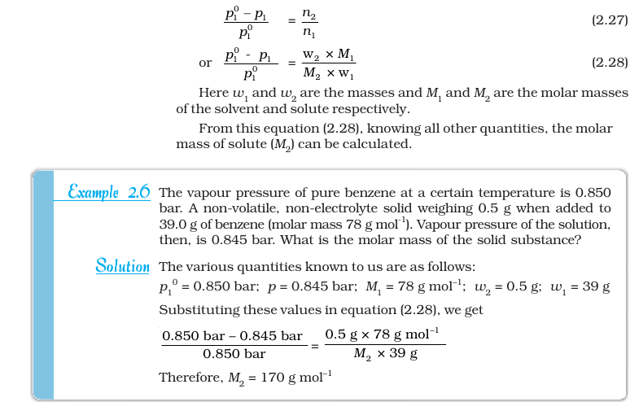
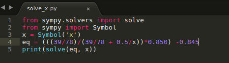

> **A short cut formula like these add nothing to the understanding of concepts, also overloads children with pointless burden as they have to memorize by parroting.**

How its need to be solved?

P°Solvent = 0.850 bar Mass of solute = 0.5g Mass of solvent = 39g Molar mass of benzene = 78g/mol PSolution = 0.845 bar Molar mass of solute (g/mol) = ? PSolution = χSolvent P°Solvent χSolvent = nSolvent/ (nSolvent + nSolute)

**Solvent:** g -----> mol Conversion factor = 1 mol/ 78 g 39g \* 1 mol/78 g = 39/78 mol No. of moles of solvent = 39/78 mol **Solute:** g -----> mole Conversion factor = 1 mol/x g 0.5g \* 1 mol/x g = 0.5/x mol No. of moles of solute = 0.5/x mol Putting these values in the equation PSolution = χSolvent P°Solvent we get following equation (((39/78)/(39/78 + 0.5/x))\*0.850) -0.845 = 0

Solving it through python programming:

Ans: \[169.000000000000\]

**Also why overload students with so much of large calculations (in higher education), when we have calculator or programming tools?**

> **When students are asked to do large calculations, they are unable to concentrate on strategizing or making a conceptual plan from the given information which is the most important step in problem-solving.**

The difficulty level becomes more intense for the students who are bad in the calculation, they usually give up after solving one or two problems as their brain gets tired of calculations, and frustration produced due to mistakes in the calculation as they don't reach the answers.

> Books should also provide resembling **_experimental raw data in the problem set, which will provide students a perspective of real-world experience in problem-solving._** 

Students should be taught how to interpret and analyze these data with computational tools. Also, group work projects can be given for analysis.

P.S. Shortcut formulas are many a time useful in maths and computer science, as it helps to decrease the number of steps in computations. So algorithmically it's efficient. But in this context, it's unnecessary for students to memorize these shortcut formulas which adds no purpose to learning.
