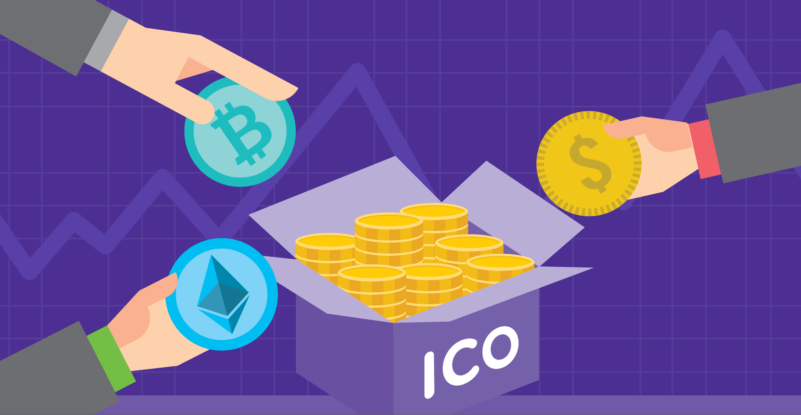
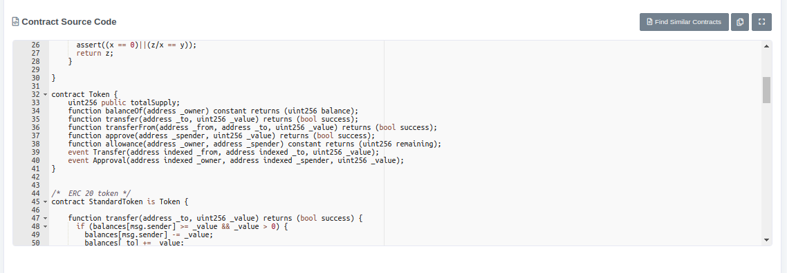

To create entrepreneurs, India requires ICO (initial coin offering) and cryptocurrency.

In India, most of the people are middle class, so funding for starting the business is one the biggest hurdle.

> Even if you have a brilliant idea, it's of no use, if you have no funding to implement your idea.

Loan creates an immense burden on entrepreneurs as you have to repay it, and the condition becomes miserable if your idea fails with a large amount of loans.

Here in ICOs, people are stakeholders of the idea. So, if the idea doesn't support the interest of people, its unlikely to be funded. It's similar to the crowdfunding system.

How to tackle fraudulent ICOs?

> Smart contracts are open and transparent. You can view the smart contracts and all the transactions going on in it, openly.

[https://etherscan.io/contractsVerified](https://etherscan.io/contractsVerified)

What we need is an auditing system and return policy of cryptocurrency if your idea fails. The smart contract should have code to return the cryptocurrency under unintended situations, and review system can be made to create awareness by giving details about the problems of smart contract and the company.

India needs an alternative source of funding for startups, and funding through ICOs is one of the best methods.

> Crypto is the rule, the rule of incentives, the rule of human behavior.
> 
> _We only need a cryptorule to review and allow other cryptorules_
> 
> [Nothing in Human Makes Sense Except in the Light of Economics](https://iambrainstorming.wordpress.com/2019/03/05/nothing-in-human-makes-sense-except-in-the-light-of-economics/)

We only need a cryptorule to review and allow other cryptorules

https://www.youtube.com/watch?v=p7HKvqRI\_Bo

How does the stock market work? - Oliver Elfenbaum
