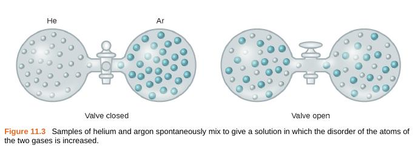

<table align="center" cellpadding="0" cellspacing="0" style="margin-left:auto;margin-right:auto;text-align:center;"><tbody><tr><td style="text-align:center;"></td></tr><tr><td style="text-align:center;">Openstax Chemistry</td></tr></tbody></table>

Link to the book for image  
[https://openstax.org/subjects/science](https://openstax.org/subjects/science)  
  
If information is binary (e.g. 0,1) what is disorderliness (or entropy)?  
  
If two objects have similar properties or pattern, each object position is replaceable by the other object, is this the actual reason for spontaneous mixing or nature tendency to mix?  
  
**Like dissolves like**
