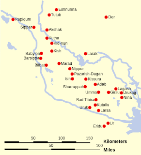

**What are the functions of a brain?**

  

Pattern recognition, interpretation and storing of information that we get from our sense organs

  

I would go with following steps to show that non-concrete information is the type of information that our brain is not trained for. The most requirement to remember abstract information is more recent when mathematics and different languages were invented.

  

The **invention of writing** that allowed **storing information** that we can't remember.

  

The human being invented abstract information like more than one language or mathematics which we are evolutionarily unfit to remember.

  

**Are we evolutionary unfit to memorize abstract information?** To prove it lets look the following experiment.

  

The brain is good at recognizing things in a span of seconds. For example, we change our path if there is a hindrance in front. But if you close your eyes, we will miss details of the hindrance.

  

  

Let's try to memorize this map in a span of seconds or minutes. Can you do it?

  

Memorizing abstract information requires the **lot of details that need to be stored, along with their associations.** 

But concrete ideas requires **imagining outlines of things without the details in it**.

  

We discovered abstract mathematical ideas by writing, as we can't remember the complete process of derivation that goes in mind. 

 e.g. The Abel–Ruffini theorem was nearly proved by Paolo Ruffini spanning 500 pages. Can he do that without using pen and paper? 

  

Writing helps to store information without the need to stress the brain for memorizing all abstract steps. Writing helps to keep the record which we can later look at it.

  

**What makes something concrete?**

It's a familiar pattern that makes something concrete. When you imagine the features of your friend, what you will first imagine is characteristics of humans, like nose, ears, eyes, but without much details. Details are not the familiar pattern which you are acquainted with during your childhood. Similarly, you can recall A-Z in sequence because you are familiar with the pattern from your childhood. But if you randomize the sequence, you can no more recall it. Most formulas, equations, new words don't form a familiar pattern, that makes us into trouble to memorize. A nonfamiliar pattern is made concrete after so much of retrieval practice e.g. it takes about a year to memorize A-Z in sequence by a child so that (s)he can retrieve it effortlessly.

  

**Why is familiarity with absurdness helps you to remember things easily?**

Take the example you have seen a fake inverted tree in your garden. You will memorize it for a very long time. Shocking things are easy to memorize. Unfamiliar patterns are junk for us, but shocking familiar patterns makes us feel that something is wrong with it, which lets us to become more cautious and **curious** about the things, that is required for making right decisions.  
  
Using this strategy to teach grammar:  
  
  

